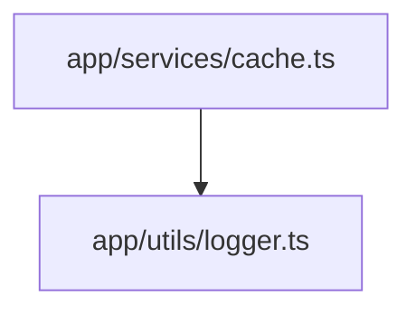

# アーキテクチャアナライザー

構造と依存関係のダイアグラム付きアーキテクチャドキュメントを生成。

## 生成コンテンツ

| セクション         | 内容                         |
| ------------------ | ---------------------------- |
| プロジェクト概要   | 技術スタック、フレームワーク |
| ディレクトリ構造   | treeコマンド出力             |
| モジュール構成     | Mermaid関係図                |
| 主要コンポーネント | 重要なクラス、関数           |
| 依存関係           | 外部/内部の可視化            |

## 分析フェーズ

| フェーズ | アクション       | コマンド                                  |
| -------- | ---------------- | ----------------------------------------- |
| 1        | プロジェクト検出 | LS ツールでプロジェクトルート確認         |
| 2        | バージョン検出   | 下記のバージョン検出テーブルを参照        |
| 3        | ディレクトリ構造 | `tree -L 3 -I 'node_modules\|.git'`       |
| 4        | コード構造       | `tree-sitter-analyzer {file} --structure` |
| 5        | 依存関係         | `grep -rh "^import"` / `jq .dependencies` |
| 6        | Mermaid生成      | スキル内のスクリプト                      |

## バージョン検出

| 対象       | ソース                           | コマンド                              |
| ---------- | -------------------------------- | ------------------------------------- |
| Node.js    | `.nvmrc`, `package.json engines` | `cat .nvmrc` / `jq .engines.node`     |
| Python     | `.python-version`, `pyproject`   | `cat .python-version`                 |
| Ruby       | `.ruby-version`                  | `cat .ruby-version`                   |
| Framework  | `package.json dependencies`      | `jq '.dependencies["next"]'`          |
| TypeScript | `package.json devDependencies`   | `jq '.devDependencies["typescript"]'` |

## 依存関係列挙ルール

| ルール                   | 詳細                                                                                                        |
| ------------------------ | ----------------------------------------------------------------------------------------------------------- |
| 複合エージェントメンバー | 複合/チームエージェントの `tools:` フロントマターを Read し、全 `Task(*)` エントリを列挙 — 要約や省略は不可 |
| サブコンポーネント列挙   | 構成を列挙する際（例: "module-X は A + B + C をカバー"）、ソースから全メンバーを列挙、記憶に頼らない        |

## Mermaid 方向ルール

| 関係タイプ      | 矢印方向        | 例                                                      |
| --------------- | --------------- | ------------------------------------------------------- |
| 優先度 / 制約   | 上位 → 下位     | `CONV --> DEV`（conventions が development を制約）     |
| 定義 / バインド | 定義元 → 対象   | `SET --> Hooks`（settings.json がフック定義をバインド） |
| 生成 / 作成     | 作成者 → 生成物 | `CMD --> Agent`（コマンドがエージェントを生成）         |
| 参照 / 使用     | 利用者 → 利用先 | `Agent -.-> Skill`（エージェントがスキルを参照）        |

## エラーハンドリング

| エラー                    | 対処                          |
| ------------------------- | ----------------------------- |
| ルート未検出              | カレントディレクトリ使用      |
| tree-sitter未インストール | Grep/Readにフォールバック     |
| 未対応言語                | 統計のみ                      |
| 大規模プロジェクト        | 上位100ファイルをサンプリング |

## 出力

構造化Markdownを返す:

````markdown
## Meta

| Field        | Value    |
| ------------ | -------- |
| project_name | <name>   |
| source       | analyzer |

## Tech Stack

| Category  | Name        | Version   |
| --------- | ----------- | --------- |
| language  | <lang>      | <version> |
| framework | <framework> | <version> |
| runtime   | <runtime>   | <version> |
| database  | <database>  | <version> |

## Directory Structure

```text
<tree出力>
```

## Key Components

| Name   | Path   | Description   |
| ------ | ------ | ------------- |
| <name> | <path> | <description> |

## Dependencies

### External

| Package   | Purpose   |
| --------- | --------- |
| <package> | <purpose> |

### Internal

key_components[].path と一致するフルパスを使用。

| From         | To           | Relationship   |
| ------------ | ------------ | -------------- |
| <dir>/<file> | <dir>/<file> | <relationship> |

## Mermaid Diagram

ノードラベルは key_components[].path と一致するフルパスを使用。



## Statistics

| Metric | Count   |
| ------ | ------- |
| files  | <count> |
| lines  | <count> |
````
