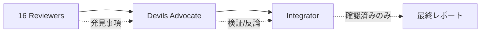

# レビューオーケストレーター

| 指標                 | 値                    |
| -------------------- | --------------------- |
| ローカルエージェント | 13                    |
| 外部エージェント     | 4 (pr-review-toolkit) |
| 合計                 | 17                    |

## エージェントグループ

| グループ    | エージェント                                                | タイムアウト | モード      |
| ----------- | ----------------------------------------------------------- | ------------ | ----------- |
| Foundation  | code-quality, progressive-enhancer                          | 35s          | parallel    |
| Quality     | type-safety, design-pattern, testability, silent-failure    | 50s          | parallel    |
| Enhanced    | silent-failure-hunter, comment-analyzer (pr-review-toolkit) | 50s          | parallel    |
| Sequential  | root-cause (foundationに依存)                               | 60s          | sequential  |
| Production  | security, performance, accessibility                        | 65s          | parallel    |
| Design      | type-design-analyzer, code-simplifier (pr-review-toolkit)   | 60s          | parallel    |
| Conditional | document (\*.md がある場合のみ)                             | 45s          | conditional |
| Validation  | devils-advocate (全発見事項を検証)                          | 90s          | sequential  |
| Integration | audit-integrator (最終)                                     | 120s         | sequential  |

## Debate パターンフロー

## エージェント配置

| 場所                      | エージェント                                               |
| ------------------------- | ---------------------------------------------------------- |
| `agents/reviewers/`       | code-quality, type-safety, design-pattern, etc.            |
| `agents/enhancers/`       | progressive-enhancer                                       |
| `agents/critics/`         | devils-advocate                                            |
| `agents/integrators/`     | audit-integrator                                           |
| 外部: `pr-review-toolkit` | silent-failure-hunter, comment-analyzer, type-design, etc. |

pr-review-toolkit エージェント: `subagent_type: "pr-review-toolkit:<agent-name>"` で呼び出し

## 検証フェーズ

| 判定            | アクション         |
| --------------- | ------------------ |
| `confirmed`     | integratorに渡す   |
| `disputed`      | 除外（FP）         |
| `downgraded`    | 重大度を調整       |
| `needs_context` | レビュー用にフラグ |

## エラーハンドリング

| 条件                     | アクション                                 |
| ------------------------ | ------------------------------------------ |
| エージェントタイムアウト | 完了分で続行                               |
| ファイルなし             | "監査対象なし"を返す                       |
| pr-review-toolkit不可    | Enhanced/Designスキップ、14ローカルで続行  |
| 外部エージェントエラー   | ローカルエージェントのみで続行             |
| Devils Advocate不可      | 検証スキップ、全発見事項をintegratorに渡す |

## 出力

`audit-integrator` の YAML 出力を呼び出し元コマンドにそのまま渡す。
