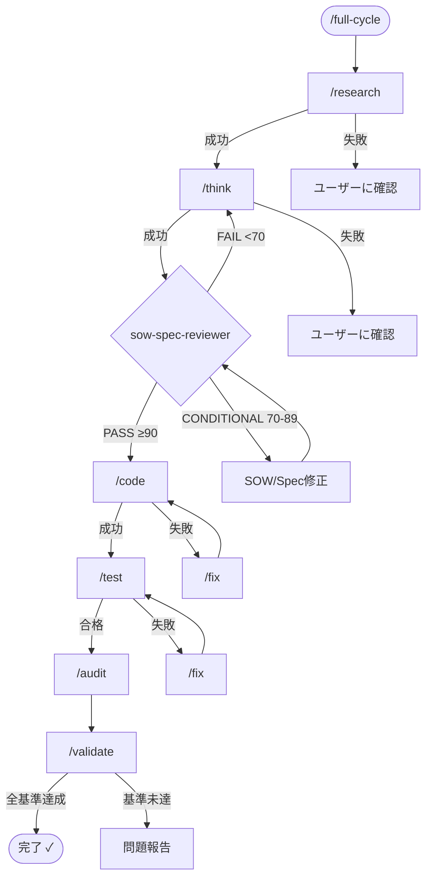

# /full-cycle - 完全開発サイクル自動化

## 目的

SlashCommandツール統合を通じて完全な開発サイクルを体系的にオーケストレーションし、リサーチから実装、テスト、バリデーションフェーズまで厳格に実行。

## ワークフロー概要



## ワークフロー指示

呼び出し時にこのコマンドシーケンスに従う。各コマンドの実行には**SlashCommandツール**を使用:

### フェーズ1: リサーチ

**SlashCommandツールで実行**: `/research [タスク説明]`

- コードベース構造を探索し、既存の実装を理解
- コンテキストのために発見を文書化
- 失敗時: ワークフローを終了しユーザーに報告

### フェーズ2: 計画

**SlashCommandツールで実行**: `/think [機能説明]`

- 受け入れ基準付きの包括的SOWを作成
- 実装アプローチとリスクを定義
- 失敗時: 1回リトライまたはユーザーに明確化を依頼

### フェーズ2.5: 設計レビュー

**Taskツールで呼び出し**: `sow-spec-reviewer`エージェント

- 生成されたsow.mdとspec.mdをレビュー
- 90点合格閾値で100点満点採点を適用
- SOW ↔ Spec整合性をチェック
- PASS（≥90）: フェーズ3へ進行
- CONDITIONAL（70-89）: 問題を修正し再レビュー
- FAIL（<70）: 明確化を得てフェーズ2に戻る

```typescript
Task({
  subagent_type: "sow-spec-reviewer",
  description: "設計ドキュメントレビュー",
  prompt: `
    SOWとSpecドキュメントをレビュー。
    100点満点採点（90点合格閾値）を適用。
    SOW ↔ Spec整合性をチェック。
    結果を日本語で報告。
  `,
});
```

### フェーズ3: 実装

**SlashCommandツールで実行**: `/code [実装詳細]`

- TDD/RGRCサイクルに従って実装
- SOLID原則とコード品質基準を適用
- 失敗時: **SlashCommandツールで`/fix`を実行**してリトライ

### フェーズ4: テスト

**SlashCommandツールで実行**: `/test`

- すべてのテストを実行（Unit、Integration、E2E）
- 品質基準を検証
- 失敗時: **SlashCommandツールで`/fix`を実行**して再テスト

### フェーズ5: レビュー

**SlashCommandツールで実行**: `/audit`

- 品質、セキュリティ、パフォーマンスのマルチエージェントコードレビュー
- 実行可能な推奨を生成
- 失敗時: 手動レビュー用に問題を文書化

### フェーズ6: バリデーション

**SlashCommandツールで実行**: `/validate`

- SOW基準に対して実装を検証
- カバレッジとパフォーマンスメトリクスをチェック
- 失敗時: 不足要件を報告

## 進捗追跡

進捗追跡に**TodoWrite**ツールを全体で使用:

```markdown
開発サイクル進捗:

- [ ] リサーチフェーズ（SlashCommandで/researchを使用）
- [ ] 計画フェーズ（SlashCommandで/thinkを使用）
- [ ] 設計レビューフェーズ（Taskでsow-spec-reviewerを使用）
- [ ] 実装フェーズ（SlashCommandで/codeを使用）
- [ ] テストフェーズ（SlashCommandで/testを使用）
- [ ] レビューフェーズ（SlashCommandで/auditを使用）
- [ ] バリデーションフェーズ（SlashCommandで/validateを使用）
```

コマンド完了時に各タスクステータスを更新。

## エラーハンドリング戦略

コマンドが失敗した場合:

1. **/codeまたは/test失敗時**: 自動的にSlashCommandで`/fix`を呼び出し
2. **/researchまたは/think失敗時**: ユーザーに明確化を依頼
3. **設計レビュー失敗時**:
   - CONDITIONAL（70-89）: 問題を表示、SOW/Specを修正、再レビュー
   - FAIL（<70）: ユーザー明確化を得て`/think`に戻る
4. **/audit失敗時**: 文書化した問題とともに継続
5. **/validate失敗時**: 失敗した特定の基準を報告

## 条件付き実行

各フェーズ後に結果を評価:

- テストカバレッジ < 80%: 追加テスト実装を検討
- クリティカルなセキュリティ問題検出: 進行前に修正を優先
- パフォーマンス問題検出: 最適化パスが必要な場合あり

## 実行例

```markdown
ユーザー: /full-cycle "ユーザー認証機能を追加"

Claude: 完全開発サイクルを開始...

[SlashCommandで実行: /research ユーザー認証]
✓ リサーチ完了 - 既存の認証パターンを発見

[SlashCommandで実行: /think OAuth2認証を追加]
✓ 8つの受け入れ基準付きSOWを作成
✓ 詳細要件付きSpecを作成

[Taskで呼び出し: sow-spec-reviewer]
📋 設計レビュースコア: 92/100 ✅ PASS

- 正確性: 23/25 ✓
- 完全性: 24/25 ✓
- 関連性: 22/25 ✓
- 実行可能性: 23/25 ✓
  ✓ 実装に進行

[SlashCommandで実行: /code OAuth2ログインフローを実装]
✓ 実装完了 - 15ファイルを変更

[SlashCommandで実行: /test]
⚠ 3つのテストが失敗

[SlashCommandで実行: /fix]
✓ 修正を適用

[SlashCommandで実行: /test]
✓ すべてのテストが合格

[SlashCommandで実行: /audit]
✓ レビュー完了 - 2つの中優先度問題を検出

[SlashCommandで実行: /validate]
✓ すべての受け入れ基準を満たす

完了！機能の実装とバリデーションが成功しました。
```

## 使用仕様

```bash
# 標準実行
/full-cycle

# フェーズを選択的にスキップ
/full-cycle --skip=research,think

# 特定フェーズから開始
/full-cycle --start-from=code

# ドライランモード（実行せずに計画を表示）
/full-cycle --dry-run
```

## 統合メリット

1. **🔄 完全自動化**: ワークフロー全体で手動介入を最小化
2. **📊 進捗の可視性**: 透明な追跡のためにTodoWriteとシームレスに統合
3. **🛡️ エラー耐性**: 自動修正付きのインテリジェントなリトライメカニズム
4. **⚡ 最適化された実行**: 最適なコマンドシーケンスとタイミングを確保

## 設定仕様

settings.jsonで動作をカスタマイズ:

```json
{
  "full_cycle": {
    "default_sequence": ["research", "think", "code", "test", "review"],
    "error_handling": "stop_on_failure",
    "parallel_execution": true,
    "auto_commit": false
  }
}
```

## 重要な要件

- SlashCommandツール（v1.0.123+）が厳密に必要
- 各コマンドの実行権限を明示的に設定必須
- 自動修正は`/fix`が利用可能な場合のみ使用
- 完了時に包括的なサマリーレポートを生成
