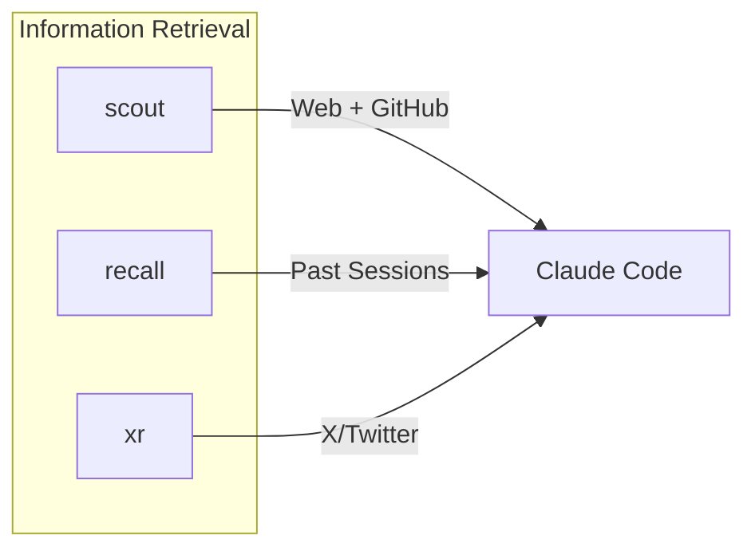

# CLI Tools

Claude Code の機能を拡張する外部 CLI ツール。

📌 [English version](../../docs/CLI_TOOLS.md)

## 概要

3 つの Rust CLI ツール。それぞれ Claude Code のデフォルト ツールに対する特定のギャップを埋めるために作られている。本ドキュメントは設計意図とアーキテクチャを扱う。

## scout

Gemini Grounding と Google 検索による Web 検索とページ取得。

| 観点    | 詳細                                                       |
| ------- | ---------------------------------------------------------- |
| Why     | WebFetch/WebSearch はトークンを消費し、Markdown 変換が弱い |
| How     | 検索は Gemini Grounding API、ページ抽出は readability      |
| Install | `brew install thkt/tap/scout`                              |
| Source  | [thkt/scout](https://github.com/thkt/scout)                |

### コマンド

| コマンド              | 用途                                          |
| --------------------- | --------------------------------------------- |
| `scout search`        | Web 検索 (Gemini Grounding)                   |
| `scout fetch`         | URL をクリーンな Markdown として取得          |
| `scout research`      | 深いリサーチ (検索 + 取得 + 編集)             |
| `scout repo-overview` | GitHub リポジトリ概要 (stars, issues, README) |
| `scout repo-tree`     | リモート GitHub リポジトリのファイル一覧      |
| `scout repo-read`     | リモート GitHub リポジトリからファイルを読む  |

### 適用条件

| scout                            | WebFetch/WebSearch  |
| -------------------------------- | ------------------- |
| 最新ドキュメント、リリースノート | 不可 (scout を優先) |
| GitHub リポジトリ探索            | 不可 (scout を優先) |
| 編集付きの深いリサーチ           | N/A                 |

## recall

過去の Claude Code・Codex セッションを横断する全文検索 (FTS5 ベースの SQLite インデックス)。

| 観点    | 詳細                                                  |
| ------- | ----------------------------------------------------- |
| Why     | JSONL のセッション履歴はデフォルトで検索できない      |
| How     | セッション トランスクリプトに対する FTS5 インデックス |
| Install | `brew install thkt/tap/recall`                        |
| Source  | [thkt/recall](https://github.com/thkt/recall)         |

### コマンド

| コマンド           | 用途                              |
| ------------------ | --------------------------------- |
| `recall "query"`   | セッション横断の全文検索          |
| `recall --days N`  | 直近 N 日にフィルタ               |
| `recall --project` | プロジェクト パスでフィルタ       |
| `recall --source`  | ソースでフィルタ (claude / codex) |
| `recall --reindex` | 完全インデックス再構築を強制      |

### 適用条件

| recall                                | Grep *.jsonl                  |
| ------------------------------------- | ----------------------------- |
| 過去の解: `how did I fix X`           | 現セッションのみ              |
| パターン想起: `what tool for Y`       | 既知の特定セッション ファイル |
| プロジェクト横断: `where did I use Z` |                               |

## xr

X/Twitter コンテンツの取得 (tweet, thread, article, user profile)。

| 観点    | 詳細                                                      |
| ------- | --------------------------------------------------------- |
| Why     | scout fetch は X/Twitter の構造化コンテンツを抽出できない |
| How     | tweet/thread/article/profile 取得のための X/Twitter API   |
| Install | `brew install thkt/tap/xr`                                |

### コマンド

| コマンド                  | 用途                        |
| ------------------------- | --------------------------- |
| `xr tweet <url>`          | 単一ツイートの取得          |
| `xr tweet <url> --thread` | スレッド付きツイートの取得  |
| `xr article <url>`        | X article の取得            |
| `xr user <screen_name>`   | ユーザー プロフィールの取得 |

### 適用条件

| xr                                | scout fetch        |
| --------------------------------- | ------------------ |
| x.com / twitter.com URL           | その他すべての URL |
| スレッド/返信のコンテキストが必要 | N/A                |
| ユーザー プロフィール検索         | N/A                |

## 関連

- [HOOKS.md](./HOOKS.md). Hook システム設計 (品質パイプラインを含む)
