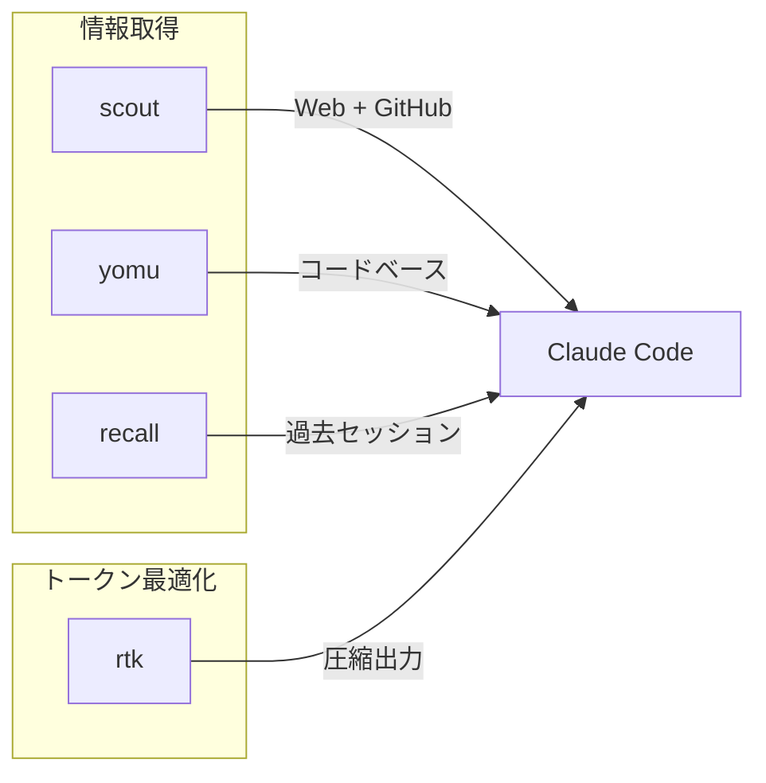

# CLIツール

Claude Codeの機能を拡張する外部CLIツール。

📌 **[English Version](../../docs/CLI_TOOLS.md)**

## 概要

4つのRust CLIツール。Claude Codeのデフォルトツールでカバーできない領域を補完する。
AI向けの選択ルールは [TOOLS.md](../rules/development/TOOLS.md) に記載。
このドキュメントでは設計意図とアーキテクチャを説明する。



## scout

Gemini Grounding with Google Searchを使ったWeb検索・ページ取得ツール。

| 項目         | 詳細                                                     |
| ------------ | -------------------------------------------------------- |
| なぜ必要か   | WebFetch/WebSearchはトークン消費が大きくMarkdown変換なし |
| 仕組み       | Gemini Grounding APIで検索、readabilityでページ抽出      |
| インストール | `brew install thkt/tap/scout`                            |
| ソース       | [thkt/scout](https://github.com/thkt/scout)              |

### コマンド

| コマンド              | 用途                                          |
| --------------------- | --------------------------------------------- |
| `scout search`        | Web検索（Gemini Grounding）                   |
| `scout fetch`         | URLをクリーンなMarkdownで取得                 |
| `scout research`      | ディープリサーチ（検索+取得+まとめ）          |
| `scout repo-overview` | GitHubリポジトリ概要（stars, issues, README） |
| `scout repo-tree`     | リモートGitHubリポジトリのファイル一覧        |
| `scout repo-read`     | リモートGitHubリポジトリのファイル読取        |

### 使い分け

| scout                        | WebFetch/WebSearch    |
| ---------------------------- | --------------------- |
| 最新ドキュメント・リリース   | 使わない（scout優先） |
| GitHubリポジトリ探索         | 使わない（scout優先） |
| まとめ付きのディープリサーチ | N/A                   |

## yomu

フロントエンドコードベース（TS/TSX/JS/CSS/HTML）のセマンティック検索。
Embeddingベース、文字列一致ではなく意味で検索。

| 項目         | 詳細                                      |
| ------------ | ----------------------------------------- |
| なぜ必要か   | Grepは完全一致。yomuは概念で検索できる    |
| 仕組み       | チャンクインデックス + Embedding検索      |
| インストール | `brew install thkt/tap/yomu`              |
| ソース       | [thkt/yomu](https://github.com/thkt/yomu) |

### コマンド

| コマンド       | 用途                                     |
| -------------- | ---------------------------------------- |
| `yomu search`  | セマンティック検索（概念・識別子・関連） |
| `yomu index`   | チャンクインデックスの増分更新           |
| `yomu rebuild` | チャンクインデックスの全再構築           |
| `yomu impact`  | ファイル・シンボルの変更影響分析         |
| `yomu status`  | インデックス統計の表示                   |

### 使い分け

| yomu                                 | Grep/Glob                             |
| ------------------------------------ | ------------------------------------- |
| 概念: "form validation", "auth flow" | リテラル: エラーメッセージ、正規表現  |
| 関連: "hooks that do Y"              | 既知パス: `src/components/Button.tsx` |
| 既知の識別子: `useAuth`              | ファイル一覧: `**/*.tsx`              |
| 名前不明: "where does X happen"      |                                       |

## recall

過去のClaude Code / Codexセッションの全文検索（FTS5ベースのSQLiteインデックス）。

| 項目         | 詳細                                           |
| ------------ | ---------------------------------------------- |
| なぜ必要か   | JONLセッション履歴はそのままでは検索不可       |
| 仕組み       | セッショントランスクリプト上のFTS5インデックス |
| インストール | `brew install thkt/tap/recall`                 |
| ソース       | [thkt/recall](https://github.com/thkt/recall)  |

### コマンド

| コマンド           | 用途                             |
| ------------------ | -------------------------------- |
| `recall "query"`   | セッション横断の全文検索         |
| `recall --days N`  | 直近N日間に限定                  |
| `recall --project` | プロジェクトパスでフィルタ       |
| `recall --source`  | ソースでフィルタ（claude/codex） |
| `recall --reindex` | インデックスの全再構築           |

### 使い分け

| recall                                | Grep \*.jsonl                |
| ------------------------------------- | ---------------------------- |
| 過去の解決策: "how did I fix X"       | 現在のセッションのみ         |
| パターン記憶: "what tool for Y"       | 特定の既知セッションファイル |
| プロジェクト横断: "where did I use Z" |                              |

## rtk（Rust Token Killer）

トークン最適化CLIプロキシ。コマンド出力からノイズを除去、テーブルを圧縮、
冗長な出力を要約してトークン消費を削減。

| 項目         | 詳細                                         |
| ------------ | -------------------------------------------- |
| なぜ必要か   | CLI出力は空白やノイズでトークンを浪費する    |
| 仕組み       | PreToolUseフックがBashコマンドを自動リライト |
| インストール | `brew install thkt/tap/rtk`                  |
| ソース       | [thkt/rtk](https://github.com/thkt/rtk)      |

### 動作原理

rtkは透過的。PreToolUseフック（`rtk-rewrite.sh`）がBashコマンドを実行前に
書き換える。手動で `rtk` プレフィックスを付ける必要はない。

```text
ユーザー入力: git status
フックが書換: rtk git status
出力: 圧縮済み、ノイズ除去済み
```

### 対応コマンド

| カテゴリ     | コマンド                                            |
| ------------ | --------------------------------------------------- |
| Git/GitHub   | git, gh                                             |
| ファイル操作 | cat/bat, rg/grep, ls/eza, tree, find/fd, diff, head |
| JS/TS        | vitest, tsc, eslint, prettier, playwright, pnpm     |
| Rust         | cargo (test/build/clippy/check/fmt)                 |
| Python       | pytest, ruff, pip, mypy                             |
| Go           | go (test/build/vet), golangci-lint                  |
| コンテナ     | docker, kubectl                                     |
| ネットワーク | curl, wget                                          |

### メタコマンド

```bash
rtk gain              # トークン削減分析
rtk gain --history    # コマンド使用履歴
rtk discover          # 最適化の機会を分析
```

## 関連

- [TOOLS.md](../rules/development/TOOLS.md) — AI向けツール選択ルール
- [HOOKS.md](./HOOKS.md) — フックシステム設計（品質パイプライン含む）
