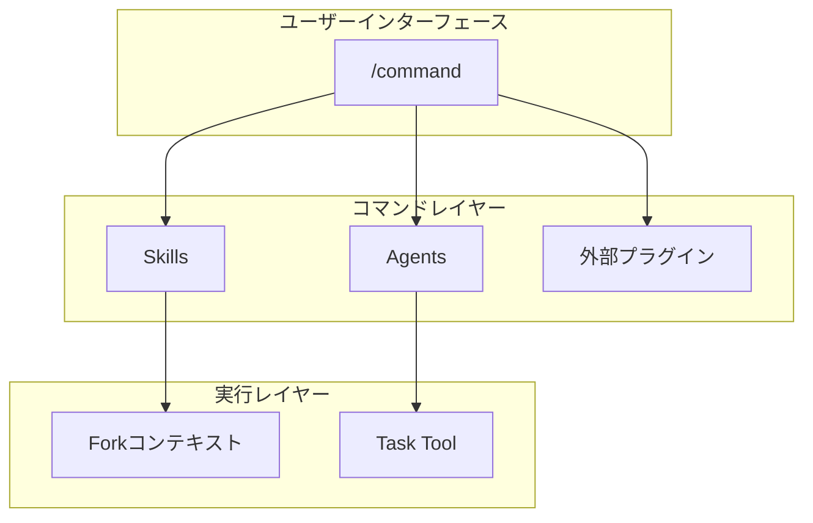
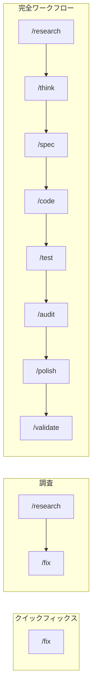

# コマンド設計

コマンドの設計意図と関係性を説明します。

📌 **[English Version](../../docs/COMMANDS.md)**

## アーキテクチャ



## コマンドカテゴリ

| カテゴリ     | コマンド                                         | 目的             |
| ------------ | ------------------------------------------------ | ---------------- |
| 計画         | `/think`, `/research`, `/sow`, `/spec`, `/plans` | 要件定義・調査   |
| 実装         | `/code`, `/fix`, `/test`                         | コード実装       |
| 品質         | `/audit`, `/polish`, `/validate`                 | 品質保証         |
| ドキュメント | `/docs`, `/adr`, `/rulify`, `/e2e`               | ドキュメント生成 |
| Git          | `/commit`, `/branch`, `/pr`, `/issue`            | Git操作          |

## 設計原則

### 1. Thin Wrapper パターン

コマンドは「オーケストレーター」であり、実装詳細を持たない。

```markdown
# 良い例: /code

- Skills: orchestrating-workflows (RGRC定義)
- Agents: test-generator (テスト生成)
- Plugins: ralph-loop (自動イテレーション)

# 悪い例

- コマンド内にTDD手順をハードコード
```

### 2. 条件付きコンテキストロード

必要な時だけスキルをロード。

```markdown
/code --frontend → applying-frontend-patterns をロード
/code --principles → applying-code-principles をロード
/code (フラグなし) → 追加スキルなし
```

### 3. グレースフルデグラデーション

外部プラグインがなくても動作する。

```markdown
ralph-loop あり → 自動RGRC反復
ralph-loop なし → 手動確認モード (機能は同じ)
```

## コマンドの関係性



| パターン             | 使用場面               |
| -------------------- | ---------------------- |
| `/fix` のみ          | 原因が明確な小さなバグ |
| `/research` → `/fix` | 原因不明の問題         |
| 完全ワークフロー     | 新機能、複雑な変更     |

## コマンド → スキル/エージェント対応表

| コマンド  | 使用スキル                                    | 使用エージェント   |
| --------- | --------------------------------------------- | ------------------ |
| `/think`  | -                                             | -                  |
| `/code`   | orchestrating-workflows, generating-tdd-tests | test-generator     |
| `/audit`  | applying-code-principles                      | 13 reviewer agents |
| `/fix`    | -                                             | -                  |
| `/polish` | -                                             | code-simplifier    |
| `/docs`   | documenting-\*                                | \*-analyzer        |

## ファイル構造

```text
commands/
├── code.md      # YAML front matter + 実行手順
├── fix.md
├── think.md
└── ...
```

### Front Matter フィールド

| フィールド      | 必須 | 目的                            |
| --------------- | ---- | ------------------------------- |
| `description`   | ✓    | コマンドの説明（Skill表示用）   |
| `allowed-tools` | ✓    | 使用可能なツール                |
| `model`         | -    | 使用モデル（opus/sonnet/haiku） |
| `argument-hint` | -    | 引数のヒント表示                |

## 関連

- [SKILLS_AGENTS.md](./SKILLS_AGENTS.md) — スキル・エージェントの詳細
- [WORKFLOW_GUIDE](../rules/workflows/WORKFLOW_GUIDE.md) — ワークフロー選択ガイド
