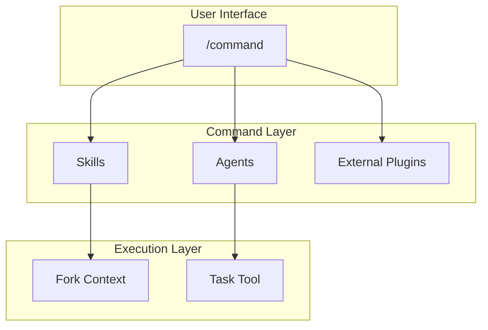

# Commands Design

コマンドの設計と関係。

📌 [English version](../../docs/COMMANDS.md)

## アーキテクチャ



## 設計原則

### 1. Thin Wrapper パターン

コマンドはオーケストレータ。実装詳細は持たない。

```markdown
# Good: /code

- Skills: use-workflow-code (RGRC definition)
- Agents: generator-test (test generation)
- Native: /goal (optional autonomous iteration)

# Bad

- TDD ステップをコマンド内にハードコード
```

### 2. 条件付きコンテキスト ロード

必要なときにのみ skill をロードする。

```markdown
/code (フラグなし) → 追加 skill なし
```

### 3. Graceful Degradation

外部プラグインなしでもコマンドが動く。

```markdown
/goal ラップあり → 自律反復; なし → gates 自動リトライ + 手動確認 (同機能)
```

## Command → Skill/Agent マッピング

| コマンド   | 使用 Skill                                | 使用 Agent                                                       |
| ---------- | ----------------------------------------- | ---------------------------------------------------------------- |
| `/think`   | -                                         | -                                                                |
| `/code`    | use-workflow-code, use-workflow-tdd-cycle | generator-test                                                   |
| `/audit`   | -                                         | tier ベースの reviewer agent (3 つまたは 17 からファイル ルート) |
| `/fix`     | use-context-root-cause-analysis           | generator-test, resolver-build                                   |
| `/polish`  | -                                         | enhancer-code                                                    |
| `/feature` | think, code, audit, fix, polish (連鎖)    | -                                                                |
| `/swarm`   | use-workflow-code                         | architect-feature, team-qa, generator-test, team-implementation  |

## ファイル構造

```text
skills/
├── code/SKILL.md      # YAML frontmatter + 実行ステップ
├── fix/SKILL.md
├── think/SKILL.md
└── ...
```

### Frontmatter フィールド

| フィールド      | 必須 | 用途                             |
| --------------- | ---- | -------------------------------- |
| `description`   | ✓    | コマンド説明 (Skill picker 表示) |
| `allowed-tools` | ✓    | 許可ツール                       |
| `model`         | -    | 使用モデル (opus/sonnet/haiku)   |
| `argument-hint` | -    | 引数入力時に表示するヒント       |

## 関連

- [SKILLS_AGENTS.md](./SKILLS_AGENTS.md). Skill とエージェントのリファレンス
