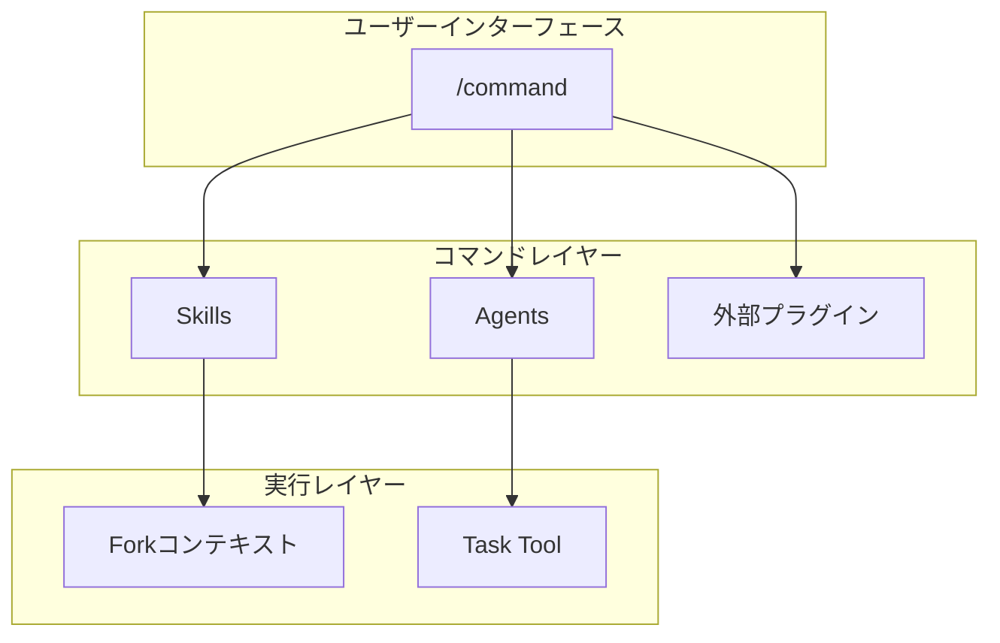

# コマンド設計

コマンドの設計と関係性。

📌 **[English Version](../../docs/COMMANDS.md)**

## アーキテクチャ



## コマンド & ワークフロー

[WORKFLOW_REFERENCE](../rules/workflows/WORKFLOW_REFERENCE.md)
にコマンド一覧と選択ガイドあり。

## 設計原則

### 1. Thin Wrapper パターン

コマンドはオーケストレーター、実装詳細を持たない。

```markdown
# 良い例: /code

- Skills: orchestrating-workflows (RGRC定義)
- Agents: test-generator (テスト生成)
- Plugins: ralph-loop (自動イテレーション)

# 悪い例

- コマンド内にTDD手順をハードコード
```

### 2. 条件付きコンテキストロード

必要時のみスキルをロード。

```markdown
/code --frontend → applying-frontend-patterns をロード /code --principles →
applying-code-principles をロード /code (フラグなし) → 追加スキルなし
```

### 3. グレースフルデグラデーション

外部プラグインなしでも動作。

```markdown
ralph-loop あり → 自動RGRC反復 ralph-loop なし → 手動確認モード (機能は同じ)
```

## コマンド → スキル/エージェント対応表

| コマンド   | 使用スキル                                    | 使用エージェント                                                      |
| ---------- | --------------------------------------------- | --------------------------------------------------------------------- |
| `/think`   | -                                             | -                                                                     |
| `/code`    | orchestrating-workflows, generating-tdd-tests | test-generator                                                        |
| `/audit`   | applying-code-principles                      | 13 reviewer agents                                                    |
| `/fix`     | -                                             | -                                                                     |
| `/polish`  | -                                             | code-simplifier                                                       |
| `/feature` | orchestrating-workflows                       | feature-explorer, feature-architect, test-generator, unit-implementer |
| `/docs`    | documenting-\*                                | \*-analyzer                                                           |

## ファイル構造

```text
commands/
├── code.md      # YAML front matter + 実行手順
├── fix.md
├── think.md
└── ...
```

### Front Matter フィールド

| フィールド      | 必須 | 目的                            |
| --------------- | ---- | ------------------------------- |
| `description`   | ✓    | コマンドの説明（Skill表示用）   |
| `allowed-tools` | ✓    | 使用可能なツール                |
| `model`         | -    | 使用モデル（opus/sonnet/haiku） |
| `argument-hint` | -    | 引数のヒント表示                |

## 関連

- [SKILLS_AGENTS.md](./SKILLS_AGENTS.md) — スキル・エージェントの詳細
- [WORKFLOW_REFERENCE](../rules/workflows/WORKFLOW_REFERENCE.md)
  — ワークフロー選択ガイド
