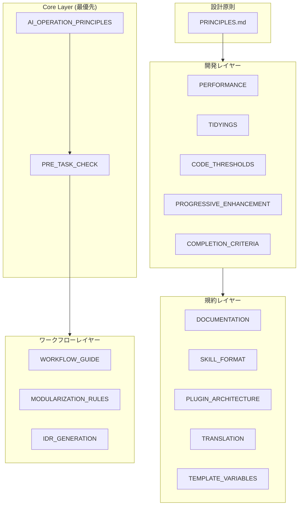
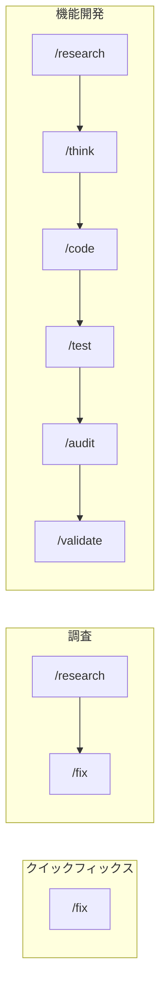

# 設計思想

この設定は **AIコーディングアシスタントの一貫性と品質を確保するためのフレームワーク** として設計されています。

📌 **[English Version](../../docs/DESIGN.md)**

## アーキテクチャ概要



## レイヤー別の設計意図

### 1. Core Layer — 安全性と透明性

最優先で適用されるルール。AIの「暴走」を防ぎ、ユーザーが常に状況を把握できるようにする。

| ファイル                                                            | 意図               | 主要な仕組み                                            |
| ------------------------------------------------------------------- | ------------------ | ------------------------------------------------------- |
| [AI_OPERATION_PRINCIPLES](../rules/core/AI_OPERATION_PRINCIPLES.md) | 安全性の担保       | `rm`禁止→`mv ~/.Trash/`、破壊的操作の確認               |
| [PRE_TASK_CHECK](../rules/core/PRE_TASK_CHECK.md)                   | タスクチェック統合 | 7項目チェック、マーカー、スキップ条件、完了テンプレート |

**この設計の理由:**

- `rm`を禁止し`mv ~/.Trash/`に置換することで、macOSのゴミ箱復元機能を活用
- 出力検証マーカー `[✓][→][?]` でAIの確信度を明示化
- 7項目チェックで「わかったつもり」による誤実装を防止

### 2. Design Principles — 判断基準

設計判断の優先順位と衝突時の解決ルールを定義。

| ファイル                                | 意図                               |
| --------------------------------------- | ---------------------------------- |
| [PRINCIPLES.md](../rules/PRINCIPLES.md) | 原則の優先順位、依存関係、衝突解決 |

**原則の階層:**

```text
Occam's Razor (メタ原則 - すべての複雑さを疑う)
    ↓
Progressive Enhancement / Readable Code / DRY (普遍的)
    ↓
TDD / SOLID / YAGNI (文脈依存)
```

**衝突解決の例:**

| 衝突              | 勝者     | 理由                                     |
| ----------------- | -------- | ---------------------------------------- |
| DRY vs 可読性     | 可読性   | 抽象化が理解を妨げるなら重複を許容       |
| SOLID vs シンプル | シンプル | 将来のためのoverdesignを避ける           |
| 完璧 vs 動作      | 動作     | 不完全な抽象化でも問題を解決するなら出荷 |

### 3. Development Layer — 実践的な基準

日々の開発で適用する具体的な基準とパターン。

| ファイル                                                                   | 意図                              | 主要な閾値                         |
| -------------------------------------------------------------------------- | --------------------------------- | ---------------------------------- |
| [CODE_THRESHOLDS](../rules/development/CODE_THRESHOLDS.md)                 | 定量的品質基準                    | 関数≤30行、ファイル≤400行          |
| [TIDYINGS](../rules/development/TIDYINGS.md)                               | 整理範囲の限定                    | 振る舞い変更禁止、編集ファイルのみ |
| [PERFORMANCE](../rules/development/PERFORMANCE.md)                         | コンテキスト/フロントエンド最適化 | MCP≤10、LCP<2.5s                   |
| [PROGRESSIVE_ENHANCEMENT](../rules/development/PROGRESSIVE_ENHANCEMENT.md) | 漸進的構築                        | CSS-First、Outcome-First           |
| [COMPLETION_CRITERIA](../rules/development/COMPLETION_CRITERIA.md)         | 完了基準                          | tests pass、lint pass、build pass  |

**AI失敗パターン (インライン):**

| パターン         | トリガー                       | アクション                     |
| ---------------- | ------------------------------ | ------------------------------ |
| コンテキスト膨張 | 使用率 >70%                    | `/clear` または `/compact`     |
| 繰り返し修正     | 同じエラーで3回目              | より具体的にプロンプトを再構成 |
| 無限探索         | >10ファイル読み込み、編集なし  | subagentでスコープを絞る       |
| 間違った方向     | 「それは望んでいたものと違う」 | `/rewind` でチェックポイントへ |

**この設計の理由:**

- AI特有の「無限探索」「繰り返し修正」を自己検知
- `TIDYINGS`で「何を整理してよいか」を明確化し、過剰リファクタリングを防止
- 定量基準（30行、400行）で主観を排除

### 4. Conventions Layer — 一貫性のルール

ドキュメント・プラグイン・翻訳の一貫性を保つルール。

| ファイル                                                           | 意図                |
| ------------------------------------------------------------------ | ------------------- |
| [DOCUMENTATION](../rules/conventions/DOCUMENTATION.md)             | 文書構造の統一      |
| [SKILL_FORMAT](../rules/conventions/SKILL_FORMAT.md)               | Skill定義の標準形式 |
| [PLUGIN_ARCHITECTURE](../rules/conventions/PLUGIN_ARCHITECTURE.md) | プラグイン制約      |
| [TRANSLATION](../rules/conventions/TRANSLATION.md)                 | EN/JP同期ルール     |
| [TEMPLATE_VARIABLES](../rules/conventions/TEMPLATE_VARIABLES.md)   | 変数置換構文        |

**この設計の理由:**

- 参照深度を制限（Skills: 1階層、Rules: 3階層）して部分読み込み問題を回避
- EN/JP構造を揃えつつ、翻訳内容の差異は許容

### 5. Workflows Layer — ユーザーインターフェース

ユーザー向けのコマンドとワークフロー体系。

| ファイル                                                           | 意図               |
| ------------------------------------------------------------------ | ------------------ |
| [WORKFLOW_GUIDE](../rules/workflows/WORKFLOW_GUIDE.md)             | コマンド選択ガイド |
| [MODULARIZATION_RULES](../rules/workflows/MODULARIZATION_RULES.md) | コマンド分割基準   |
| [IDR_GENERATION](../rules/workflows/IDR_GENERATION.md)             | 実装記録の自動生成 |

**ワークフローパターン:**



## 根底にある思想

| 思想       | 実装                                        |
| ---------- | ------------------------------------------- |
| **透明性** | チェックリスト、確信度マーカー、進捗可視化  |
| **安全性** | 破壊的操作禁止/確認、ゴミ箱移動、復元可能性 |
| **一貫性** | 命名規則、ファイル構成、コマンド体系        |
| **学習性** | Explanatory mode、Insight表示               |

これらは「**AIは間違える**」という前提のもと、以下を実現するための仕組み：

- 間違いを**検知しやすく**する
- 間違いを**修正しやすく**する
- 間違いの**被害を最小化**する

## 詳細ドキュメント

より詳細な設計意図については、以下のドキュメントを参照してください：

| ドキュメント                        | 内容                                         |
| ----------------------------------- | -------------------------------------------- |
| [COMMANDS](./COMMANDS.md)           | コマンドの設計意図と関係性                   |
| [SKILLS_AGENTS](./SKILLS_AGENTS.md) | スキル・エージェントの仕組みと使い分け       |
| [HOOKS](./HOOKS.md)                 | フックシステムとIDR生成                      |
| [TEMPLATES](./TEMPLATES.md)         | テンプレート体系とドキュメントライフサイクル |

---

_この設計ドキュメントは設定の「なぜ」を説明しています。「使い方」については [README.md](../README.md) を参照してください。_
