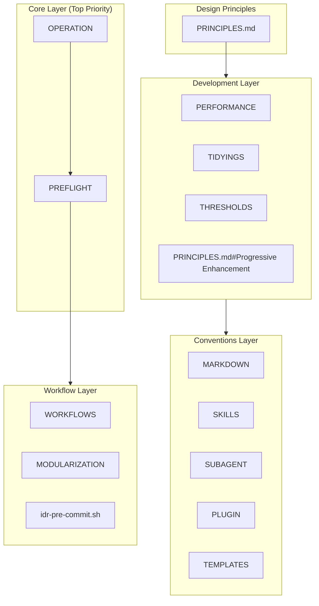
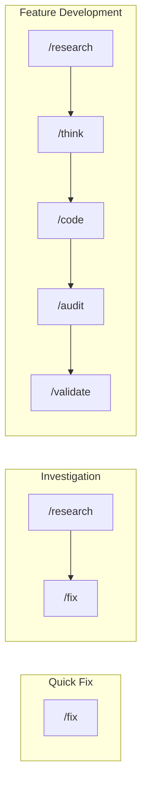

# Design Philosophy

AI コーディング アシスタントの一貫性と品質のためのフレームワーク。

📌 [English version](../../docs/DESIGN.md)

## アーキテクチャ概要



## レイヤー別の設計意図

### 1. Core Layer. 安全性と透明性

最優先のルール。AI の暴走を防ぎ、ユーザーに状況を伝える。

| ファイル                                | 意図             | 主な仕組み                                    |
| --------------------------------------- | ---------------- | --------------------------------------------- |
| [OPERATION](../rules/core/OPERATION.md) | 安全性の確保     | `rm` 禁止 → `mv ~/.Trash/`、破壊的操作の確認 |
| [PREFLIGHT](../rules/core/PREFLIGHT.md) | タスク確認の統一 | Rationalization counter、分割閾値、完了の定義 |

設計理由:

- `rm` を禁止し、`mv ~/.Trash/` で macOS のごみ箱回復を活用
- Rationalization counter がモデルによる scope check の自己除外を防ぐ
- 分割閾値 (Files ≥5, Features ≥3) がスコープ膨張を防ぐ

### 2. Design Principles. 意思決定フレームワーク

設計判断のための優先順位と衝突解決。

| ファイル                                | 意図                             |
| --------------------------------------- | -------------------------------- |
| [PRINCIPLES.md](../rules/PRINCIPLES.md) | 原則の優先度、依存関係、衝突解決 |

原則の階層:

```text
Occam's Razor (Meta. すべての複雑性に問いを立てる)
    ↓
Progressive Enhancement / Readable Code / DRY (Universal)
    ↓
TDD / SOLID / YAGNI (Contextual)
```

衝突解決の例:

| 衝突               | 勝つ側   | 理由                                 |
| ------------------ | -------- | ------------------------------------ |
| DRY vs Readable    | Readable | 明瞭性を損なう抽象より重複           |
| SOLID vs Simple    | Simple   | 想像上の将来のための過剰設計を避ける |
| Perfect vs Working | Working  | 実問題を解くなら出荷する             |

### 3. Development Layer. 実用基準

日々の開発のための具体的な基準。

| ファイル                                                        | 意図                     | 主な閾値                           |
| --------------------------------------------------------------- | ------------------------ | ---------------------------------- |
| [THRESHOLDS](../rules/development/THRESHOLDS.md)                | 品質メトリクス + 完了    | 関数 ≤30 行、テスト合格           |
| [TIDYINGS](../rules/development/TIDYINGS.md)                    | クリーンアップの範囲制限 | 振る舞い変更なし、編集ファイル限定 |
| [PERFORMANCE](../rules/development/PERFORMANCE.md)              | コンテキスト管理         | MCP ≤10、`/compact` >70%          |
| [PRINCIPLES.md#Progressive Enhancement](../rules/PRINCIPLES.md) | 段階的構築               | CSS-First、Outcome-First           |

AI 失敗パターン (インライン):

| パターン             | トリガー                  | アクション                   |
| -------------------- | ------------------------- | ---------------------------- |
| Context Bloat        | 使用率 >70%               | `/clear` または `/compact`   |
| Repeated Fixes       | 同じエラーで 3 回目       | 具体性を増して再フレーム     |
| Infinite Exploration | 10 ファイル以上読み未編集 | サブエージェントで縮小       |
| Wrong Direction      | 「望んだものではない」    | チェックポイントへ `/rewind` |

設計理由:

- 無限探索や繰り返し修正など AI のパターンを自己検出
- `TIDYINGS` がクリーンアップ範囲を絞り、過剰リファクタを防ぐ
- 定量的閾値 (30 行、400 行) が主観性を排除

### 4. Conventions Layer. 一貫性ルール

ドキュメント、プラグイン、翻訳の一貫性。

| ファイル                                       | 意図                       |
| ---------------------------------------------- | -------------------------- |
| [MARKDOWN](../rules/conventions/MARKDOWN.md)   | Markdown 規約              |
| [SKILLS](../rules/conventions/SKILLS.md)       | Skill 定義の標準           |
| [SUBAGENT](../rules/conventions/SUBAGENT.md)   | サブエージェント定義の標準 |
| [PLUGIN](../rules/conventions/PLUGIN.md)       | プラグイン制約             |
| [TEMPLATES](../rules/conventions/TEMPLATES.md) | 変数置換構文               |

設計理由:

- 部分読み取りの問題を避けるため、参照深度を制限 (Skills 1 階層、Rules 3 階層)
- 翻訳内容の差を許容しつつ EN/JP の構造を揃える

### 5. Workflows Layer. ユーザー インターフェース

ユーザー向けコマンドとワークフロー システム。

| ファイル                                                     | 意図               |
| ------------------------------------------------------------ | ------------------ |
| [WORKFLOWS](../rules/workflows/WORKFLOWS.md)                 | コマンド選択ガイド |
| [MODULARIZATION](../rules/workflows/MODULARIZATION.md)       | コマンド分割基準   |
| [idr-pre-commit.sh](../../hooks/lifecycle/idr-pre-commit.sh) | 実装記録の自動生成 |

ワークフロー パターン:



## 根底の哲学

| 哲学         | 実装                                              |
| ------------ | ------------------------------------------------- |
| Transparency | チェックリスト、出典引用、進捗の可視化            |
| Safety       | 破壊的操作の禁止/確認、ごみ箱への移動、復旧可能性 |
| Consistency  | 命名規約、ファイル構造、コマンド体系              |
| Learnability | 説明モード、Insight 表示                          |

「AI は誤る」を前提にする。

- 誤りを発見しやすくする
- 誤りを修正しやすくする
- 誤りの被害を最小化する

## 詳細ドキュメント

| ドキュメント                        | 内容                       |
| ----------------------------------- | -------------------------- |
| [COMMANDS](./COMMANDS.md)           | コマンドの設計と関係       |
| [SKILLS_AGENTS](./SKILLS_AGENTS.md) | Skill/agent の仕組みと利用 |
| [HOOKS](./HOOKS.md)                 | Hook システムと IDR 生成   |
| [GLOSSARY](./GLOSSARY.md)           | ユビキタス言語辞書         |

---

_設定の「なぜ」を説明する。「使い方」については [README.md](../README.md) を参照。_
