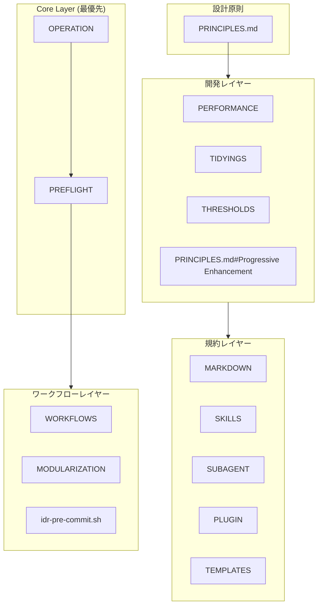
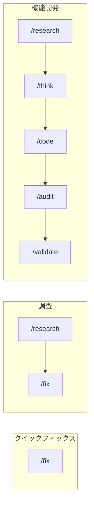

# 設計思想

**AIコーディングアシスタントの一貫性と品質確保フレームワーク。**

📌 **[English Version](../../docs/DESIGN.md)**

## アーキテクチャ概要



## レイヤー別の設計意図

### 1. Core Layer — 安全性と透明性

最優先で適用。AIの暴走を防ぎ、ユーザーの状況把握を確保。

| ファイル                                                            | 意図               | 主要な仕組み                              |
| ------------------------------------------------------------------- | ------------------ | ----------------------------------------- |
| [OPERATION](../rules/core/OPERATION.md) | 安全性の担保       | `rm`禁止→`mv ~/.Trash/`、破壊的操作の確認 |
| [PREFLIGHT](../rules/core/PREFLIGHT.md)                   | タスクチェック統合 | 合理化カウンター、分解閾値、完了定義      |

**理由:**

- `rm`禁止; `mv ~/.Trash/`でmacOSゴミ箱復元を活用
- 合理化カウンターでモデルのスコープチェック自己免除を防止
- 分解閾値（Files ≥5、Features ≥3）でスコープクリープを防止

### 2. Design Principles — 判断基準

優先順位と衝突解決ルール。

| ファイル                                | 意図                               |
| --------------------------------------- | ---------------------------------- |
| [PRINCIPLES.md](../rules/PRINCIPLES.md) | 原則の優先順位、依存関係、衝突解決 |

**階層:**

```text
Occam's Razor (メタ原則 - すべての複雑さを疑う)
    ↓
Progressive Enhancement / Readable Code / DRY (普遍的)
    ↓
TDD / SOLID / YAGNI (文脈依存)
```

**衝突解決:**

| 衝突              | 勝者     | 理由                             |
| ----------------- | -------- | -------------------------------- |
| DRY vs 可読性     | 可読性   | 可読性を損なう抽象化より重複許容 |
| SOLID vs シンプル | シンプル | overdesignを避ける               |
| 完璧 vs 動作      | 動作     | 実問題を解決するなら出荷         |

### 3. Development Layer — 実践的な基準

日々の開発で適用する具体的基準。

| ファイル                                                        | 意図                              | 主要な閾値                         |
| --------------------------------------------------------------- | --------------------------------- | ---------------------------------- |
| [THRESHOLDS](../rules/development/THRESHOLDS.md)      | 品質基準 + 完了条件               | 関数≤30行、tests pass              |
| [TIDYINGS](../rules/development/TIDYINGS.md)                    | 整理範囲の限定                    | 振る舞い変更禁止、編集ファイルのみ |
| [PERFORMANCE](../rules/development/PERFORMANCE.md)              | コンテキスト/フロントエンド最適化 | MCP≤10、LCP<2.5s                   |
| [PRINCIPLES.md#Progressive Enhancement](../rules/PRINCIPLES.md) | 漸進的構築                        | CSS-First、Outcome-First           |

**AI失敗パターン:**

| パターン         | トリガー                       | アクション                     |
| ---------------- | ------------------------------ | ------------------------------ |
| コンテキスト膨張 | 使用率 >70%                    | `/clear` または `/compact`     |
| 繰り返し修正     | 同じエラーで3回目              | プロンプトを再構成             |
| 無限探索         | >10ファイル読み込み、編集なし  | subagentでスコープを絞る       |
| 間違った方向     | 「それは望んでいたものと違う」 | `/rewind` でチェックポイントへ |

**理由:**

- AI特有パターン（無限探索、繰り返し修正）を自己検知
- `TIDYINGS`で整理範囲を限定、過剰リファクタリングを防止
- 定量基準（30行、400行）で主観を排除

### 4. Conventions Layer — 一貫性のルール

ドキュメント・プラグイン・翻訳の一貫性確保。

| ファイル                                                           | 意図                |
| ------------------------------------------------------------------ | ------------------- |
| [MARKDOWN](../rules/conventions/MARKDOWN.md)                       | Markdown規約 |
| [SKILLS](../rules/conventions/SKILLS.md)                           | Skill定義の標準形式            |
| [SUBAGENT](../rules/conventions/SUBAGENT.md)                       | サブエージェント定義の標準形式 |
| [PLUGIN](../rules/conventions/PLUGIN.md)                           | プラグイン制約      |
| [TEMPLATES](../rules/conventions/TEMPLATES.md)                     | 変数置換構文        |

**理由:**

- 参照深度制限（Skills: 1階層、Rules: 3階層）で部分読み込み問題を回避
- EN/JP構造を揃えつつ、翻訳内容の差異は許容

### 5. Workflows Layer — ユーザーインターフェース

ユーザー向けのコマンドとワークフロー体系。

| ファイル                                                           | 意図               |
| ------------------------------------------------------------------ | ------------------ |
| [WORKFLOWS](../rules/workflows/WORKFLOWS.md)     | コマンド選択ガイド |
| [MODULARIZATION](../rules/workflows/MODULARIZATION.md) | コマンド分割基準   |
| [idr-pre-commit.sh](../hooks/lifecycle/idr-pre-commit.sh)          | 実装記録の自動生成 |

**ワークフローパターン:**



## 根底にある思想

| 思想       | 実装                                        |
| ---------- | ------------------------------------------- |
| **透明性** | チェックリスト、確信度マーカー、進捗可視化  |
| **安全性** | 破壊的操作禁止/確認、ゴミ箱移動、復元可能性 |
| **一貫性** | 命名規則、ファイル構成、コマンド体系        |
| **学習性** | Explanatory mode、Insight表示               |

「**AIは間違える**」前提で：

- 間違いを**検知しやすく**する
- 間違いを**修正しやすく**する
- 間違いの**被害を最小化**する

## 詳細ドキュメント

参照:

| ドキュメント                        | 内容                                         |
| ----------------------------------- | -------------------------------------------- |
| [COMMANDS](./COMMANDS.md)           | コマンドの設計と関係性                       |
| [SKILLS_AGENTS](./SKILLS_AGENTS.md) | スキル・エージェントの仕組みと使い分け       |
| [HOOKS](./HOOKS.md)                 | フックシステムとIDR生成                      |
| [TEMPLATES](./TEMPLATES.md)         | テンプレート体系とドキュメントライフサイクル |
| [GLOSSARY](./GLOSSARY.md)           | ユビキタス言語辞書                           |

---

_設定の「なぜ」を説明。「使い方」は [README.md](../README.md) 参照。_
