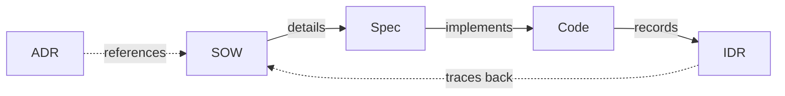

# Glossary

このプロジェクトのユビキタス言語辞書。

📌 [English version](../../docs/GLOSSARY.md)

## ドキュメント

| 用語 | 正式名称                       | 用途                 | 生成元              | 読み手 | ライフサイクル |
| ---- | ------------------------------ | -------------------- | ------------------- | ------ | -------------- |
| ADR  | Architecture Decision Record   | 技術判断の記録       | `/adr`              | 人間   | 受理後は不変   |
| SOW  | Statement of Work              | 計画、スコープ、基準 | `/think`            | AI     | 承認後は静的   |
| Spec | Specification                  | 実装詳細、テスト     | `/think`            | AI     | 承認後は静的   |
| IDR  | Implementation Decision Record | 実装記録             | `git commit` フック | 人間   | 追記のみ       |

### ADR. Architecture Decision Record

答えること: 「なぜこのアプローチを選んだのか」

技術判断 (技術選定、アーキテクチャ パターン、廃止、プロセス変更) の根拠を記録する。MADR 形式の prose スタイルで書き、数か月から数年後に文脈を理解する必要がある人間の読者に最適化する。

主な特性:

- 読み手は将来の開発者。プロジェクトに加わった人が ADR を読むことで過去の判断を理解できる
- 受理後は不変。新たな ADR で置換されるが、編集はしない
- プレースホルダより prose。ADR-0008 で、人間向けドキュメントは構造化テーブルではなく物語的に書くと定めた
- 判断種別ごとに 4 つのテンプレート バリアントがある: technology-selection, architecture-pattern, deprecation, process-change

配置: `adr/NNNN-title.md`

### SOW. Statement of Work

答えること: 「何を作るのか、完了の判定はどうするのか」

スコープ、受け入れ基準、実装アプローチを定める計画文書。`/think` の中で、設計探索 (アプローチ比較、自己反論、ドメイン/技術視点) の後に作成される。

主な特性:

- 読み手は AI。`/validate` と `/code` が機械的にパースできる構造化テーブル
- 承認後は静的。ユーザーが承認したら SOW は変更しない
- AC-N 受け入れ基準。シンプルな番号付きチェックリスト (WHEN/THEN 形式ではない。ADR-0008 で未使用の I-001/A-001 体系から簡略化された)
- YAGNI チェックリストを含む。除外する機能を明示し、スコープ膨張を防ぐ
- Spec と対。SOW は「何を/なぜ」、Spec は「どう」を定める

配置: `workspace/planning/YYYY-MM-DD-[feature]/sow.md`

### Spec. Specification

答えること: 「具体的にどう実装するのか」

SOW の受け入れ基準を機能要件、テスト シナリオ、ドメイン モデルに落とす。`/code` 実装の主入力。

主な特性:

- 読み手は AI。完全な追跡性を持つ構造化テーブル (`FR-001 Implements: AC-001` → `T-001 Validates: FR-001`)
- 承認後は静的。SOW と一緒にロックされる
- ドメイン モデルの深さは可変。CLI/設定向けには簡潔なデータ モデル、ビジネス アプリ向けには詳細なエンティティ/ビジネス ルール/イベント (ADR-0008 の閾値: エンティティ 3 以上またはビジネス ルール 3 以上)
- テスト シナリオが詳細を持つ。テスト計画は SOW ではなく Spec にある (ADR-0008 で重複を排除)
- 追跡性マトリクス。すべての AC が FR、テスト、NFR にマップされる

配置: `workspace/planning/YYYY-MM-DD-[feature]/spec.md`

### IDR. Implementation Decision Record

答えること: 「実装中に実際に何が起きたか」

各コミットの変更を自動生成する記録。コーディング中に下した判断を捕捉する。`claude-idr` (Rust バイナリ) が git pre-commit フック時にセッション ログと diff を分析して作成する。

主な特性:

- 読み手は人間レビュアー。構造化データではなく、変更の物語的なサマリ
- 追記のみ。各コミットが新規 IDR ファイルを追加し、過去のものは変更しない
- 自動。手動操作不要。フックが git diff + セッション コンテキストから生成する
- SOW へ追跡可能。SOW があれば同じディレクトリに置かれ、計画から実行へのリンクを提供する
- 連番。feature ディレクトリ内で `idr-01.md`, `idr-02.md`, ... と続く

配置: `workspace/planning/[feature]/idr-NN.md` または `workspace/planning/YYYY-MM-DD/idr-NN.md`

### ドキュメントの関係



| 関係         | 仕組み                                            |
| ------------ | ------------------------------------------------- |
| SOW → Spec  | SOW の AC-N → Spec の FR-NNN `Implements: AC-N`  |
| Spec → Code | `/code` が Spec を実装入力として読む              |
| Code → IDR  | git commit フックが diff から IDR を自動生成      |
| ADR → SOW   | `/think` Step 5.5 が主要判断に対し ADR を提案する |
| IDR → SOW   | IDR は同ディレクトリに置かれ、計画へ追跡可能      |

## ID 規約

| 接頭辞  | 意味                       | 利用先 | 例      |
| ------- | -------------------------- | ------ | ------- |
| AC-NNN  | Acceptance Criteria        | SOW    | AC-001  |
| FR-NNN  | Functional Requirement     | Spec   | FR-001  |
| T-NNN   | Test Scenario              | Spec   | T-001   |
| NFR-NNN | Non-Functional Requirement | Spec   | NFR-001 |
| BR-NNN  | Business Rule              | Spec   | BR-001  |
| RC-NNN  | Root Cause                 | Audit  | RC-001  |
| SUG-NNN | Suggestion                 | Audit  | SUG-001 |

### 追跡性

```text
AC-001 ← FR-001 ← T-001
              ↑        ↑
           NFR-001   BR-001
```

ID はドキュメント間で追跡される。SOW 受け入れ基準 → Spec 要件 → テスト シナリオ。

## 関連

- [DESIGN](./DESIGN.md). アーキテクチャ概要
- [HOOKS](./HOOKS.md). IDR 生成の詳細
