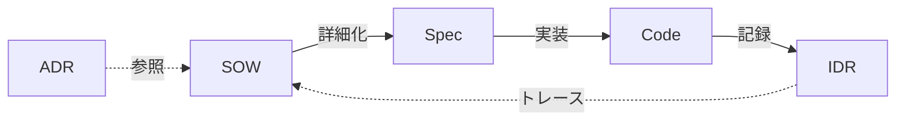

# 用語集（ユビキタス言語辞書）

プロジェクト全体で統一して使う用語の定義。

## ドキュメント

| 略称     | 正式名称                       | 目的                     | 生成元            | 対象読者 | ライフサイクル    |
| -------- | ------------------------------ | ------------------------ | ----------------- | -------- | ----------------- |
| **ADR**  | Architecture Decision Record   | 技術的意思決定の記録     | `/adr`            | 人間     | Accepted 後は不変 |
| **SOW**  | Statement of Work              | 計画・スコープ・受入基準 | `/think`          | AI       | 承認後は固定      |
| **Spec** | Specification                  | 実装詳細・テスト計画     | `/think`          | AI       | 承認後は固定      |
| **IDR**  | Implementation Decision Record | 実装記録                 | `git commit` hook | 人間     | 追記のみ          |

### ADR — Architecture Decision Record

**答える問い:** 「なぜこのアプローチを選んだのか？」

重要な技術的意思決定の背景と理由を記録する。技術選定、アーキテクチャパターン、非推奨化、プロセス変更が対象。MADR フォーマットで、人間が数ヶ月〜数年後に文脈を理解できる散文スタイルで記述する。

特性:

- **読み手: 将来の開発者** — プロジェクトに参加した人が過去の決定を ADR で理解できる
- **Accepted 後は不変** — 新しい ADR で supersede する。既存 ADR は編集しない
- **散文 > プレースホルダ** — ADR-0008 で人間向けドキュメントは散文スタイルに決定
- **4種のテンプレート**: technology-selection, architecture-pattern, deprecation, process-change

配置: `adr/NNNN-title.md`

### SOW — Statement of Work

**答える問い:** 「何を作るのか？完了をどう判定するか？」

スコープ、受入基準、実装方針を定義する計画ドキュメント。`/think` の設計探索（アプローチ比較、自己チャレンジ、ドメイン/技術観点）を経て生成される。

特性:

- **読み手: AI** — `/validate` や `/code` が機械的に解析できる構造化テーブル
- **承認後は固定** — ユーザー承認後は変更しない
- **AC-N 受入基準** — シンプルな番号付きチェックリスト（ADR-0008 で未使用の I-001/A-001 体系から簡素化）
- **YAGNI チェックリスト付き** — 除外機能を明示してスコープクリープを防止
- **Spec とペア** — SOW が "what/why"、Spec が "how"

配置: `workspace/planning/YYYY-MM-DD-[feature]/sow.md`

### Spec — Specification

**答える問い:** 「具体的にどう実装するのか？」

SOW の受入基準を機能要件、テストシナリオ、ドメインモデルに変換する。`/code` の主要な入力。

特性:

- **読み手: AI** — 完全なトレーサビリティを持つ構造化テーブル（`FR-001 Implements: AC-001` → `T-001 Validates: FR-001`）
- **承認後は固定** — SOW と一緒にロック
- **ドメインモデルの深さは可変** — CLI/設定なら簡素なデータモデル、業務アプリなら詳細なエンティティ/ビジネスルール/ドメインイベント（ADR-0008 閾値: エンティティ ≥ 3 またはビジネスルール ≥ 3）
- **テストの詳細は Spec が担当** — テスト計画は Spec に集約、SOW との重複を排除（ADR-0008）
- **トレーサビリティマトリクス** — すべての AC が FR、テスト、NFR に対応

配置: `workspace/planning/YYYY-MM-DD-[feature]/spec.md`

### IDR — Implementation Decision Record

**答える問い:** 「実装中に実際に何が起きたか？」

各コミットの変更内容を記録する自動生成ドキュメント。`claude-idr`（Rust バイナリ）が git pre-commit hook でセッションログと diff を解析して生成する。

特性:

- **読み手: 人間レビュアー** — 変更のナラティブサマリーとして記述（構造化データではない）
- **追記のみ** — コミットごとに新しい IDR ファイルを追加。既存 IDR は変更しない
- **自動生成** — 手動作業不要。hook が git diff + セッションコンテキストから生成
- **SOW へのトレース** — SOW が存在する場合は同じディレクトリに配置され、計画から実行への追跡リンクを提供
- **連番** — フィーチャーディレクトリ内で `idr-01.md`, `idr-02.md`, ...

配置: `workspace/planning/[feature]/idr-NN.md` または `workspace/planning/YYYY-MM-DD/idr-NN.md`

### ドキュメント間の関係



| 関係        | メカニズム                                             |
| ----------- | ------------------------------------------------------ |
| SOW → Spec  | SOW の AC-N → Spec の FR-NNN `Implements: AC-N`        |
| Spec → Code | `/code` が Spec を実装入力として読み込む               |
| Code → IDR  | git commit hook が diff から IDR を自動生成            |
| ADR → SOW   | `/think` Step 5.5 で主要な決定に ADR を提案            |
| IDR → SOW   | IDR を同じディレクトリに配置し、計画へのトレースを提供 |

## ID 体系

| 接頭辞      | 意味           | 使用箇所 | 例      |
| ----------- | -------------- | -------- | ------- |
| **AC-NNN**  | 受入基準       | SOW      | AC-001  |
| **FR-NNN**  | 機能要件       | Spec     | FR-001  |
| **T-NNN**   | テストシナリオ | Spec     | T-001   |
| **NFR-NNN** | 非機能要件     | Spec     | NFR-001 |
| **BR-NNN**  | ビジネスルール | Spec     | BR-001  |
| **I-NNN**   | 課題・調査項目 | SOW      | I-001   |
| **RC-NNN**  | 根本原因       | Audit    | RC-001  |
| **SUG-NNN** | 改善提案       | Audit    | SUG-001 |

### トレーサビリティ

```text
AC-001 ← FR-001 ← T-001
              ↑        ↑
           NFR-001   BR-001
```

SOW の受入基準 → Spec の機能要件 → テストシナリオへと、ドキュメントをまたいで ID が追跡可能。

## 確信度マーカー

| マーカー | 確信度 | 意味   | アクション       |
| -------- | ------ | ------ | ---------------- |
| `[✓]`    | ≥95%   | 確認済 | そのまま進行     |
| `[→]`    | 70-94% | 推定   | 確認してから進行 |
| `[?]`    | <70%   | 不明   | 調査してから進行 |

PRE_TASK_CHECK およびドキュメント全般で使用。

## 関連ドキュメント

- [TEMPLATES](./TEMPLATES.md) — テンプレート構造とライフサイクル
- [DESIGN](./DESIGN.md) — アーキテクチャ概要
- [HOOKS](./HOOKS.md) — IDR 生成の詳細
