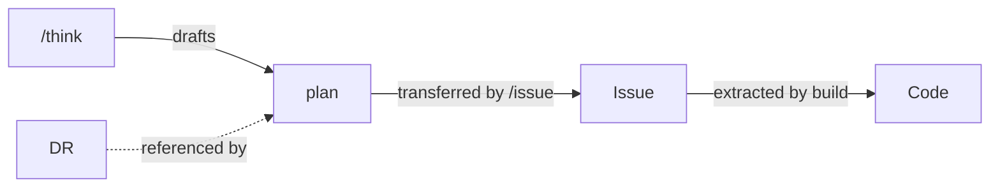

# Glossary

このプロジェクトのユビキタス言語辞書。

📌 [English version](../../docs/GLOSSARY.md)

## ドキュメント

| 用語 | 正式名称            | 用途                           | 生成元   | 読み手    | ライフサイクル         |
| ---- | ------------------- | ------------------------------ | -------- | --------- | ---------------------- |
| DR   | Decision Record     | 技術判断の記録                 | `/dr`    | 人間      | 受理後は不変           |
| plan | Implementation Plan | スコープ、unit、受け入れテスト | `/think` | AI + 人間 | 下書き後、issue で凍結 |

### DR. Decision Record

答えること: 「なぜこのアプローチを選んだのか」

技術判断 (技術選定、アーキテクチャ パターン、廃止、プロセス変更) の根拠を記録する。MADR 形式の prose スタイルで書き、数か月から数年後に文脈を理解する必要がある人間の読者に最適化する。すべての判断がアーキテクチャに限るわけではないため、Architecture に限定せず Decision Record として記録する。

主な特性:

- 読み手は将来の開発者。プロジェクトに加わった人が DR を読むことで過去の判断を理解できる
- 受理後は不変。新たな DR で置換されるが、編集はしない
- 判断種別ごとに 4 つのテンプレート バリアントがある: technology-selection, architecture-pattern, deprecation, process-change

配置: `docs/decisions/NNNN-title.md`

### plan. Implementation Plan

答えること: 「何を、どの順で作り、各ステップをどう検証するのか」

`/think` が設計探索 (アプローチ比較、`critic-design` 反論) の後に下書きする。`templates/plan.md` の骨子に沿って `.claude/workspace/planning/YYYY-MM-DD-<slug>.plan.md` に書き、`/issue` が両セクションを issue の Plan 節へそのまま転記する。build ワークフローが U-NNN / T-NNN の id 集合を抽出し、unit 単位で実装する。

主な特性:

- 読み手は AI と人間。build が構造を機械的に抽出し、人間は build 実行前に issue 上でレビューする
- セクションは 2 つのみ。`## Plan` (Outcome, test_command, Preconditions, U-NNN unit) と `## Backlog candidates`
- issue で凍結。Plan 節へ転記されたら、その節が build の消費する正となる
- unit が受け入れテストを持つ。各 U-NNN は T-NNN テストで挙動を固定する。docs / config の unit はテストを省き、build が直接実装する

配置: `.claude/workspace/planning/YYYY-MM-DD-<slug>.plan.md`、その後 issue の `## Plan` 節

### ドキュメントの関係



| 関係         | 仕組み                                                       |
| ------------ | ------------------------------------------------------------ |
| think → plan | `/think` が `templates/plan.md` に沿って plan を下書きする   |
| plan → Issue | `/issue` が `## Plan` と `## Backlog candidates` を転記する  |
| Issue → Code | build が U-NNN / T-NNN を抽出し unit 単位で実装する          |
| DR → plan    | `/think` が主要判断に対し DR を提案し、plan がそれを参照する |

## ID 規約

| 接頭辞 | 意味                           | 利用先 | 例    |
| ------ | ------------------------------ | ------ | ----- |
| U-NNN  | Unit (実装スライス)            | plan   | U-001 |
| T-NNN  | Test Scenario (受け入れテスト) | plan   | T-001 |

### 追跡性

```text
U-001 → T-001
```

ID は plan 内で追跡される。各 unit U-NNN が受け入れテスト T-NNN を持つ。T-NNN は plan 全体で一意で、unit ごとに振り直さない。

## 関連

- [DESIGN](./DESIGN.md). アーキテクチャ概要
- [HOOKS](./HOOKS.md). フックパイプライン
