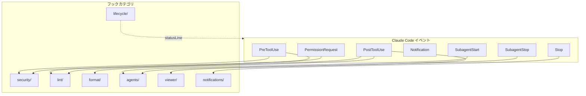
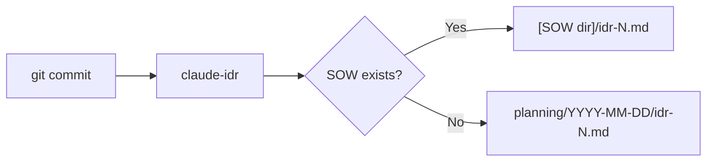

# フック設計

フックシステムの設計意図と仕組みを説明します。

📌 **[English Version](../../docs/HOOKS.md)**

## 概要



## フックカテゴリ

| カテゴリ         | トリガー        | 目的                           |
| ---------------- | --------------- | ------------------------------ |
| `security/`      | PreToolUse      | Bash安全チェック、権限制御     |
| `lint/`          | Pre/PostToolUse | コード品質チェック             |
| `format/`        | PostToolUse     | フォーマット適用               |
| `lifecycle/`     | statusLine      | ステータスライン、PRキャッシュ |
| `agents/`        | Subagent*       | エージェントログ・通知         |
| `viewer/`        | PostToolUse     | SOW/Spec/IDRビューア連携       |
| `notifications/` | Stop            | 完了通知                       |

## 主要フック

### security/

| フック                  | イベント          | 失敗モード  | 目的                   |
| ----------------------- | ----------------- | ----------- | ---------------------- |
| `bash-safety.sh`        | PreToolUse(Bash)  | fail-closed | 危険コマンドをブロック |
| `permission-request.sh` | PermissionRequest | fail-closed | 自動承認/拒否の判定    |

### lint/

| フック                | イベント           | 失敗モード | 目的              |
| --------------------- | ------------------ | ---------- | ----------------- |
| `typescript-check.sh` | PostToolUse(Write) | fail-open  | tsc --noEmit 実行 |

### format/

| フック           | イベント                | 失敗モード | 目的               |
| ---------------- | ----------------------- | ---------- | ------------------ |
| `eof-newline.sh` | PostToolUse(Write)      | fail-open  | EOF改行を保証      |
| `format.sh`      | PostToolUse(Write/Edit) | fail-open  | biome/prettier実行 |

### lifecycle/

| フック          | トリガー   | 目的                 |
| --------------- | ---------- | -------------------- |
| `statusline.sh` | statusLine | ステータスライン表示 |
| `_pr-cache.sh`  | (sourced)  | PR情報のキャッシュ   |

### agents/

| フック                 | イベント      | 失敗モード | 目的                 |
| ---------------------- | ------------- | ---------- | -------------------- |
| `subagent-start.sh`    | SubagentStart | fail-open  | 開始ログ・通知音     |
| `subagent-analysis.sh` | SubagentStop  | fail-open  | トランスクリプト保存 |

### viewer/

| フック               | イベント           | 失敗モード | 目的                         |
| -------------------- | ------------------ | ---------- | ---------------------------- |
| `ccplanview-open.sh` | PostToolUse(Write) | fail-open  | SOW/Spec/IDRをビューアで開く |

## 設定

フックは `settings.json` で設定:

```json
{
  "hooks": {
    "PreToolUse": [
      {
        "matcher": "Bash",
        "hooks": [
          {
            "type": "command",
            "command": "~/.claude/hooks/security/bash-safety.sh",
            "timeout": 2000
          }
        ]
      }
    ],
    "PostToolUse": [
      {
        "matcher": "Write|Edit|MultiEdit",
        "hooks": [
          {
            "type": "command",
            "command": "~/.claude/hooks/format/format.sh",
            "timeout": 5000
          }
        ]
      }
    ]
  }
}
```

## 設計原則

### 1. デフォルトでノンブロッキング

フックは通常、操作をブロックしない。ブロックは明示的な設定が必要。

### 2. フェイルセーフ

フックがエラーで終了しても、Claude Codeは継続動作。

### 3. 失敗モード規約

- **fail-open** (`set +e`): エラー時はスキップして継続。大半のフックがこちら。
- **fail-closed** (`set -euo pipefail`): エラー時はブロック。セキュリティフックのみ。

### 4. 組み合わせ可能

小さなフックを組み合わせて複雑な動作を実現。

## IDR（実装決定記録）

コミット時に `claude-idr` バイナリで自動生成される実装記録。



## 関連

- [Claude Code Hooks Docs](https://docs.anthropic.com/en/docs/claude-code/hooks)
