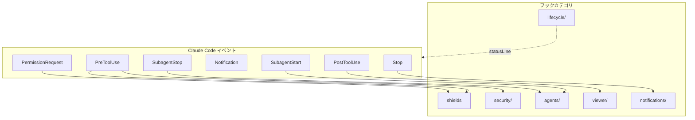
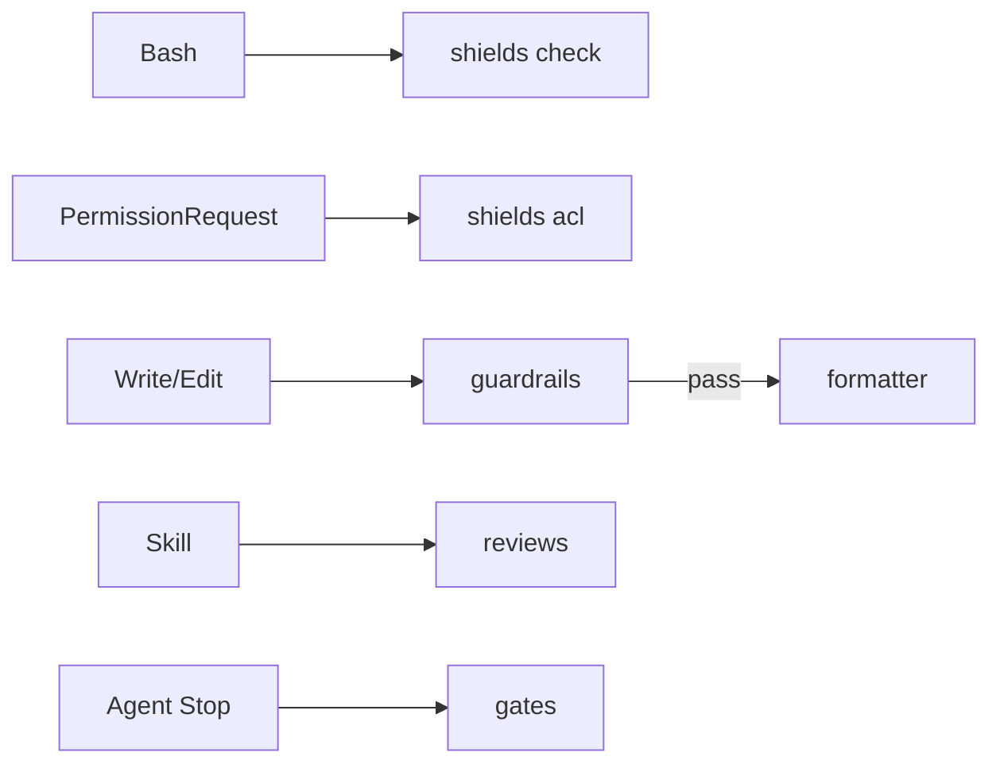
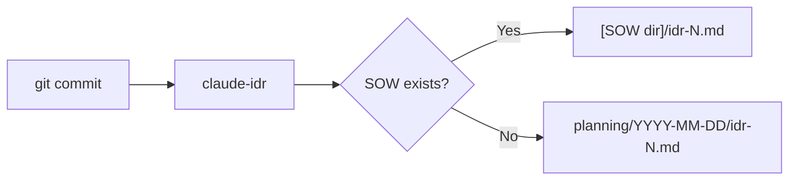

# フック設計

フックシステムの設計意図と仕組みを説明します。

📌 **[English Version](../../docs/HOOKS.md)**

## 概要



## フックカテゴリ

| カテゴリ         | トリガー                       | 目的                                   |
| ---------------- | ------------------------------ | -------------------------------------- |
| `shields`        | PreToolUse, PermissionRequest  | コマンドガード、ファイルACL、秘匿情報 |
| `security/`      | PreToolUse                     | 設定ファイル変更の監査ログ             |
| `lifecycle/`     | statusLine, pre-commit         | ステータスライン、PRキャッシュ、IDR生成 |
| `agents/`        | Subagent\*                     | エージェントログ、アイドル検知         |
| `viewer/`        | PostToolUse                    | SOW/Spec/IDRビューア連携               |
| `notifications/` | Stop                           | 完了通知                               |

## 主要フック

### shields（Rustバイナリ）

bash-safety.sh、permission-request.sh、secrets-check.shを単一のRustバイナリに統合。
`brew install thkt/tap/shields` またはClaude Codeプラグイン（`shields@sentinels`）でインストール。

| サブコマンド    | イベント          | 失敗モード  | 目的                                        |
| --------------- | ----------------- | ----------- | ------------------------------------------- |
| `shields check` | PreToolUse(Bash)  | fail-closed | 44ビルトイン + カスタムパターン、N1-N7正規化 |
| `shields acl`   | PermissionRequest | fail-closed | パスベースACL、サブエージェント制限         |

`shields check` は `git commit` 時にステージされた秘匿ファイルもブロック（20ビルトインパターン）。
設定は `.claude/tools.json` の `shields` キー。

### security/

| フック             | イベント   | 失敗モード | 目的                   |
| ------------------ | ---------- | ---------- | ---------------------- |
| `config-change.sh` | PreToolUse | fail-open  | 設定ファイル変更の検知 |

### lifecycle/

| フック              | トリガー   | 目的                 |
| ------------------- | ---------- | -------------------- |
| `statusline.sh`     | statusLine | ステータスライン表示 |
| `_pr-cache.sh`      | (sourced)  | PR情報のキャッシュ   |
| `idr-pre-commit.sh` | pre-commit | IDR自動生成          |

### agents/

| フック             | イベント     | 失敗モード | 目的                 |
| ------------------ | ------------ | ---------- | -------------------- |
| `subagent-done.sh` | SubagentStop | fail-open  | 完了マーカー書き込み |
| `teammate-idle.sh` | TeammateIdle | fail-open  | チームメイト待機検知 |

### viewer/

| フック               | イベント           | 失敗モード | 目的                         |
| -------------------- | ------------------ | ---------- | ---------------------------- |
| `ccplanview-open.sh` | PostToolUse(Write) | fail-open  | SOW/Spec/IDRをビューアで開く |

## 品質パイプライン（Rustバイナリ）

品質とセキュリティの主要な強制レイヤーとなる5つのRustバイナリ。別リポジトリで管理、
`brew install thkt/tap/{tool}` またはClaude Codeプラグインでインストール。
プロジェクトごとの設定は `.claude/tools.json`。



### guardrails

PreToolUseフック。Write/Edit適用前にコードを検証。

| 項目           | 詳細                                                  |
| -------------- | ----------------------------------------------------- |
| リンター       | oxlint（優先）/ biome（フォールバック）               |
| カスタムルール | 19ルール（sensitiveFile, cryptoWeak, XSS, eval 等）   |
| ブロック       | critical/highでブロック                               |
| ソース         | [thkt/guardrails](https://github.com/thkt/guardrails) |

### formatter

PostToolUseフック。Write/Edit後にファイルを自動フォーマット。

| 項目           | 詳細                                                |
| -------------- | --------------------------------------------------- |
| フォーマッター | oxfmt（優先）/ biome（フォールバック）+ EOF改行     |
| ブロック       | しない（常にexit 0、エラーはstderrにログ）          |
| ソース         | [thkt/formatter](https://github.com/thkt/formatter) |

### reviews

PreToolUseフック（Skillマッチャー）。設定されたスキル実行前に静的解析結果を注入。

| 項目     | 詳細                                            |
| -------- | ----------------------------------------------- |
| ツール   | knip, oxlint, tsgo, react-doctor（並列実行）    |
| ブロック | しない（advisory、additionalContextとして注入） |
| ソース   | [thkt/reviews](https://github.com/thkt/reviews) |

### gates

Stopフック。エージェント完了時に品質ゲートを強制。

| 項目       | 詳細                                                           |
| ---------- | -------------------------------------------------------------- |
| 静的ゲート | knip, tsgo, madge                                              |
| スクリプト | lint, type-check, test（package.jsonから検出）                 |
| フェーズ   | fix → review → allow（初回all-passではレビュー指示でブロック） |
| ブロック   | ゲート失敗時はブロック。ツール未インストール時はスキップ       |
| ソース     | [thkt/gates](https://github.com/thkt/gates)                    |

### パイプライン設定

5ツール共通でプロジェクトルートの `.claude/tools.json` から読み込み:

```json
{
  "shields": { "check": true, "acl": true, "custom_patterns": [] },
  "guardrails": { "rules": { "oxlint": true } },
  "formatter": { "formatters": { "oxfmt": true } },
  "reviews": { "skills": ["audit"], "tools": { "knip": true, "tsgo": true } },
  "gates": { "knip": true, "tsgo": true }
}
```

各ツールはプロジェクト単位で `"enabled": false` で無効化可能。

## 設定

シェルフックは `settings.json` で設定。セキュリティフック（shields）は
`shields@sentinels` プラグインで登録。残りのシェルフック:

```json
{
  "hooks": {
    "PostToolUse": [
      {
        "matcher": "Write|Edit|MultiEdit",
        "hooks": [
          {
            "type": "command",
            "command": "~/.claude/hooks/viewer/ccplanview-open.sh",
            "timeout": 5000
          }
        ]
      }
    ]
  }
}
```

## 設計原則

### 1. デフォルトでノンブロッキング

フックは通常、操作をブロックしない。ブロックは明示的な設定が必要。

### 2. フェイルセーフ

フックがエラーで終了しても、Claude Codeは継続動作。

### 3. 失敗モード規約

- **fail-open** (`set +e`): エラー時はスキップして継続。大半のフックがこちら。
- **fail-closed**
  (`set -euo pipefail`): エラー時はブロック。セキュリティフックのみ。

### 4. 組み合わせ可能

小さなフックを組み合わせて複雑な動作を実現。

## IDR（実装決定記録）

コミット時に `claude-idr` バイナリで自動生成される実装記録。



## 関連

- [Claude Code Hooks Docs](https://docs.anthropic.com/en/docs/claude-code/hooks)
