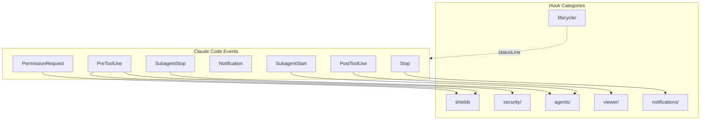
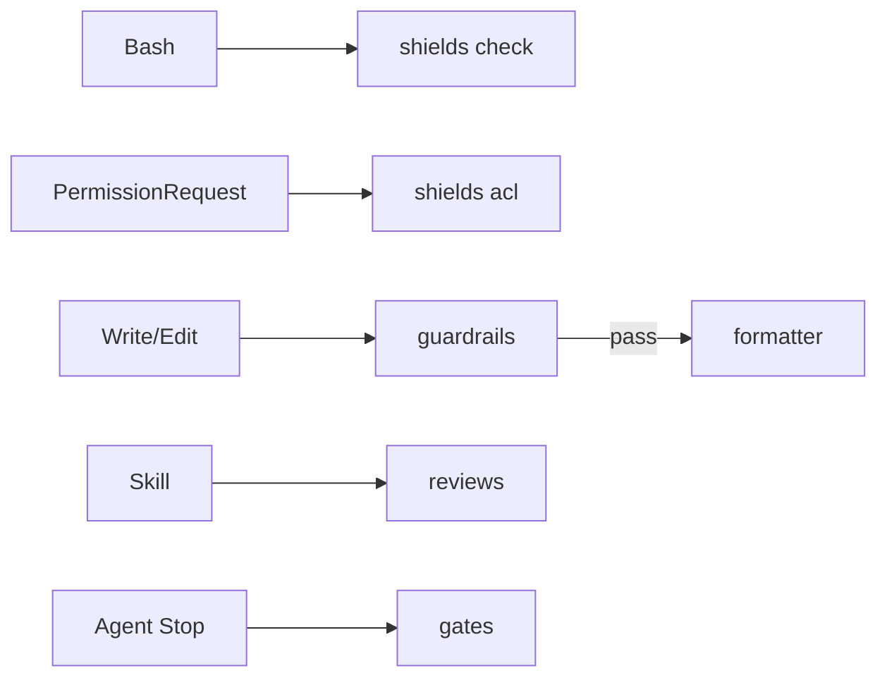
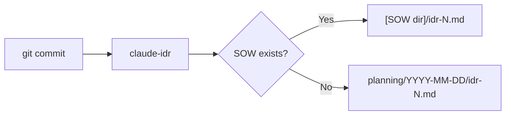

# Hooks Design

Hook システムの設計意図と仕組み。

## 概要



## Hook カテゴリ

| カテゴリ         | トリガー                      | 用途                                            |
| ---------------- | ----------------------------- | ----------------------------------------------- |
| `shields`        | PreToolUse, PermissionRequest | コマンド ガード、ファイル ACL、secrets チェック |
| `security/`      | PreToolUse                    | 設定変更の監査ログ                              |
| `lifecycle/`     | statusLine, pre-commit        | ステータス ライン、PR キャッシュ、IDR 生成      |
| `agents/`        | Subagent\*                    | Agent ロギング、idle 検出                       |
| `viewer/`        | PostToolUse                   | SOW/Spec/IDR ビューア                           |
| `notifications/` | Stop                          | 完了通知                                        |

## 主要 Hook

### shields (Rust バイナリ)

bash-safety.sh, permission-request.sh, secrets-check.sh を 1 つの Rust バイナリに置換。`brew install thkt/tap/shields` または Claude Code プラグイン (`shields@sentinels`) でインストール。

| サブコマンド    | イベント          | 失敗モード  | 用途                                                      |
| --------------- | ----------------- | ----------- | --------------------------------------------------------- |
| `shields check` | PreToolUse(Bash)  | fail-closed | 44 個のビルトイン + カスタム パターン、N1-N7 バイパス対策 |
| `shields acl`   | PermissionRequest | fail-closed | パス ベースの ACL、サブエージェント制限                   |

`shields check` はステージ済みシークレットを伴う `git commit` もブロックする (20 個のビルトイン パターン)。設定は `.claude/tools.json` の `shields` キー。

### security/

| Hook               | イベント   | 失敗モード | 用途                   |
| ------------------ | ---------- | ---------- | ---------------------- |
| `config-change.sh` | PreToolUse | fail-open  | 設定ファイル変更を検出 |

### lifecycle/

| Hook                | トリガー   | 用途                  |
| ------------------- | ---------- | --------------------- |
| `statusline.sh`     | statusLine | ステータス ライン表示 |
| `_pr-cache.sh`      | (sourced)  | PR 情報キャッシュ     |
| `idr-pre-commit.sh` | pre-commit | IDR 自動生成          |

### agents/

| Hook               | イベント     | 失敗モード | 用途                           |
| ------------------ | ------------ | ---------- | ------------------------------ |
| `subagent-done.sh` | SubagentStop | fail-open  | 完了マーカーを書く             |
| `teammate-idle.sh` | TeammateIdle | fail-open  | チームメイトの idle 状態を検出 |

### viewer/

| Hook                 | イベント           | 失敗モード | 用途                          |
| -------------------- | ------------------ | ---------- | ----------------------------- |
| `ccplanview-open.sh` | PostToolUse(Write) | fail-open  | SOW/Spec/IDR をビューアで開く |

## Quality Pipeline (Rust バイナリ)

主要な品質・セキュリティ強制レイヤーを構成する 5 つの Rust バイナリ。リポジトリは別、`brew install thkt/tap/{tool}` または Claude Code プラグイン経由でインストール。プロジェクト設定は `.claude/tools.json`。



### guardrails

PreToolUse フック。Write/Edit 適用前にコードを検証する。

| 観点            | 詳細                                                  |
| --------------- | ----------------------------------------------------- |
| Linter          | oxlint (優先) / biome (フォールバック)                |
| カスタム ルール | 19 ルール (sensitiveFile, cryptoWeak, XSS, eval 等)   |
| ブロッキング    | あり。critical/high severity でブロック               |
| Source          | [thkt/guardrails](https://github.com/thkt/guardrails) |

### formatter

PostToolUse フック。Write/Edit 後にファイルを自動整形する。

| 観点         | 詳細                                                |
| ------------ | --------------------------------------------------- |
| Formatter    | oxfmt (優先) / biome (フォールバック) + EOF 改行    |
| ブロッキング | なし (常に exit 0、エラーは stderr へ)              |
| Source       | [thkt/formatter](https://github.com/thkt/formatter) |

### reviews

PreToolUse フック (Skill matcher)。設定された skill の前に静的解析コンテキストを注入する。

| 観点         | 詳細                                                  |
| ------------ | ----------------------------------------------------- |
| ツール       | knip, oxlint, tsgo, react-doctor (並列実行)           |
| ブロッキング | なし (advisory のみ、結果は additionalContext として) |
| Source       | [thkt/reviews](https://github.com/thkt/reviews)       |

### gates

Stop フック。エージェント完了時に品質ゲートを強制する。

| 観点              | 詳細                                                      |
| ----------------- | --------------------------------------------------------- |
| 静的ゲート        | knip, tsgo, madge                                         |
| スクリプト ゲート | lint, type-check, test (package.json から検出)            |
| フェーズ検出      | fix → review → allow (最初の全合格をレビューにブロック) |
| ブロッキング      | ゲート失敗時にブロック。ツール欠落は fail-open            |
| Source            | [thkt/gates](https://github.com/thkt/gates)               |

### Pipeline 設定

5 ツールはプロジェクト ルートの `.claude/tools.json` を共有する。

```json
{
  "shields": { "check": true, "acl": true, "custom_patterns": [] },
  "guardrails": { "rules": { "oxlint": true } },
  "formatter": { "formatters": { "oxfmt": true } },
  "reviews": { "skills": ["audit"], "tools": { "knip": true, "tsgo": true } },
  "gates": { "knip": true, "tsgo": true }
}
```

各ツールはプロジェクト単位で `"enabled": false` により無効化できる。

## 設定

シェル フックは `settings.json` で設定する。セキュリティ フック (shields) は `shields@sentinels` プラグイン経由で登録する。残りのシェル フック。

```json
{
  "hooks": {
    "PostToolUse": [
      {
        "matcher": "Write|Edit|MultiEdit",
        "hooks": [
          {
            "type": "command",
            "command": "~/.claude/hooks/viewer/ccplanview-open.sh",
            "timeout": 5000
          }
        ]
      }
    ]
  }
}
```

## 設計原則

### 1. デフォルトでノンブロッキング

フックはデフォルトで操作をブロックしない。ブロックは明示設定が必要。

### 2. Fail-safe

フックがエラー終了しても Claude Code は継続する。

### 3. fail-mode 規約

- fail-open (`set +e`): エラー時にスキップして継続。多くのフックがこちら。
- fail-closed (`set -euo pipefail`): エラー時にブロック。セキュリティ フックのみで使う。

### 4. Composable

小さなフックを組み合わせて複雑な振る舞いを実現する。

## IDR (Implementation Decision Record)

コミット時に `claude-idr` バイナリが自動生成する実装記録。



## 関連

- [Claude Code Hooks Docs](https://docs.anthropic.com/en/docs/claude-code/hooks)
