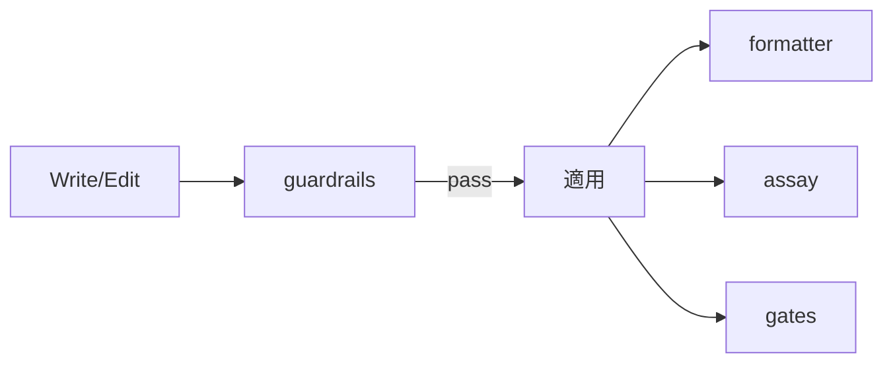

# Hooks Design

Hook システムの設計意図と仕組み。実登録は `settings.json` が正で、本書は構造と意図を説明する。

## 実行レイヤー

Rust バイナリは sentinels プラグインとしても配布するが、現在はプラグイン登録を無効化し、brew バイナリの直登録に一本化している。

| レイヤー      | 実体                           | 登録方式                         |
| ------------- | ------------------------------ | -------------------------------- |
| シェル hooks  | `~/.claude/hooks/**/*.sh`      | `settings.json`                  |
| Rust バイナリ | `brew install thkt/tap/{tool}` | `settings.json` (コマンド直登録) |

## イベント マップ

| イベント           | Matcher                   | フック                                                                                                   |
| ------------------ | ------------------------- | -------------------------------------------------------------------------------------------------------- |
| PreToolUse         | Bash                      | auto-package-manager, security/npm-safe-install, security/rm-to-trash, textlint-lint, localized-headings |
| PreToolUse         | Edit/Write/MultiEdit      | rust-pre-edit, guardrails                                                                                |
| PreToolUse         | EnterPlanMode             | deny (計画は /think へ誘導)                                                                              |
| PreToolUse         | ExitPlanMode              | CCPlanView notifier                                                                                      |
| PostToolUse        | Edit/Write/MultiEdit      | rust-post-edit, textlint-fix, assay, formatter, gates                                                    |
| PostToolUse        | Write/Edit/MultiEdit/Bash | lifecycle/context-monitor                                                                                |
| SessionStart       | -                         | lifecycle/recall-index                                                                                   |
| Stop / StopFailure | -                         | notify-stop / notify-stop-failure                                                                        |
| Notification       | permission_prompt 等      | 通知サウンド (afplay)                                                                                    |
| statusLine         | -                         | lifecycle/statusline                                                                                     |

## シェル hooks

### 直下

| Hook                    | イベント         | 失敗モード  | 用途                                                         |
| ----------------------- | ---------------- | ----------- | ------------------------------------------------------------ |
| auto-package-manager.sh | PreToolUse(Bash) | fail-closed | パッケージ マネージャー コマンドを ni 系へ変換               |
| localized-headings.sh   | PreToolUse(Bash) | fail-closed | gh issue/pr create の見出し言語を検査                        |
| textlint-lint.sh        | PreToolUse(Bash) | fail-closed | gh issue/pr create 本文の textlint + 構造チェック (advisory) |
| textlint-fix.sh         | PostToolUse      | fail-closed | .md ファイルを textlint で自動修正                           |
| rust-pre-edit.sh        | PreToolUse       | fail-open   | .rs 編集前に cargo clippy、結果を additionalContext 注入     |
| rust-post-edit.sh       | PostToolUse      | fail-open   | .rs 編集後に cargo fmt                                       |
| notify-stop.sh          | Stop             | fail-open   | 文脈別の完了サウンド (subagent は無音)                       |
| notify-stop-failure.sh  | StopFailure      | fail-open   | API エラーによるターン終了を通知                             |

### security/

| Hook                | イベント         | 失敗モード  | 用途                                                   |
| ------------------- | ---------------- | ----------- | ------------------------------------------------------ |
| npm-safe-install.sh | PreToolUse(Bash) | fail-closed | ignore-scripts なしのパッケージ インストールをブロック |
| rm-to-trash.sh      | PreToolUse(Bash) | fail-closed | rm/rmdir/unlink/shred を `mv ~/.Trash/` へ誘導         |

### lifecycle/

| Hook               | トリガー     | 失敗モード | 用途                                                 |
| ------------------ | ------------ | ---------- | ---------------------------------------------------- |
| statusline.sh      | statusLine   | fail-open  | ステータス ライン表示                                |
| \_pr-cache.sh      | (sourced)    | fail-open  | statusline 用の PR 情報キャッシュ                    |
| context-monitor.sh | PostToolUse  | fail-open  | コンテキスト使用量の警告 (advisory)                  |
| recall-index.sh    | SessionStart | fail-open  | recall のクロスセッション索引をバックグラウンド更新  |
| reflection-\*.sh   | 未登録       | fail-open  | セッション振り返りの抽出・注入。再設計待ちで無効化中 |

### lib/

hook から source する共有関数 (japanese-detect, notify, reflection)。単体では登録しない。

## Quality Pipeline (Rust バイナリ)

編集ライフサイクルに品質強制を挟む Rust バイナリ。リポジトリは独立し、`brew install thkt/tap/{tool}` でインストールする (assay はローカル ビルド)。



### guardrails

PreToolUse フック。Write/Edit 適用前にコードを検証する。

| 観点            | 詳細                                                   |
| --------------- | ------------------------------------------------------ |
| Linter          | oxlint (優先) / biome (フォールバック)                 |
| カスタム ルール | sensitiveFile, cryptoWeak, XSS, eval など (網羅でない) |
| ブロッキング    | あり。critical/high severity でブロック                |
| Source          | [thkt/guardrails](https://github.com/thkt/guardrails)  |

### formatter

PostToolUse フック。Write/Edit 後にファイルを自動整形する。

| 観点         | 詳細                                                |
| ------------ | --------------------------------------------------- |
| Formatter    | oxfmt (優先) / biome (フォールバック) + EOF 改行    |
| ブロッキング | なし (常に exit 0、エラーは stderr へ)              |
| Source       | [thkt/formatter](https://github.com/thkt/formatter) |

### gates

PostToolUse フック。編集のたびに品質ゲートを強制する。

| 観点              | 詳細                                                                                       |
| ----------------- | ------------------------------------------------------------------------------------------ |
| 静的ゲート        | knip, tsgo, litmus (テスト品質), circular (循環依存)。litmus / circular はバイナリ埋め込み |
| スクリプト ゲート | lint, type-check, test (package.json から検出)                                             |
| ブロッキング      | ゲート失敗時に fix prompt でブロック。ツール欠落は fail-open                               |
| Source            | [thkt/gates](https://github.com/thkt/gates)                                                |

### assay

PostToolUse フック。spec.md / eval-criteria.md の保存時に文書品質を検証する。

| 観点     | 詳細                                             |
| -------- | ------------------------------------------------ |
| 対象     | spec.md, eval-criteria.md                        |
| チェック | complete / unambiguous / verifiable / consistent |
| 配布     | ローカル ビルド (`~/.cargo/bin/assay`)           |

### プロジェクト設定

guardrails / formatter / gates はプロジェクト ルートの `.claude/tools.json` を共有する。各ツールはプロジェクト単位で `"enabled": false` により無効化できる。

```json
{
  "guardrails": { "rules": { "oxlint": true } },
  "formatter": { "formatters": { "oxfmt": true } },
  "gates": { "knip": true, "tsgo": true }
}
```

### 休止中

shields (コマンド ガード、ファイル ACL、secrets チェック) と reviews (skill 実行前の静的解析コンテキスト注入) は同ファミリーのバイナリだが、意図的に settings.json から外して休止中。

## 設計原則

### 1. デフォルトでノンブロッキング

フックはデフォルトで操作をブロックしない。ブロックは明示設定が必要。

### 2. Fail-safe

フックがエラー終了しても Claude Code は継続する。

### 3. fail-mode 規約

- fail-open (`set +e`): エラー時にスキップして継続。観測・通知系フックはこちら。
- fail-closed (`set -euo pipefail`): エラー時にブロック。セキュリティと規約強制のフックで使う。

### 4. Composable

小さなフックを組み合わせて複雑な振る舞いを実現する。

## 関連

- [Claude Code Hooks Docs](https://docs.anthropic.com/en/docs/claude-code/hooks)
