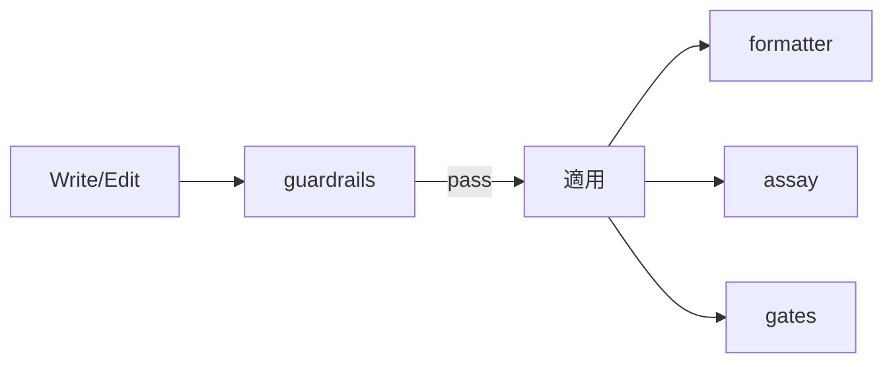

# Hooks Design

Hook システムの設計意図と仕組み。実登録は `settings.json` が正で、本書は構造と意図を説明する。

## 実行レイヤー

Rust バイナリは sentinels プラグインとしても配布するが、登録は brew バイナリの直登録に一本化している。

| レイヤー         | 実体                           | 登録方式                         |
| ---------------- | ------------------------------ | -------------------------------- |
| スクリプト hooks | `~/.claude/hooks/**/*.{sh,py}` | `settings.json`                  |
| Rust バイナリ    | `brew install thkt/tap/{tool}` | `settings.json` (コマンド直登録) |

### 言語

hook をシェルスクリプトで書くのは、仕事が数個の判定と 1 回の fork で済むとき。構造が要るほど処理が長いか、テストと共有するときは Python か TypeScript で書く。`mirror_prose_guard.ts` が後者で、規則そのものは `_lib/mirror_prose.ts` にあり、リポジトリ一括検査のテストも同じモジュールを読む。

テストは hook 本体と同じ言語で書く。シェルに残すのは、スタブとしてシェルスクリプトを PATH へ置くものだけで、`amphetamine_agent_session` の osascript と `rust-edit` の cargo がこれにあたる。

Python 側では、1 つのメソッドが最初の失敗で止まると残りのアサーションが走らない。これは 2 つの形で起こる。複数のアサーションを並べた場合は `subTest` で 1 件ずつ包む。hook の出力を `json.loads` に直接渡した場合は、何も返さない hook で例外がメソッドごと落とすので、空を `{}` に倒してから読む。どちらも落ちる件数が静かに減るだけなので、テストは green のままになる。

## 命名

ディレクトリがイベントを答えるので、ファイル名は対象と操作を答える。形は `<対象>_<操作>` で、対象はこの hook が見るもの、操作はそれに対して何をするか。読み手は先頭の語で対象を絞り込める。

Python はアンダースコアで区切る。shell はハイフンで区切る。`_lib/` のモジュールは import されるので、語の区切りにアンダースコアが要る。hook 本体どうしは import しないため、技術的な縛りが無い。それでも揃えるのは、テスト名が `<hook 名>_test.py` で一致し、hook からテストを変換なしで引けるため。

操作を表す語は、名詞としても読める語 (guard/gate/fix/index/alert/rewrite) を選ぶ。`notify` のような動詞専用の語は名前として据わりが悪い。既に英語として読める動詞句 (`rm_to_trash`, `body_proofread`) はそのまま置く。

例外は 2 つ。外部アプリを丸ごと扱うものは `<アプリ名>_<管理対象>` とし、`amphetamine_agent_session` は「エージェントのターン中だけ」という限定を名前に残す。1 語で足りるものは 1 語で置く (`statusline`)。複数の hook をまとめて見るテストは、その群を表す名前を持つ (`rust-edit.test.sh` は pre/post の 2 本と `_lib/rust_target.py` を見る)。

| 種別            | 形                  | 例                          |
| --------------- | ------------------- | --------------------------- |
| Python hook     | `<対象>_<操作>.py`  | `git_sandbox_guard.py`      |
| shell hook      | `<対象>-<操作>.sh`  | `failure-alert.sh`          |
| _lib モジュール | `<名詞>.py`         | `command_scan.py`           |
| Python テスト   | `<hook 名>_test.py` | `git_sandbox_guard_test.py` |
| shell テスト    | `<hook 名>.test.sh` | `failure-alert.test.sh`     |

## 実行の絞り込み

Bash ゲートの hook はすべての Bash 呼び出しで発火し、実際の仕事には Python が要る。そのため fast-exit を何よりも先に走らせる。Python 本体の前にシェルラッパーを置けば、そこで抜ける呼び出しはインタープリタ起動を払わずに済み、本体が読み込むモジュール次第で 7ms から 17ms 浮く。それでも該当する hook はすべて 1 ファイルを選んでいる。`amphetamine_agent_session`、`package_manager_rewrite`、`body_proofread`、`security/` の 3 本は、いずれも生の payload への部分文字列の検査で始まり、何も parse しないまま返る。

`settings.json` の `if` 条件はこの絞り込みを代われない。`cd /tmp && git commit` を取りこぼすからである。fast-exit にできるのは、追い返す呼び出しから import を外すこと。この頻度で発火する Python hook は重いモジュールを遅らせ、`re` と `subprocess` は必要とする関数の中で読む。`json` や `shutil` のような軽いモジュールと、hook が hot path で必ず通るモジュールは、遅らせても差が出ない。

## イベントマップ

シェル hook は、それを発火させるイベントの名前が付いたディレクトリに置く。新しい hook の置き場は `settings.json` が決める。`security/` だけは役割で分けた例外。破壊的なコマンドを止める仕事は、Bash ゲートの他と分けて名指しする価値がある。

| イベント         | Matcher            | フック                                                                                                                                                            |
| ---------------- | ------------------ | ----------------------------------------------------------------------------------------------------------------------------------------------------------------- |
| PreToolUse       | Bash               | pre-bash/package_manager_rewrite, security/npm_install_guard, security/rm_to_trash, security/git_sandbox_guard, pre-bash/body_proofread, pre-bash/issue_body_gate |
| PreToolUse       | Write/Edit         | edit/rust_pre_edit.py, guardrails                                                                                                                                 |
| PreToolUse       | EnterPlanMode      | deny (計画は /think へ誘導)                                                                                                                                       |
| PreToolUse       | WebFetch/WebSearch | deny (scout CLI へ誘導)                                                                                                                                           |
| PostToolUse      | Write/Edit         | edit/rust_post_edit.py, edit/textlint_fix.py, edit/mirror_prose_guard.ts, assay, formatter, gates                                                                 |
| PostToolUse      | Bash               | gates changed                                                                                                                                                     |
| PostToolUse      | \*                 | integrations/amphetamine_agent_session background                                                                                                                 |
| SessionStart     | \*                 | lifecycle/recall_index.ts                                                                                                                                         |
| UserPromptSubmit | -                  | integrations/amphetamine_agent_session acquire                                                                                                                    |
| Stop/StopFailure | -                  | lifecycle/failure-alert, integrations/amphetamine_agent_session release                                                                                           |
| statusLine       | -                  | lifecycle/statusline                                                                                                                                              |

## スクリプト hooks

### pre-bash/

| Hook                       | イベント         | 失敗モード  | 用途                                                                                                          |
| -------------------------- | ---------------- | ----------- | ------------------------------------------------------------------------------------------------------------- |
| package_manager_rewrite.py | PreToolUse(Bash) | fail-closed | パッケージマネージャーコマンドを ni 系へ変換。マネージャー自身のフラグと bun 内蔵のテストランナーは素通しする |
| body_proofread.py          | PreToolUse(Bash) | fail-closed | gh issue/pr create の本文と commit メッセージを校正し、起票には構造チェックを添える (advisory)                |
| issue_body_gate.py         | PreToolUse(Bash) | fail-closed | 本文が骨格から外れた `gh issue create` を deny する                                                           |

### edit/

| Hook                  | イベント    | 失敗モード  | 用途                                                                |
| --------------------- | ----------- | ----------- | ------------------------------------------------------------------- |
| rust_pre_edit.py      | PreToolUse  | fail-open   | .rs 編集前に cargo clippy を走らせ、結果を additionalContext へ注入 |
| rust_post_edit.py     | PostToolUse | fail-open   | .rs 編集後に cargo fmt、その結果へ clippy                           |
| textlint_fix.py       | PostToolUse | fail-closed | 日本語の .md ファイルを textlint で自動修正                         |
| mirror_prose_guard.ts | PostToolUse | fail-closed | `.ja/` のファイルが日本語の散文を失ったら警告する (ブロックしない)  |

### security/

| Hook                 | イベント         | 失敗モード  | 用途                                                                                                        |
| -------------------- | ---------------- | ----------- | ----------------------------------------------------------------------------------------------------------- |
| npm_install_guard.py | PreToolUse(Bash) | fail-closed | ignore-scripts が有効でないパッケージインストールをブロック。走らせる先の .npmrc をホーム側より優先して読む |
| rm_to_trash.py       | PreToolUse(Bash) | fail-closed | rm/rmdir/unlink/shred を `mv ~/.Trash/` へ誘導                                                              |
| git_sandbox_guard.py | PreToolUse(Bash) | fail-closed | ~/.claude で作業ツリーを書き換える git を sandbox 内で止める。読み取りだけの形は通す                        |

### lifecycle/

| Hook             | トリガー          | 失敗モード | 用途                                                                        |
| ---------------- | ----------------- | ---------- | --------------------------------------------------------------------------- |
| statusline.sh    | statusLine        | fail-open  | ステータスライン表示と、自身が持つセッション単位 state の TTL 掃除          |
| recall_index.ts  | SessionStart      | fail-open  | recall のクロスセッション索引をバックグラウンド更新                         |
| failure-alert.sh | Stop, StopFailure | fail-open  | 悪い終わり方をしたターンを音で知らせる。end_turn と subagent では鳴らさない |

### integrations/

Claude Code の外にあるアプリを動かす hook。対象のアプリが無いマシンでは exit 0 で終わるので、入れていないマシンでも影響が出ない。

| Hook                         | トリガー                            | 失敗モード  | 用途                                                        |
| ---------------------------- | ----------------------------------- | ----------- | ----------------------------------------------------------- |
| amphetamine_agent_session.py | UserPromptSubmit, PostToolUse, Stop | fail-closed | ターンが走る間 macOS を起こしたままにし、終わったら解放する |

### _lib/

hook が読み込む共有コード。単体では登録しない。`japanese.py` は言語そのものを判定し、`mirror_prose.ts` は `.ja/` の中身を検査する。前者はどのファイルにも使える述語で、後者はミラーだけを対象に取る。

| モジュール      | 利用元                                        |
| --------------- | ------------------------------------------------ |
| command_scan.py | issue_body_gate, body_proofread, security の 3 本 |
| gh_filing.py    | issue_body_gate, body_proofread                   |
| hook_payload.py | textlint_fix, body_proofread, rust_target, amphetamine |
| hook_payload.ts | mirror_prose.ts, recall_index.ts                  |
| mirror_prose.ts | mirror_prose_guard と .ja/ 一括検査テスト          |
| japanese.py     | body_proofread, textlint_fix                       |
| japanese.ts     | mirror_prose.ts                                    |
| textlint.py     | body_proofread, textlint_fix                       |
| rust_target.py  | rust_pre_edit, rust_post_edit                       |

## Quality Pipeline (Rust バイナリ)

編集ライフサイクルに品質強制を挟む Rust バイナリ。リポジトリは独立し、`brew install thkt/tap/{tool}` でインストールする (assay はローカルビルド)。


```mermaid
flowchart LR
    W[Write/Edit] --> G[guardrails]
    G -->|pass| AP[適用]
    AP --> F[formatter]
    AP --> A[assay]
    AP --> GA[gates]
```

### guardrails

PreToolUse フック。Write/Edit 適用前にコードを検証する。

| 観点           | 詳細                                                   |
| -------------- | ------------------------------------------------------ |
| Linter         | oxlint (優先)/biome (フォールバック)                   |
| カスタムルール | sensitiveFile, cryptoWeak, XSS, eval など (網羅でない) |
| ブロッキング   | あり。critical/high severity でブロック                |
| Source         | [thkt/guardrails](https://github.com/thkt/guardrails)  |

### formatter

PostToolUse フック。Write/Edit 後にファイルを自動整形する。

| 観点         | 詳細                                                |
| ------------ | --------------------------------------------------- |
| Formatter    | oxfmt (優先)/biome (フォールバック) + EOF 改行      |
| ブロッキング | なし (常に exit 0、エラーは stderr へ)              |
| Source       | [thkt/formatter](https://github.com/thkt/formatter) |

### gates

PostToolUse フック。編集のたびに品質ゲートを強制する。

| 観点             | 詳細                                                                                     |
| ---------------- | ---------------------------------------------------------------------------------------- |
| 静的ゲート       | knip, tsgo, litmus (テスト品質), circular (循環依存)。litmus/circular はバイナリ埋め込み |
| スクリプトゲート | lint, type-check, test (package.json から検出)                                           |
| ブロッキング     | ゲート失敗時に fix prompt でブロック。ツール欠落は fail-open                             |
| Source           | [thkt/gates](https://github.com/thkt/gates)                                              |

### assay

PostToolUse フック。spec.md/eval-criteria.md の保存時に文書品質を検証する。

| 観点     | 詳細                                       |
| -------- | ------------------------------------------ |
| 対象     | spec.md, eval-criteria.md                  |
| チェック | complete/unambiguous/verifiable/consistent |
| 配布     | ローカルビルド (`~/.cargo/bin/assay`)      |

### プロジェクト設定

guardrails/formatter/gates はプロジェクトルートの `.claude/tools.json` を共有する。各ツールはプロジェクト単位で `"enabled": false` により無効化できる。

```json
{
  "guardrails": { "rules": { "oxlint": true } },
  "formatter": { "formatters": { "oxfmt": true } },
  "gates": { "knip": true, "tsgo": true }
}
```

### 休止中

shields (コマンドガード、ファイル ACL、secrets チェック) と reviews (skill 実行前の静的解析コンテキスト注入) は同ファミリーのバイナリだが、意図的に settings.json から外して休止中。

## 設計原則

### 1. デフォルトでノンブロッキング

フックはデフォルトで操作をブロックしない。ブロックは明示設定が必要。

### 2. state はセッション単位

配線はグローバルの `settings.json` にあるので、このマシンで走るすべての Claude Code プロセスが同じ hook を実行する。throttle や 1 セッション 1 回のマーカーには、セッション id ごとの記録が要る。共有ファイルが 1 つだと互いに上書きし合い、2 つのプロセスが順に発火する。`recall_index` の「1 窓に最大 1 回」のように、意図してマシン全体で 1 つにする state はその旨を書いた場所で例外だと述べる。

### 3. fail-mode 規約

このモードが名指すのは、スクリプト自身がエラーにどう反応するかであって、ツール呼び出しが生き延びるかどうかではない。呼び出しを止められるのは PreToolUse の hook だけで、止め方は決定を出力することであり、非 0 で終わることではない。hook がエラーで終わっても Claude Code は動き続ける。

fail-closed の hook が特定の失敗を 1 つだけ無視するのは格下げではない。`textlint_fix.py` は自身の欠陥では止まるが textlint の終了コードは無視する。この hook が走る時点で編集はすでに適用されているからである。

| モード      | スクリプトの振る舞い                   | シェルでの書き方    | Python での書き方        | 使う場面          |
| ----------- | -------------------------------------- | ------------------- | ------------------------ | ----------------- |
| fail-open   | エラーを踏み越えて 0 で終わる          | `set +e`            | 例外を握って return する | 観測と通知の hook |
| fail-closed | 自身の欠陥を含め、最初のエラーで止まる | `set -euo pipefail` | 例外を伝播させる         | 安全と規約の hook |

### 4. 組み合わせられる

小さなフックを組み合わせて複雑な振る舞いを実現する。

### 5. settings.json の管轄外

外部アプリが `settings.json` へ書き込んだ hook 配線は、そのアプリをアンインストールしても残る。残った配線は非ブロッキングのまま毎イベント失敗し続ける。会話と `git diff` のどちらにも出ないので、気付く経路は transcript の `hook_non_blocking_error` と `stop_hook_summary` の `hookErrors` に限られる。

hook が毎回出す 1 行を `settings.json` 側の設定で消す口はない。`suppressOutput` は hook が返す JSON のキーで、stdout 専用。stderr へ出す formatter や gates の定型行は、出力さえあれば `hook_success` として記録され描画される。

`autoMemoryEnabled: false` で auto-memory の読み書きを止められる。バイナリ内の `/pause-memory` は `isEnabled: () => false` のまま埋め込まれており、有効化しても動作しない。

## 関連

- [Claude Code Hooks Docs](https://docs.anthropic.com/en/docs/claude-code/hooks)
