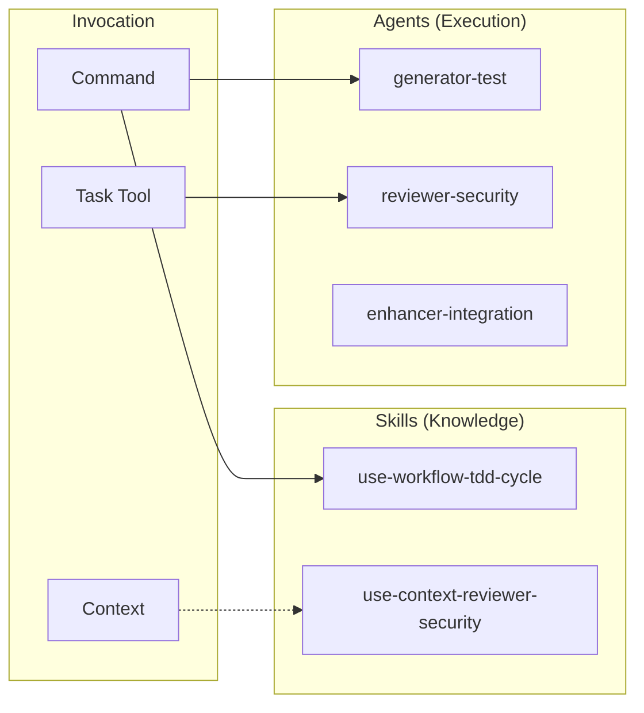
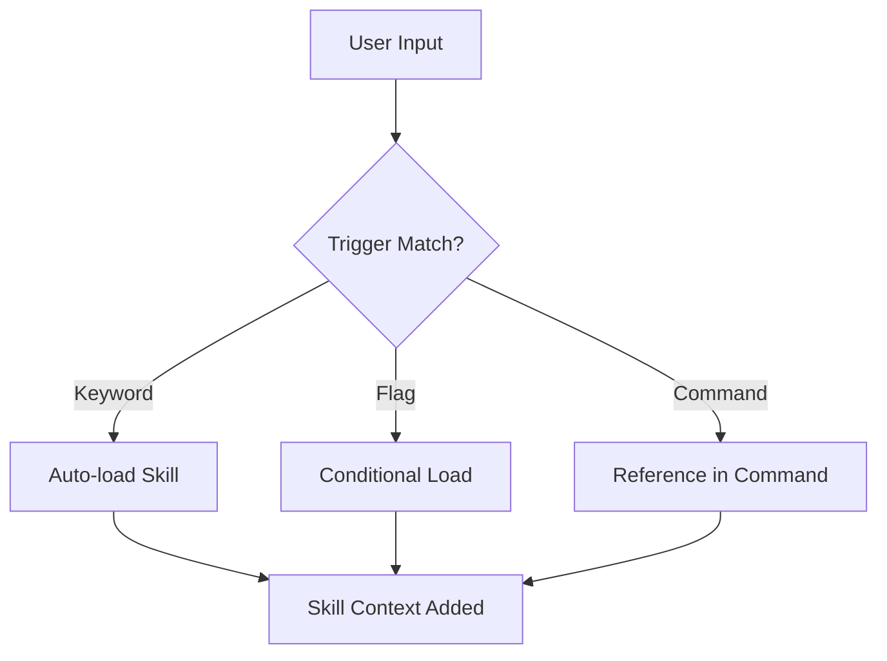

# Skills & Agents Design

Skill とエージェントの設計意図と利用ガイドライン。

📌 [English version](../../docs/SKILLS_AGENTS.md)

## コア コンセプト



## Skills と Agents

| 観点         | Skills                       | Agents           |
| ------------ | ---------------------------- | ---------------- |
| 役割         | ナレッジベース (What/How)    | 実行者 (Do)      |
| 起動         | 自動ロードまたはコマンド参照 | Task ツール経由  |
| コンテキスト | メイン または fork           | 常に fork        |
| 状態         | 読み取り専用                 | 可変             |
| 出力         | 情報                         | アーティファクト |

## Skills

### 用途

Skills は「ナレッジ モジュール」。AI がタスク実行時にドメイン固有の知識を提供する。

### カテゴリ

| カテゴリ       | Skills                                                           | 用途                                  |
| -------------- | ---------------------------------------------------------------- | ------------------------------------- |
| Workflow       | use-workflow-tdd-cycle, use-workflow-pageshot                    | 多段ワークフロー定義                  |
| Context        | use-context-reviewer-\*, use-context-root-cause-analysis         | エージェント向けドメイン知識          |
| CLI ラッパー   | use-cli-recall, use-cli-scout, use-cli-gcloud, use-cli-heptabase | CLI ツール統合                        |
| User-invocable | think, research, code, audit, polish, feature, fix, adr 等       | スラッシュ コマンド エントリ ポイント |

### ロード機構



トリガー例:

| トリガー                | ロードされる Skill              |
| ----------------------- | ------------------------------- |
| "TDD", "test-driven"    | use-workflow-tdd-cycle          |
| "OWASP", "セキュリティ" | use-context-reviewer-security   |
| "5 Whys", "root cause"  | use-context-root-cause-analysis |

### ファイル構造

```text
skills/[skill-name]/
├── SKILL.md        # 必須: YAML frontmatter + 知識本体
└── references/     # 任意: 詳細ガイド
    └── *.md
```

### YAML Frontmatter

```yaml
---
name: use-workflow-tdd-cycle
description: TDD with RGRC cycle and Baby Steps.
when_to_use: TDD, テスト駆動, Red-Green-Refactor, Baby Steps
allowed-tools: Read Write Edit Grep Glob
context: fork # fork または inline
user-invocable: false # スラッシュ コマンドとして起動可能か
---
```

## Agents

### 用途

エージェントは「専門実行者」。Task ツール経由で起動し、特定の分析や生成タスクを自律的に行う。

### カテゴリ

```text
agents/
├── critics/        # 反論検証 (critic-audit, critic-design, critic-evidence)
├── enhancers/      # コード改善・結果統合 (enhancer-code, enhancer-evidence, enhancer-integration)
├── explorers/      # 探索 (explorer-feature)
├── generators/     # 生成 (generator-test)
├── resolvers/      # 問題解決 (resolver-build)
└── reviewers/      # レビュー (15 種の専門 reviewer)
```

### Reviewer Agents (15 種)

| Agent                  | 焦点                             |
| ---------------------- | -------------------------------- |
| reviewer-accessibility | WCAG 2.2 適合                    |
| reviewer-causation     | 5 Whys 根本原因分析              |
| reviewer-coverage      | テスト カバレッジ品質            |
| reviewer-design        | React 設計パターン               |
| reviewer-duplication   | クロスファイル DRY 分析          |
| reviewer-efficiency    | アルゴリズム コスト、ホット パス |
| reviewer-operations    | エラー境界、ロギング             |
| reviewer-progressive   | CSS-first、JS 削減               |
| reviewer-prompt        | LLM プロンプト定義の品質         |
| reviewer-readability   | コード構造、可読性               |
| reviewer-resilience    | 耐障害性の弱点分析               |
| reviewer-reuse         | 既存コードの再利用機会           |
| reviewer-security      | OWASP Top 10                     |
| reviewer-silence       | サイレント失敗の検出             |
| reviewer-testability   | テスト可能なコード設計           |

### Task ツールでの起動

```markdown
Task tool で:

- subagent_type: "reviewer-security"
- prompt: "Review the authentication module for vulnerabilities"
- model: "sonnet" (任意)
```

## 設計判断

### Skill と Agent を分ける理由

| 理由             | 説明                                                        |
| ---------------- | ----------------------------------------------------------- |
| 関心の分離       | 知識 (Skills) と実行 (Agents) を分離                        |
| コンテキスト管理 | エージェントは fork で動き、メイン コンテキストを汚染しない |
| 再利用性         | Skill は複数のコマンドから参照できる                        |
| 専門化           | エージェントは特定タスクに特化し、より深い分析を行う        |

### 参照深度ルール

```text
SKILL.md → reference.md (1 階層のみ)
```

理由: Claude は深いネストを `head -100` で切り詰め、情報損失が起こる。

## 関連

- [COMMANDS.md](./COMMANDS.md). コマンド設計
- [SKILLS](../rules/conventions/SKILLS.md). Skill 定義書式
- [SUBAGENT](../rules/conventions/SUBAGENT.md). サブエージェント定義書式
