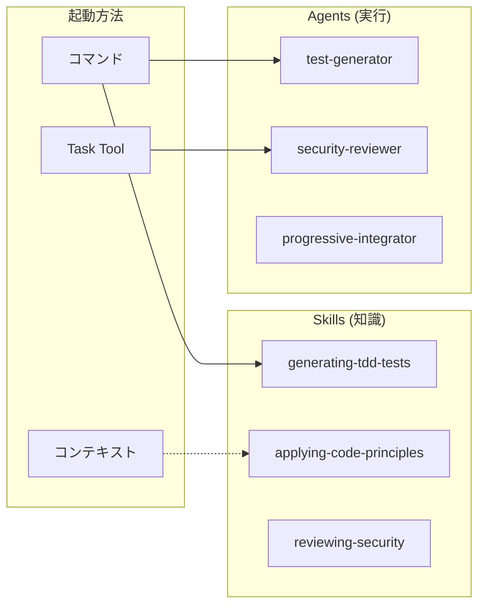
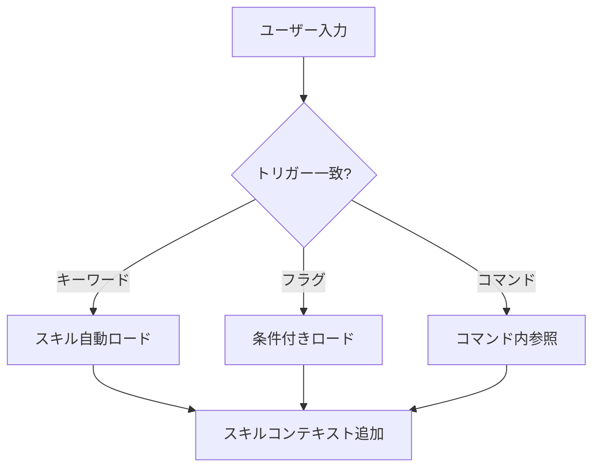

# スキル・エージェント設計

スキルとエージェントの設計意図と使い分けを説明します。

📌 **[English Version](../../docs/SKILLS_AGENTS.md)**

## 基本概念



## スキル vs エージェント

| 観点             | スキル                         | エージェント  |
| ---------------- | ------------------------------ | ------------- |
| **役割**         | 知識ベース（What/How）         | 実行者（Do）  |
| **起動**         | 自動ロード or コマンドから参照 | Task tool経由 |
| **コンテキスト** | メインまたはfork               | 常にfork      |
| **状態**         | 読み取り専用                   | 変更可能      |
| **出力**         | 情報提供                       | 成果物生成    |

## スキル

### 目的

スキルは「知識モジュール」。AIが特定のタスクを実行する際に必要な知識を提供。

### カテゴリ

| カテゴリ     | スキル                                               | 目的               |
| ------------ | ---------------------------------------------------- | ------------------ |
| TDD/テスト   | generating-tdd-tests                                 | テスト手法         |
| 原則         | applying-code-principles, applying-frontend-patterns | 設計原則           |
| ドキュメント | documenting-\*                                       | ドキュメント生成   |
| レビュー     | reviewing-\*                                         | コードレビュー観点 |
| ワークフロー | orchestrating-workflows                              | ワークフロー定義   |

### ロード機構



**トリガー例:**

| トリガー            | ロードされるスキル         |
| ------------------- | -------------------------- |
| "TDD", "テスト駆動" | generating-tdd-tests       |
| "SOLID", "原則"     | applying-code-principles   |
| "/code --frontend"  | applying-frontend-patterns |

### ファイル構造

```text
skills/[skill-name]/
├── SKILL.md        # 必須: YAML front matter + 知識本体
└── references/     # 任意: 詳細ガイド
    └── *.md
```

### YAML Front Matter

```yaml
---
name: generating-tdd-tests
description: >
  TDD with RGRC cycle and Baby Steps methodology.
  Use when implementing features with test-driven development,
  or when user mentions TDD, テスト駆動, Red-Green-Refactor.
allowed-tools: [Read, Write, Edit, Grep, Glob, Task]
context: fork # fork or inline
user-invocable: false # スラッシュコマンドとして呼び出し可能か
---
```

## エージェント

### 目的

エージェントは「専門実行者」。Task toolで起動され、特定の分析・生成タスクを自律的に実行。

### カテゴリ

```text
agents/
├── analyzers/      # コード分析 (api, architecture, code-flow, domain, plugin-scanner, setup)
├── architects/     # 設計 (feature-architect)
├── critics/        # 批判的検証 (devils-advocate-audit, devils-advocate-design, evidence-verifier)
├── enhancers/      # コード改善 (code-simplifier)
├── explorers/      # 探索 (feature-explorer)
├── generators/     # 生成 (branch, commit, issue, pr, test)
├── resolvers/      # 問題解決 (build-error-resolver)
├── reviewers/      # レビュー (15 specialized reviewers)
└── teams/          # チーム統合 (progressive-integrator, unit-implementer)
```

### レビューエージェント（15種類）

| エージェント            | フォーカス           |
| ----------------------- | -------------------- |
| security-reviewer       | OWASP Top 10         |
| type-safety-reviewer    | TypeScript型安全性   |
| type-design-reviewer    | 型設計 + カプセル化  |
| testability-reviewer    | テスト容易性         |
| test-coverage-reviewer  | テストカバレッジ品質 |
| silent-failure-reviewer | 静かな失敗検知       |
| root-cause-reviewer     | 根本原因分析         |
| code-quality-reviewer   | 構造 + 可読性        |
| progressive-enhancer    | CSS-first + JS削減   |
| performance-reviewer    | パフォーマンス       |
| accessibility-reviewer  | WCAG準拠             |
| design-pattern-reviewer | Reactパターン        |
| document-reviewer       | ドキュメント品質     |
| sow-spec-reviewer       | SOW/Spec品質         |
| subagent-reviewer       | サブエージェント定義 |

### チームエージェント（2種類）

| エージェント           | フォーカス                                         |
| ---------------------- | -------------------------------------------------- |
| progressive-integrator | challenge/verification 結果の照合 + 根本原因の統合 |
| unit-implementer       | RGRC サイクルによる実装                            |

### Task Tool による起動

```markdown
Task tool with:

- subagent_type: "security-reviewer"
- prompt: "認証モジュールの脆弱性をレビュー"
- model: "sonnet" (任意)
```

## 設計判断

### なぜスキルとエージェントを分けるのか？

| 理由                 | 説明                                               |
| -------------------- | -------------------------------------------------- |
| **関心の分離**       | 知識（Skills）と実行（Agents）を分離               |
| **コンテキスト管理** | Agentsはforkで実行、メインコンテキストを汚染しない |
| **再利用性**         | Skillsは複数のコマンドから参照可能                 |
| **専門性**           | Agentsは特定タスクに特化、深い分析が可能           |

### 参照深度ルール

```text
SKILL.md → reference.md (1階層まで)
```

理由: Claudeが深いネストを `head -100` で読むと情報が欠落する。

## 関連

- [COMMANDS.md](./COMMANDS.md) — コマンドの設計
- [SKILL_FORMAT](../rules/conventions/SKILL_FORMAT.md) — スキル定義形式
