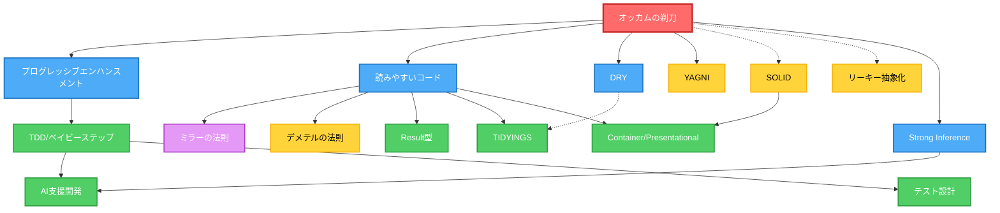

# 原則

## 優先度マトリックス

| 優先度       | 原則                           | 一言説明                               | 適用タイミング           |
| ------------ | ------------------------------ | -------------------------------------- | ------------------------ |
| クリティカル | オッカムの剃刀                 | 動作する最もシンプルな解決策を選ぶ     | 常に - すべての判断で    |
| クリティカル | プログレッシブエンハンスメント | シンプルに構築し、徐々に強化           | 実装開始時               |
| デフォルト   | 読みやすいコード               | コンピュータではなく人間のためのコード | コードを書くとき         |
| デフォルト   | ミラーの法則                   | 7±2の認知限界を尊重                    | インターフェース設計時   |
| デフォルト   | TDD/ベイビーステップ           | テスト付きの小さな増分変更             | 開発プロセス             |
| デフォルト   | DRY                            | 自分自身を繰り返さない                 | 3回以上の重複発見時      |
| デフォルト   | YAGNI                          | 必要でないものは作らない               | 「念のため」コード追加時 |
| デフォルト   | Strong Inference               | 複数仮説を立て、証拠で棄却             | 調査・分析時             |
| コンテキスト | SOLID                          | 変更に対応した設計                     | 大規模アーキテクチャ     |
| コンテキスト | Container/Presentational       | ロジックとUIを分離                     | React/UIコンポーネント   |
| コンテキスト | デメテルの法則                 | 直接の友人とだけ話す                   | 複雑な依存関係           |
| コンテキスト | リーキー抽象化                 | 不完全な抽象化を受け入れる             | 抽象化の評価時           |
| コンテキスト | AI支援開発                     | AIが生成、人間が検証                   | AIツール使用時           |
| コンテキスト | TIDYINGS                       | 作業しながらクリーン                   | 開発中                   |

## 依存グラフ

| 色  | タイプ                 | 説明                                  |
| --- | ---------------------- | ------------------------------------- |
| 赤  | メタ原則               | オッカムの剃刀 - すべての複雑さを問う |
| 青  | 普遍的                 | すべての判断にデフォルトで適用        |
| 緑  | 適用されるプラクティス | 具体的な実装パターン                  |
| 黄  | コンテキスト依存       | 状況が要求するときに適用              |
| 紫  | 科学的                 | 認知科学に裏付けられている            |

## 主要な関係

| 関係                              | 理由                           |
| --------------------------------- | ------------------------------ |
| オッカムの剃刀 ⟷ SOLID            | バランス: 構造 vs 過剰設計     |
| オッカムの剃刀 ⟷ リーキー抽象化   | 複雑さより不完全さを受け入れる |
| 読みやすいコード → ミラーの法則   | 認知科学の裏付け（7±2制限）    |
| 読みやすいコード + DRY → TIDYINGS | 2つの原則の実践的な組み合わせ  |
| TDD → AI支援開発                  | AIがサイクルを加速、人間が検証 |
| Strong Inference → AI支援開発     | 複数仮説が確証バイアスを防ぐ   |

## 競合解決

| 競合              | 解決策           | 例                                         |
| ----------------- | ---------------- | ------------------------------------------ |
| DRY vs 読みやすさ | 読みやすさが勝つ | 抽象化が明確さを損なうなら重複を受け入れる |
| SOLID vs シンプル | シンプルが勝つ   | 想像上の未来のために過剰設計しない         |
| 完璧 vs 動作      | 動作が勝つ       | 実際の問題を解決するリーキー抽象化を出荷   |
| 抽象 vs 具体      | 具体から始める   | パターンが現れたとき（3回以上）のみ抽象化  |

## レッドフラグ

- メソッドチェーン > 2レベル → デメテルの法則を適用
- 1分で理解できない → 読みやすいコードを適用
- 「念のため」の実装 → YAGNIを思い出す
- 完璧な抽象化の試み → リーキー抽象化を受け入れる
- 複雑な解決策を先に → オッカムの剃刀を適用
- レビューなしでAI出力を受け入れる → AI支援開発を適用
- 単一仮説を正しいと仮定 → Strong Inferenceを適用

## コマンド

| コマンド    | 主要原則              | 副次原則                          |
| ----------- | --------------------- | --------------------------------- |
| `/think`    | SOLID、オッカムの剃刀 | プログレッシブエンハンスメント    |
| `/research` | Strong Inference      | コンテキストのためのすべての原則  |
| `/code`     | TDD、ベイビーステップ | 読みやすいコード、DRY、AI支援開発 |
| `/test`     | TDD                   | デメテルの法則、AI支援開発        |
| `/fix`      | オッカムの剃刀        | TIDYINGS                          |
| `/audit`    | すべての原則          | 優先順序、Strong Inference        |

## 最終的な知恵

最高の原則は、原則を適用しないときを知ることである。

迷ったら:

1. 巧妙よりシンプルを選ぶ
2. 抽象より具体を選ぶ
3. 完璧より動作を選ぶ
4. DRYより明確さを選ぶ
5. 純粋より実用的を選ぶ

覚えておく: 原則はルールではなくツール。目標は動作する保守可能なソフトウェア。
