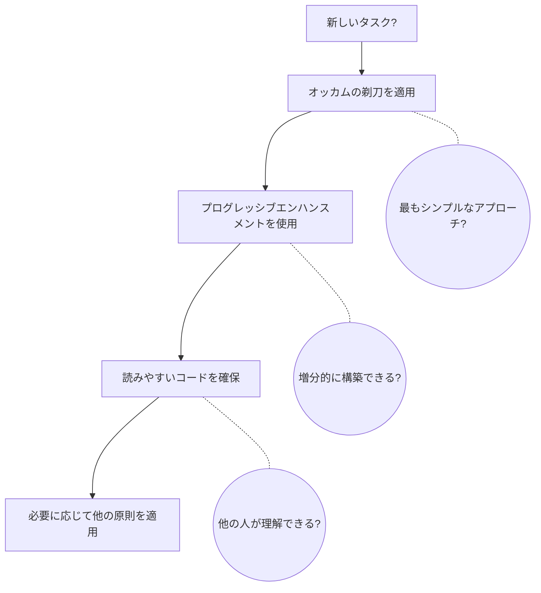

# 原則適用ガイド

> 即座のニーズにはクイックリファレンスから。深い理解には詳細ガイドを参照。

---

## クイックリファレンス

### 優先度マトリックス

| 優先度 | 原則 | 一言説明 | 適用タイミング |
| --- | --- | --- | --- |
| **[クリティカル]** | | | |
| | オッカムの剃刀 | 動作する最もシンプルな解決策を選ぶ | 常に - すべての判断で |
| | プログレッシブエンハンスメント | シンプルに構築し、徐々に強化 | 実装開始時 |
| **[デフォルト]** | | | |
| | 読みやすいコード | コンピュータではなく人間のためのコード | コードを書くとき |
| | TDD/ベイビーステップ | テスト付きの小さな増分変更 | 開発プロセス |
| | DRY | 自分自身を繰り返さない | 3回以上の重複発見時 |
| **[コンテキスト依存 - アーキテクチャ]** | | | |
| | SOLID | 変更に対応した設計 | 大規模アーキテクチャ |
| | Container/Presentational | ロジックとUIを分離 | React/UIコンポーネント |
| | デメテルの法則 | 直接の友人とだけ話す | 複雑な依存関係 |
| **[コンテキスト依存 - 実践]** | | | |
| | リーキー抽象化 | 不完全な抽象化を受け入れる | 抽象化の評価時 |
| | AI支援開発 | AIが生成、人間が検証 | AIツール使用時 |
| | TIDYINGS | 作業しながらクリーン | 開発中 |

### 判断フロー

### 競合解決

| 競合 | 解決策 | 例 |
| --- | --- | --- |
| **DRY vs 読みやすさ** | 読みやすさが勝つ | 抽象化が明確さを損なうなら重複を受け入れる |
| **SOLID vs シンプル** | シンプルが勝つ | 想像上の未来のために過剰設計しない |
| **完璧 vs 動作** | 動作が勝つ | 実際の問題を解決するリーキー抽象化を出荷 |
| **抽象 vs 具体** | 具体から始める | パターンが現れたとき（3回以上）のみ抽象化 |

### レッドフラグ

- メソッドチェーン > 3レベル → デメテルの法則を適用
- 1分で理解できない → 読みやすいコードを適用
- 「念のため」の実装 → YAGNIを思い出す
- 完璧な抽象化の試み → リーキー抽象化を受け入れる
- 複雑な解決策を先に → オッカムの剃刀を適用
- レビューなしでAI出力を受け入れる → AI支援開発を適用

### クイックコマンド

| 状況 | コマンド | 適用される原則 |
| --- | --- | --- |
| バグ修正 | `/fix` | オッカムの剃刀、プログレッシブエンハンスメント |
| 新機能 | `/research → /think → /code` | TDD、ベイビーステップ、SOLID |
| リファクタリング | `/research → /code` | TIDYINGS、DRY、読みやすいコード |

---

## 詳細ガイド

### 原則の階層

| レベル | 原則 | キー質問 |
| --- | --- | --- |
| **L1: 普遍的** | オッカムの剃刀、プログレッシブエンハンスメント | 「最もシンプルな解決策？最小限から始める？」 |
| **L2: デフォルト** | 読みやすいコード、TDD/ベイビーステップ、DRY | 「明確？テスト済み？3回ルール？」 |
| **L3: コンテキスト依存** | SOLID、Container/Presentational、デメテルの法則、リーキー抽象化、TIDYINGS | 「必要なときのみ」 |

### 原則の関係

詳細な原則の関係性と依存グラフについては以下を参照:
[@./PRINCIPLE_RELATIONSHIPS.md](./PRINCIPLE_RELATIONSHIPS.md)

### 実践的な適用シナリオ

| シナリオ | 主要原則 | アプローチ |
| --- | --- | --- |
| **新機能** | プログレッシブエンハンスメント TDD/ベイビーステップ 読みやすいコード | 1. 最もシンプルなバージョンから開始 2. 失敗するテストを書く → 最小限のコード 3. 新しい開発者のための明確さを確保 4. SOLIDは以下の場合のみ考慮: マルチチーム、パブリックAPI、明示的な将来要件 |
| **レガシー修正** | オッカムの剃刀 TIDYINGS リーキー抽象化 | 1. 問題を修正するための最小限の変更 2. 触れたコードのみクリーン 3. DRYを問う: 重複は有害か？ 4. フレームワークの制限を受け入れ、戦わない |
| **コードレビュー** | すべての原則 | 各項目をチェック: より簡単な方法？（オッカム） 増分的に出荷できる？（プログレッシブ） 理解できる？（読みやすさ） 重複は問題？（DRY） メソッドチェーン > 2？（デメテル） フレームワークと戦っている？（リーキー） |

### コマンドとの統合

| コマンド | 主要原則 | 副次原則 |
| --- | --- | --- |
| `/think` | SOLID、オッカムの剃刀 | プログレッシブエンハンスメント |
| `/research` | - | コンテキストのためのすべての原則 |
| `/code` | TDD、ベイビーステップ | 読みやすいコード、DRY、AI支援開発 |
| `/test` | TDD | デメテルの法則、AI支援開発 |
| `/fix` | オッカムの剃刀 | TIDYINGS |
| `/audit` | すべての原則 | 優先順序 |

### アンチパターン

**主要な例**: 単一実装のインターフェース、1つの関数をラップするクラス、「将来対応」の抽象化

詳細: [@../skills/reviewing-readability/references/ai-antipatterns.md](../skills/reviewing-readability/references/ai-antipatterns.md)

## 最終的な知恵

> 「最高の原則は、原則を適用しないときを知ることである。」

迷ったら:

1. 巧妙よりシンプルを選ぶ
2. 抽象より具体を選ぶ
3. 完璧より動作を選ぶ
4. DRYより明確さを選ぶ
5. 純粋より実用的を選ぶ

覚えておく: **原則はルールではなくツール**。目標は動作する保守可能なソフトウェア。

## 関連原則

### コアドキュメント

- [@../skills/applying-code-principles/SKILL.md](../skills/applying-code-principles/SKILL.md) - 閾値付きの原則
- [@./development/PROGRESSIVE_ENHANCEMENT.md](./development/PROGRESSIVE_ENHANCEMENT.md) - アプローチ
- [@./development/READABLE_CODE.md](./development/READABLE_CODE.md) - ベースライン

### すべての原則

- スキル: [@../skills/applying-code-principles/SKILL.md](../skills/applying-code-principles/SKILL.md) - SOLID、DRY、オッカムの剃刀、ミラーの法則、YAGNI
- 開発: [@./development/](./development/) - 実践的な原則
- コマンド: [@../docs/COMMANDS.md](../docs/COMMANDS.md) - 統合ワークフロー
