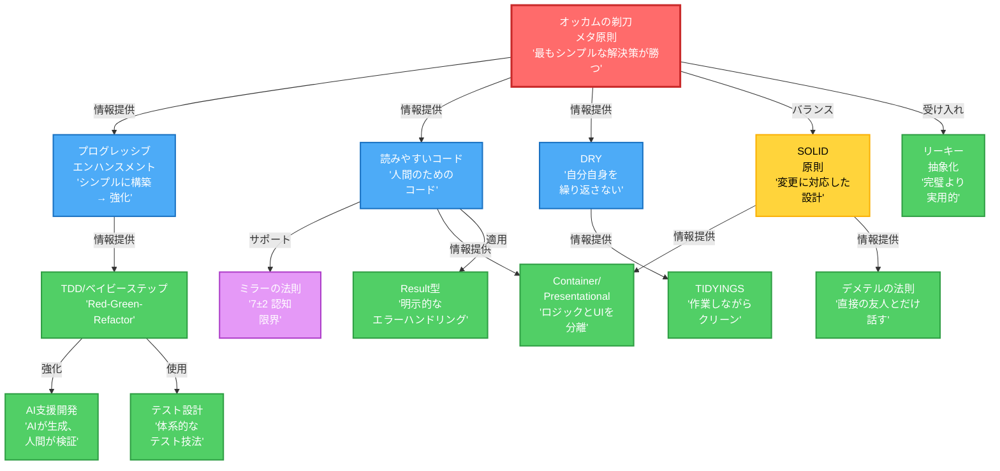

# 原則の関係性

原則がどのように関連し、互いに構築されるかを理解することで、一貫した適用が可能になる。

## 依存グラフ

## グラフ凡例

| 色  | タイプ                 | 説明                                  |
| --- | ---------------------- | ------------------------------------- |
| 赤  | メタ原則               | オッカムの剃刀 - すべての複雑さを問う |
| 青  | 普遍的                 | すべての判断にデフォルトで適用        |
| 緑  | 適用されるプラクティス | 具体的な実装パターン                  |
| 黄  | コンテキスト依存       | 状況が要求するときに適用              |
| 紫  | 科学的                 | 認知科学に裏付けられている            |

## 主要な関係

| #   | 関係                                                      | 説明                                                    |
| --- | --------------------------------------------------------- | ------------------------------------------------------- |
| 1   | **オッカムの剃刀 → すべて**                               | すべての複雑さを問うメタ原則                            |
| 2   | **オッカムの剃刀 → プログレッシブエンハンスメント**       | シンプルに始め、必要なときだけ複雑さを追加              |
| 3   | **オッカムの剃刀 → DRY**                                  | 抽象化（DRY）とシンプルさ（オッカム）のバランス         |
| 4   | **オッカムの剃刀 ⟷ SOLID**                                | バランス: 構造のためのSOLID、過剰設計を防ぐオッカム     |
| 5   | **プログレッシブエンハンスメント → TDD/ベイビーステップ** | 両方とも増分開発を重視                                  |
| 6   | **読みやすいコード → ミラーの法則**                       | 読みやすさの限界に対する認知科学の裏付け（7±2アイテム） |
| 7   | **SOLID → Container/Presentational**                      | SRP（単一責任）がUI/ロジック分離を推進                  |
| 8   | **SOLID → デメテルの法則**                                | 両方とも依存関係と結合を管理                            |
| 9   | **読みやすいコード + DRY → TIDYINGS**                     | コードをクリーンに保つ実践的な適用                      |
| 10  | **オッカムの剃刀 → リーキー抽象化**                       | シンプルさのために不完全な抽象化を受け入れる            |
| 11  | **TDD → AI支援開発**                                      | AIがTDDサイクルを加速、人間が検証                       |
| 12  | **TDD → テスト設計**                                      | テストケース設計のための体系的手法                      |
| 13  | **読みやすいコード → Result型**                           | 明示的なエラーハンドリングでコードの意図を明確に        |

## このグラフの使い方

1. **開始点**: すべての判断でオッカムの剃刀（赤）から始める
2. **構築**: 普遍的原則（青）を適用 - プログレッシブエンハンスメント、読みやすいコード、DRY
3. **実装**: 適用されるプラクティス（緑）を使用 - TDD、Container/Presentational、TIDYINGS
4. **特定のコンテキスト**: コンテキスト依存原則（黄）を適用 - SOLID、デメテルの法則は必要なときのみ
5. **競合解決**: 原則が競合したら、最上部のオッカムの剃刀に戻る

## 開発プラクティス

各プラクティスの詳細な実装ガイド:

| プラクティス                   | ファイル                                                                                                    | フォーカス                 |
| ------------------------------ | ----------------------------------------------------------------------------------------------------------- | -------------------------- |
| プログレッシブエンハンスメント | [@./development/PROGRESSIVE_ENHANCEMENT.md](./development/PROGRESSIVE_ENHANCEMENT.md)                       | CSS優先、成果駆動          |
| 読みやすいコード               | [@./development/READABLE_CODE.md](./development/READABLE_CODE.md)                                           | 巧妙さより明瞭さ           |
| TDD/RGRC                       | [@./development/TDD_RGRC.md](./development/TDD_RGRC.md)                                                     | Red-Green-Refactorサイクル |
| テスト設計                     | [@./development/TEST_GENERATION.md](./development/TEST_GENERATION.md)                                       | 体系的テスト技法           |
| Container/Presentational       | [@../../patterns/frontend/container-presentational.md](../../patterns/frontend/container-presentational.md) | UI/ロジック分離            |
| デメテルの法則                 | [@./development/LAW_OF_DEMETER.md](./development/LAW_OF_DEMETER.md)                                         | 最小結合                   |
| リーキー抽象化                 | [@./development/LEAKY_ABSTRACTION.md](./development/LEAKY_ABSTRACTION.md)                                   | 実用的な抽象化             |
| TIDYINGS                       | [@./development/TIDYINGS.md](./development/TIDYINGS.md)                                                     | マイクロ改善               |
| AI支援開発                     | [@./development/AI_ASSISTED_DEVELOPMENT.md](./development/AI_ASSISTED_DEVELOPMENT.md)                       | AIが生成、人間が検証       |
| Result型ハンドリング           | [@./development/RESULT_TYPE_HANDLING.md](./development/RESULT_TYPE_HANDLING.md)                             | 明示的エラーハンドリング   |

## 関連ドキュメント

- [@./PRINCIPLES_GUIDE.md](./PRINCIPLES_GUIDE.md) - 完全な原則ガイド
- [@./development/](./development/) - 個別の原則ファイル
