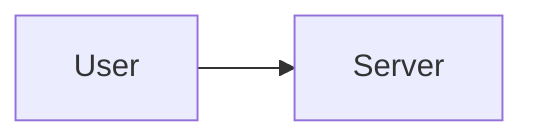

# ドキュメントルールとガイドライン

Claude Codeエコシステムにおける一貫性があり、よく整理されたドキュメントを維持するためのガイドライン。

## コア原則

1. **完全性より明確性** - ドキュメントにオッカムの剃刀を適用
2. **言語間の一貫性** - EN/JP同期を維持
3. **論理的階層** - 原則と実践の明確な分離
4. **循環参照なし** - クリーンな依存関係グラフを維持
5. **絵文字使用ポリシー** - 人間向け出力とAI用ドキュメントを区別:
   - **人間向け出力テンプレート**: 絵文字OK（✅/❌/⚠️は視覚効果として有効）
   - **AI用ドキュメント**: 絵文字の代わりにテキストラベルを使用
6. **図表フォーマットポリシー** - ASCII図よりMermaidとテーブルを優先:
   - **新規ドキュメント**: Mermaidダイアグラムまたはマークダウンテーブルを使用（必須）
   - **既存ドキュメント**: 編集時にASCII図をMermaid/テーブルへ移行

## ディレクトリ構造

### 配置基準

```markdown
/rules/
├── core/ # AI動作ルール（hook注入）
│ ├── AI_OPERATION_PRINCIPLES.md # 安全性、権限、ワークフロー
│ ├── PRE_TASK_CHECK_RULES.md # タスク検証（ルール）
│ └── PRE_TASK_CHECK_TEMPLATES.md # タスク検証（テンプレート）
│
├── guidelines/ # ドキュメントガイドライン
│ └── DOCUMENTATION_RULES.md # このファイル
│
├── development/ # 実践的な適用
│ ├── TDD_RGRC.md # TDDサイクル
│ ├── PROGRESSIVE_ENHANCEMENT.md # CSS優先アプローチ
│ ├── READABLE_CODE.md # コードの明確性
│ └── TIDYINGS.md # マイクロ改善
│
├── commands/ # コマンド固有ルール
│ └── COMMAND_WORKFLOWS.md # ワークフロー選択
│
├── PRINCIPLES_GUIDE.md # クイックリファレンス
└── PRINCIPLE_RELATIONSHIPS.md # 原則の依存関係

注: コア原則（SOLID、DRY、オッカムの剃刀）は以下にある:
→ /skills/applying-code-principles/SKILL.md
```

### 判断フレームワーク

新しいドキュメントを追加するとき:

```markdown
基本的な原則または理論か？
YES → /rules/guidelines/
NO → 続行

実践的な方法または技法か？
YES → /rules/development/
NO → 続行

コマンドまたはツールか？
YES → /commands/
NO → /docs/
```

## 参照管理

### 参照階層

```markdown
レベル1: CLAUDE.md（トップレベル設定）
├─→ レベル2: コア原則（/rules/guidelines/）
├─→ レベル2: 開発プラクティス（/rules/development/）
└─→ レベル2: コマンド（/commands/）
└─→ レベル3: ドキュメント間のクロスリファレンス
```

### 参照ルール

1. **最大深度**: 参照は3レベルまで
2. **循環を避ける**: A → B → A は禁止
3. **重要なものは直接**: コア原則はCLAUDE.mdから直接参照
4. **関連をグループ化**: セクションヘッダーで参照をグループ化

### 参照フォーマット

```markdown
## 関連原則

### コア原則（skills/から）

- [@../../skills/applying-code-principles/SKILL.md](../../skills/applying-code-principles/SKILL.md) - SOLID, DRY, YAGNI原則

### 実践で適用

- [@../development/TDD_RGRC.md](../development/TDD_RGRC.md) - TDD方法論
```

### 標準セクション名

| 目的             | 標準名                  | 非推奨                         |
| ---------------- | ----------------------- | ------------------------------ |
| 関連ドキュメント | `## Related Principles` | `## References`, `## See Also` |
| コード例         | `## Examples`           | -                              |
| APIドキュメント  | `## API Reference`      | -                              |

**注**: すべてのドキュメントファイルの末尾で `## Related Principles` を一貫して使用すること。

## 言語同期

### 二言語要件

**すべてのドキュメントファイルは以下を持つ必要がある:**

- 英語版: `/path/to/FILE.md`
- 日本語版: `/.ja/path/to/FILE.md`

### 同期チェックリスト

ドキュメントを更新するとき:

```markdown
☐ 英語版を更新
☐ 日本語版を更新
☐ 構造が一致することを確認
☐ 参照パスを確認（相対パスが異なる！）
☐ セクションヘッダーが一致することを確認
☐ クロスリファレンスが機能することをテスト
```

### パス参照

ENとJPは各ディレクトリ内で同一の相対パスパターンを使用:

```markdown
[@./DOCUMENTATION_RULES.md](./DOCUMENTATION_RULES.md) # 同じディレクトリ
[@../development/TDD_RGRC.md](../development/TDD_RGRC.md) # 1レベル上
```

### 言語例外

**ADR（アーキテクチャ決定記録）**:

- `docs/adr/*.md` ファイルはCLAUDE.md P1ルールに従いデフォルトで日本語出力
- ソースが既に日本語のため `.ja/` への翻訳は不要
- ADR出力言語はプロジェクトの言語設定に従う

## 更新手順

| 操作             | ステップ                                                              |
| ---------------- | --------------------------------------------------------------------- |
| **新規追加**     | 1. EN/JP両方を作成 2. CLAUDE.mdに参照追加 3. 関連ドキュメント更新     |
| **変更**         | 1. `grep -r "FILENAME"` で参照確認 2. EN/JPを一緒に更新 3. リンク確認 |
| **ファイル移動** | 1. 参照検索 2. EN/JP移動 3. すべての参照更新                          |

## ドキュメント標準

### ファイル構造

```markdown
# タイトル - 明確で説明的

## コア哲学

なぜこれが存在するかの簡潔な説明

## 主要概念

主なアイデア、明確に説明

## 実践的な適用

例とユースケース

## 関連原則

関連ドキュメントへのリンク
```

### 記述スタイル

1. **ヘッダー**: 文頭大文字、すべて大文字ではない
2. **例**: 実践的なコード例を含める
3. **比較**: 悪い例 vs 良い例を示す
4. **要約**: 要点を箇条書きで
5. **絵文字ポリシー**: コア原則#5を適用（上記参照）
   - 人間向け出力テンプレート: 視覚効果として絵文字を維持
   - AI用ドキュメント部分: テキストラベルを使用

### 図表フォーマット

視覚的表現を作成する際はコア原則#6を適用:

**フローチャートや関係図にはMermaidを使用:**

````markdown
<!-- 悪い例: ASCII図 -->

+--------+ +--------+
| User | --> | Server |
+--------+ +--------+

<!-- 良い例: Mermaidダイアグラム -->


````

**構造化データにはテーブルを使用:**

```markdown
<!-- 悪い例: ASCIIテーブル -->

+----------+--------+---------+
| Name | Type | Default |
+----------+--------+---------+
| timeout | number | 30000 |
+----------+--------+---------+

<!-- 良い例: マークダウンテーブル -->

| Name    | Type   | Default |
| ------- | ------ | ------- |
| timeout | number | 30000   |
```

**移行優先度:**

| 優先度 | パターン               | アクション                       |
| ------ | ---------------------- | -------------------------------- |
| 高     | フローチャート、決定木 | Mermaidに変換                    |
| 高     | データテーブル         | マークダウンテーブルに変換       |
| 中     | ディレクトリ構造       | コードブロックのまま維持（例外） |
| 低     | シンプルなインライン図 | ケースバイケースで評価           |

### コード例

```typescript
// 悪い例: 複雑な例を最初に
complexImplementation();

// 良い例: シンプルな例を最初に
simpleImplementation();

// その後、複雑への進行を示す
advancedImplementation();
```

## 品質チェックリスト

- [ ] EN/JP同期済み
- [ ] すべてのリンクをテスト
- [ ] 循環参照なし
- [ ] 正しい配置（guidelines/ vs development/）
- [ ] 図表はMermaidまたはテーブルを使用（ASCII図なし）

## 一般的なパターン

| パターン       | ステップ                                   |
| -------------- | ------------------------------------------ |
| 新原則         | guidelines/にEN/JPを作成 → CLAUDE.mdに追加 |
| 新プラクティス | development/にEN/JPを作成 → 原則から参照   |
| 新コマンド     | commands/にEN/JPを作成 → COMMANDS.mdに追加 |

## アンチパターン

| 避ける                  | 代わりに                                  |
| ----------------------- | ----------------------------------------- |
| 単一言語の更新          | 同期更新（EN/JP一緒に）                   |
| 深いネスト（3レベル超） | フラット階層                              |
| 孤立したドキュメント    | 接続されたグラフ                          |
| 循環参照                | ツリー構造                                |
| 配置の誤り              | 判断フレームワークに従う                  |
| ASCII図                 | MermaidダイアグラムまたはMarkdownテーブル |

## メンテナンスタスク

### 定期レビュー

週次:

- 壊れた参照をチェック
- EN/JP同期を確認
- 一貫性のための最近の変更をレビュー

月次:

- ディレクトリ構造を評価
- 孤立したドキュメントをチェック
- 参照深度をレビュー

### リファクタリングシグナル

以下の場合にリファクタリングを検討:

- 参照深度が3レベルを超える
- 循環依存が検出される
- 配置の混乱（原則 vs 実践）
- EN/JPの構造のずれ
- クロスリファレンスが多すぎる（ドキュメントごとに5超）

## ツール

```bash
grep -r "FILENAME" ~/.claude/           # 参照を検索
diff <(ls /rules/) <(ls /.ja/rules/)    # EN/JP一致をチェック
```

## 進化ガイドライン

### 新カテゴリを作成するタイミング

以下の場合に新ディレクトリを作成:

- 同じカテゴリに5つ以上の関連ドキュメント
- 明確な概念境界が現れる
- 配置の混乱が繰り返される

### カテゴリを統合するタイミング

以下の場合に統合を検討:

- カテゴリごとに3つ未満のドキュメント
- 概念境界が不明確
- 配置の混乱が頻繁

### バージョン管理

常に明確なメッセージでコミット:

```bash
# 良いコミットメッセージ
docs: オッカムの剃刀原則をリファレンスに追加
docs: TDD_RGRCのEN/JPを同期
docs: TIDYINGSをreferenceからdevelopmentへ移動
refactor: 原則ドキュメント構造を再編成

# 何が変わったか、なぜかを含める
```

## 覚えておく

> 「最高のドキュメントは最も包括的なものではなく、最も理解しやすいもの」 - ドキュメントに適用したオッカムの剃刀

以下を保つ:

- **シンプル** - 理解しやすい
- **整理済み** - 見つけやすい
- **同期済み** - 言語間で一貫性
- **接続済み** - 適切に参照
- **メンテナンス済み** - 定期的に更新

---

_最終更新: 2026-01-01_
