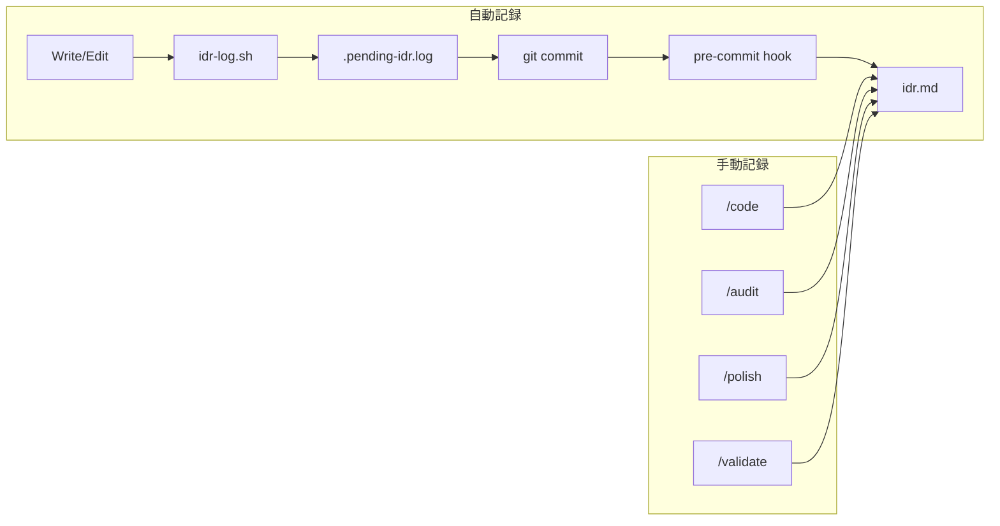

# IDR (Implementation Decision Record) 生成

開発ライフサイクル全体を通じて実装決定を追跡します。

## 記録レイヤー

| レイヤー   | トリガー   | 記録内容                   | 自動 |
| ---------- | ---------- | -------------------------- | ---- |
| pre-commit | git commit | 変更ファイル、確認チェック | Yes  |
| /code      | 実装完了時 | 設計決定、トレードオフ     | 任意 |
| /audit     | レビュー時 | 問題点、改善提案           | 任意 |
| /polish    | 整理時     | 削除・簡略化内容           | 任意 |
| /validate  | 検証時     | SOW適合性、ギャップ        | 任意 |

## 自動記録 (pre-commit hook)

コミット時に自動的に以下を記録：

| セクション   | 内容                           |
| ------------ | ------------------------------ |
| 変更ファイル | ステージされたファイル一覧     |
| 確認内容     | Claudeが生成した確認質問の回答 |
| メモ         | 開発者が記入したメモ           |

場所: `[IDRと同じディレクトリ]/.idr-confirm.md` (作業用)

## 手動記録 (スラッシュコマンド)

より詳細な記録が必要な場合にスラッシュコマンドを使用：

| コマンド  | 使用タイミング         | 記録内容             |
| --------- | ---------------------- | -------------------- |
| /code     | 重要な設計決定をした時 | 決定理由、代替案     |
| /audit    | コードレビュー後       | 問題点、修正提案     |
| /polish   | リファクタリング後     | 削除内容、簡略化理由 |
| /validate | 実装完了時             | SOW適合性、残タスク  |

## IDRファイルの場所

| シナリオ | 検出方法                                        | パス                       |
| -------- | ----------------------------------------------- | -------------------------- |
| SOWあり  | `~/.claude/workspace/planning/**/sow.md` を検索 | `[SOWディレクトリ]/idr.md` |
| SOWなし  | デフォルト場所                                  | `planning/default/idr.md`  |

## 統合

## 関連

- Hook: `~/.claude/hooks/lifecycle/idr-log.sh`
- Hook: `~/.claude/hooks/lifecycle/idr-pre-commit.sh`
- SOWテンプレート: `~/.claude/templates/sow/template.md`
