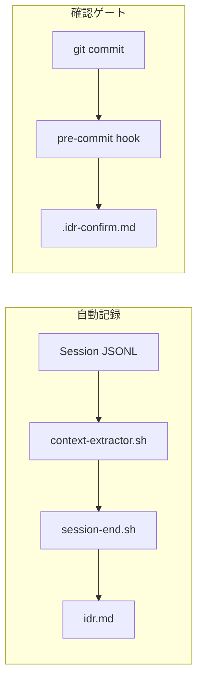

# IDR (Implementation Decision Record) 生成

開発ライフサイクル全体を通じて実装決定を追跡します。

## 記録レイヤー

| レイヤー    | トリガー         | 記録内容           | 自動 |
| ----------- | ---------------- | ------------------ | ---- |
| session-end | セッション終了時 | 実装内容、設計決定 | Yes  |
| pre-commit  | git commit       | 確認ゲートのみ     | Yes  |

## 自動記録 (session-end hook)

セッション終了時に自動的に以下を記録：

| セクション | 内容                               |
| ---------- | ---------------------------------- |
| 実装内容   | Claudeが変更内容を要約             |
| 設計決定   | 主要な設計決定とその理由（あれば） |

## 確認ゲート (pre-commit hook)

コミット前の確認ゲート（IDRへの記録はしない）：

| ファイル          | 用途                       |
| ----------------- | -------------------------- |
| `.idr-confirm.md` | 確認質問（一時的、作業用） |

## IDRファイルの場所

| シナリオ        | 検出方法                                      | パス                         |
| --------------- | --------------------------------------------- | ---------------------------- |
| 追跡中のSOWあり | `$HOME/.claude/workspace/.current-sow` を読込 | `[SOWディレクトリ]/idr.md`   |
| 追跡中のSOWなし | 日付ベースのディレクトリ                      | `planning/YYYY-MM-DD/idr.md` |

### SOW追跡

`.current-sow` ファイルで現在作業中のSOWを追跡:

```bash
# SOWを設定（/think, /code コマンドで実行）
echo "/path/to/sow.md" > "$HOME/.claude/workspace/.current-sow"

# 作業完了時にクリア
mv "$HOME/.claude/workspace/.current-sow" ~/.Trash/
```

## 統合



## 関連

- ユーティリティ: `$HOME/.claude/hooks/lifecycle/_utils.sh`
- ユーティリティ: `$HOME/.claude/hooks/lifecycle/_context-extractor.sh`
- Hook: `$HOME/.claude/hooks/lifecycle/idr-pre-commit.sh`
- Hook: `$HOME/.claude/hooks/lifecycle/session-end.sh`
- SOWテンプレート: `$HOME/.claude/templates/sow/template.md`
