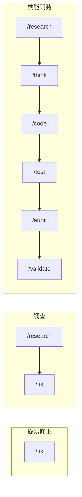

# ワークフローガイド

コマンドの使い方ガイド。コマンド選択とワークフローパターンのユーザーリファレンス。

## 利用可能なコマンド

### コア開発

| コマンド    | 目的                             |
| ----------- | -------------------------------- |
| `/think`    | SOW作成と検証                    |
| `/research` | 実装なしの調査                   |
| `/code`     | TDD/RGRC実装                     |
| `/test`     | 包括的テスト                     |
| `/audit`    | エージェント経由のコードレビュー |
| `/polish`   | AI生成スロップの除去             |
| `/validate` | SOW準拠の検証                    |
| `/plans`    | 計画ドキュメント一覧（SOW/Spec） |
| `/spec`     | Spec生成（実装詳細）             |
| `/sow`      | SOW進捗表示                      |

### クイックアクション

| コマンド | 目的                              |
| -------- | --------------------------------- |
| `/fix`   | 迅速なバグ修正（think→code→test） |

### ブラウザ & ドキュメント

| コマンド  | 目的                            |
| --------- | ------------------------------- |
| `/e2e`    | ブラウザ操作からのE2Eテスト     |
| `/adr`    | アーキテクチャ決定記録          |
| `/rulify` | ADRからのプロジェクトルール生成 |
| `/docs`   | コードからドキュメント生成      |

### Git操作

| コマンド  | 目的                           |
| --------- | ------------------------------ |
| `/branch` | ブランチ名の提案               |
| `/commit` | Conventional Commitsメッセージ |
| `/pr`     | PRの説明                       |
| `/issue`  | GitHub Issues                  |

## 標準ワークフロー

| パターン | ワークフロー                                                        | 使用場面             |
| -------- | ------------------------------------------------------------------- | -------------------- |
| 簡易修正 | `/fix`                                                              | 小さなバグ、開発環境 |
| 調査     | `/research` → `/fix`                                                | 原因不明             |
| 機能開発 | `/research` → `/think` → `/code` → `/test` → `/audit` → `/validate` | 新機能               |
| シンプル | `/code` → `/test`                                                   | 明確な実装           |

## コマンド選択

| 基準   | [✓] 高優先度                | [→] 中優先度          | [?] 低優先度       |
| ------ | --------------------------- | --------------------- | ------------------ |
| 理解度 | ≥95% → 直接実行             | 70-94% → `/think`     | <70% → `/research` |
| 複雑さ | 複数ステップ → ワークフロー | 単一ファイル → `/fix` | 不明確 → `/think`  |
| 緊急度 | 重大 → `/fix`               | 通常 → 標準フロー     | 計画 → `/think`    |

### タスク分析

| ユーザーの意図     | 分析             | 結果                               |
| ------------------ | ---------------- | ---------------------------------- |
| 「Xが壊れている」  | 調査が必要？     | Yes → `/research` → `/fix`         |
| 「Y機能を追加」    | 複数ステップ？   | Yes → `/think` → `/code` → `/test` |
| 「サイトがダウン」 | 緊急？           | Yes → `/fix`（緊急対応）           |
| 「タイポを修正」   | シンプルで明確？ | Yes → `/fix`                       |
| 「Zはどう動く？」  | 調査のみ         | `/research`（実装なし）            |

| 主要な判断要素 | 説明                               |
| -------------- | ---------------------------------- |
| スコープ       | 単一ファイル vs 複数コンポーネント |
| コンテキスト   | 既知 vs 探索が必要                 |
| リスク         | 開発環境 vs 本番環境               |

## IDR（実装決定記録）

ライフサイクル全体で実装を追跡する自動生成ドキュメント。

[@./IDR_GENERATION.md](./IDR_GENERATION.md) を参照

| レイヤー    | トリガー       | 記録内容           | 自動 |
| ----------- | -------------- | ------------------ | ---- |
| session-end | セッション終了 | 実装内容、設計決定 | Yes  |
| pre-commit  | git commit     | 確認ゲートのみ     | Yes  |

場所: `$HOME/.claude/workspace/planning/[feature]/idr.md` または `planning/YYYY-MM-DD/idr.md`

## アーキテクチャ

| レイヤー | 配置場所            | 役割                     |
| -------- | ------------------- | ------------------------ |
| Command  | `commands/*.md`     | ユーザー向けワークフロー |
| Skill    | `skills/*/SKILL.md` | 知識ベース               |
| Agent    | `agents/*.md`       | 特化した分析             |

## エッジケース

| 状況                   | アクション                            |
| ---------------------- | ------------------------------------- |
| 意図が曖昧             | 理解度チェックで確認を求める          |
| コマンド該当なし       | `Command: N/A` を使用、直接実装に進む |
| 複数の有効なアプローチ | ユーザーに選択肢を提示                |
| 要件が不明確           | `/research` から開始                  |
| 複合的な複数パート     | サブワークフローに分割                |
