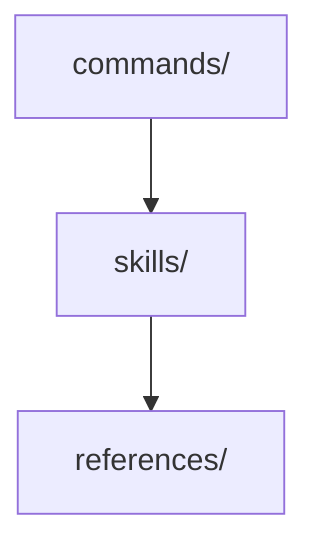

# アーキテクチャパターンテンプレート

複数ファイルに影響するアーキテクチャパターン、コンポーネント構造、設計ポリシーの採用判断を記録するためのガイド。

## 使用場面

| シナリオ                                                        |
| --------------------------------------------------------------- |
| アーキテクチャパターンの選択 (MVC、Clean Architecture 等)       |
| コンポーネント構造やモジュール境界の定義                        |
| 複数ファイルに影響する設計ポリシーの確立                        |

## 必須セクション (MADR コア)

| # | セクション                    | 目的                                                  |
| - | ----------------------------- | ----------------------------------------------------- |
| 1 | Title                         | アクション指向。例: `YにXパターンを採用`              |
| 2 | Status                        | `proposed` / `accepted` / `deprecated` / `superseded` |
| 3 | Context and Problem Statement | なぜ今この判断が必要か                                |
| 4 | Decision Drivers              | 判断に影響を与える要因                                |
| 5 | Considered Options            | 最低 2 つの選択肢。各々に Good / Bad の箇条書き       |
| 6 | Decision Outcome              | `Chosen option: X, because Y` 形式                    |
| 7 | Consequences                  | ポジティブ・ネガティブな影響                          |

メタデータ行: `- Confidence: {level}. {根拠}`。再評価は Consequences の後に任意の `## Reassessment Triggers` セクションで。

## テンプレート固有セクション

| セクション                | 目的                                             |
| ------------------------- | ------------------------------------------------ |
| Architecture Diagram      | Mermaid またはテキスト図で構造を示す             |
| Quality Attributes        | 優先度表 (保守性、パフォーマンス等)              |
| Trade-offs                | 得るものと引き換えに犠牲にするもの               |
| Implementation Guidelines | パターン適用の具体ルール                         |
| Monitoring                | パターンが機能しているかの検証方法               |

## 例

````markdown
# スキル中心アーキテクチャの採用

- Status: accepted
- Deciders: プロジェクトオーナー
- Date: 2026-01-08
- Confidence: high. 6 ヶ月の本番運用で検証済み。

## Context and Problem Statement

コマンドファイルが肥大化し、900 行を超えるものが出ていた。Knowledge (skills) と Workflow (commands) が分離されていないため、DRY 違反と保守性低下が発生していた。

## Decision Drivers

- Miller の法則を超えたコマンドファイル (責務数 > 9)
- 同じ知識が複数コマンドに重複
- 新機能追加時に影響範囲が不明確

## Considered Options

### スキル中心アーキテクチャ

コマンドは薄いラッパーとして機能し、知識は skill に委譲。

- Good: DRY を達成 (知識が一箇所)
- Good: コマンドが 100 行以下に収まる
- Bad: references 経由で indirection が増える

### 現状維持 (モノリシックコマンド)

各コマンドが必要な知識を全てインラインで保持。

- Good: 1 ファイルで完結
- Bad: 重複が増え続ける
- Bad: 変更影響が読めない

## Decision Outcome

スキル中心アーキテクチャを採用。コマンドは Thin Wrapper パターンに従い、実装知識は `skills/` に集約。

### Positive Consequences

- コマンドが軽量化 (平均 80 行)
- skill が再利用可能に

### Negative Consequences

- ファイル間移動が増える

## Architecture Diagram



## Quality Attributes

| 属性   | 優先度 | アプローチ   |
| ------ | ------ | ------------ |
| 保守性 | 高     | skill 分離   |
| 理解性 | 中     | Thin Wrapper |

## Trade-offs

ファイル数が増える代わりに、各ファイルの単一責務が明確になる。

## Reassessment Triggers

- コマンド数が 30 を超え、skill 依存グラフが複雑化した場合
````
