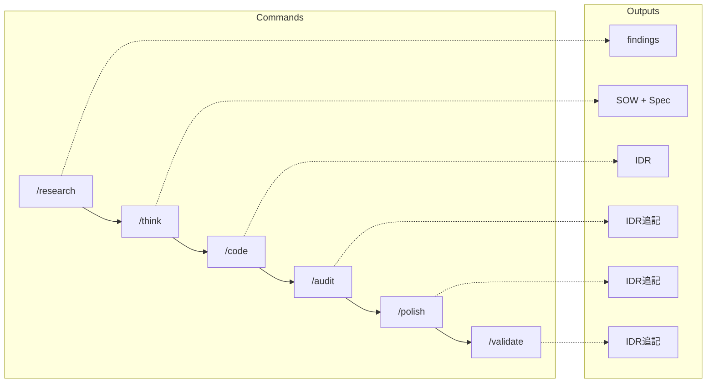

# テンプレート

コマンドで参照される構造テンプレート。

## 計画ワークフロー



| フェーズ | コマンド  | 出力            | テンプレート         |
| -------- | --------- | --------------- | -------------------- |
| 調査     | /research | findings        | research/template.md |
| 計画     | /think    | sow.md, spec.md | sow/, spec/          |
| 実装     | /code     | idr.md (作成)   | idr/template.md      |
| レビュー | /audit    | idr.md (追記)   | -                    |
| 整理     | /polish   | idr.md (追記)   | -                    |
| 検証     | /validate | idr.md (追記)   | -                    |

## ディレクトリ構造

```text
templates/
├── README.md
├── research/
│   └── template.md    # リサーチ結果
├── sow/
│   └── template.md    # Statement of Work
├── spec/
│   └── template.md    # 仕様書
├── idr/
│   └── template.md    # 実装判断記録
└── rules/
    └── from-adr.md    # ADRからのルール
```

## ドキュメント責務

| ドキュメント | 役割             | 対象読者 | 更新頻度         |
| ------------ | ---------------- | -------- | ---------------- |
| **SOW**      | 計画、基準、設計 | AI       | 承認後は静的     |
| **Spec**     | 実装詳細、テスト | AI       | 承認後は静的     |
| **IDR**      | 実装記録         | Human    | 動的（追記のみ） |

## カスタマイズ

1. 必須セクション（## ヘッダー）を維持
2. 信頼度マーカー: [✓] ≥95%, [→] 70-94%, [?] <70%
3. ID規約: I-001, AC-001, FR-001, T-001, NFR-001
