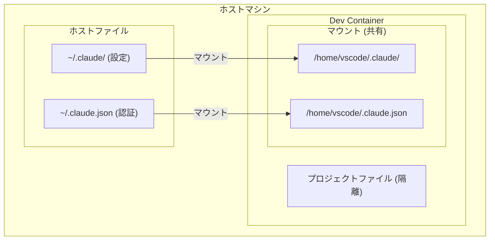

# Claude Code Dev Container テンプレート

Claude Codeを安全なコンテナ環境で実行するためのテンプレートです。

## 特徴

- **物理的なサンドボックス**: ホストのファイルシステムから完全に分離
- **認証情報の共有**: `~/.claude/` をマウントして設定を再利用
- **すぐに使える環境**: Rust/Node/Ruby/Python が統合済み

## 使い方

### 1. テンプレートをプロジェクトにコピー

```bash
cp -r ~/.claude/templates/devcontainer/.devcontainer /path/to/your/project/
```

### 2. VSCodeで開く

```bash
code /path/to/your/project
```

### 3. Dev Containerで開く

VSCodeで `Cmd+Shift+P` → `Dev Containers: Reopen in Container`

## カスタマイズ

### ベースイメージを変更する

`devcontainer.json` の `image` を変更:

```jsonc
// Node.jsのみの場合
"image": "mcr.microsoft.com/devcontainers/javascript-node:20"

// Pythonのみの場合
"image": "mcr.microsoft.com/devcontainers/python:3.12"
```

### ポートを追加する

```jsonc
"forwardPorts": [3000, 5173, 8080, 4000]
```

### 追加パッケージをインストール

```jsonc
"postCreateCommand": "npm install -g @anthropic-ai/claude-code && npm install -g pnpm"
```

## アーキテクチャ



## 注意事項

- **初回起動時**: `postCreateCommand` でClaude Codeがインストールされます
- **認証**: ホストの認証情報がマウントされるため、再ログイン不要
- **git設定**: コンテナ内で別途設定が必要な場合があります

## トラブルシューティング

### 認証エラーが出る場合

ホスト側で認証ファイルが存在するか確認:

```bash
ls -la ~/.claude.json
```

### コンテナが起動しない場合

Docker Desktopが起動しているか確認し、イメージをプル:

```bash
docker pull ghcr.io/creanciel/deck:latest
```

## 参考

- [元記事: Claude Code Dev Container設定](https://zenn.dev/creanciel/articles/my-claude-code-dev-container-deck)
- [Dev Containers公式ドキュメント](https://containers.dev/)
