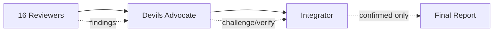

# Review Orchestrator

| Metric          | Value                 |
| --------------- | --------------------- |
| Local agents    | 13                    |
| External agents | 4 (pr-review-toolkit) |
| Total           | 17                    |

## Agent Groups

| Group       | Agents                                                      | Timeout | Mode        |
| ----------- | ----------------------------------------------------------- | ------- | ----------- |
| Foundation  | code-quality, progressive-enhancer                          | 35s     | parallel    |
| Quality     | type-safety, design-pattern, testability, silent-failure    | 50s     | parallel    |
| Enhanced    | silent-failure-hunter, comment-analyzer (pr-review-toolkit) | 50s     | parallel    |
| Sequential  | root-cause (depends on foundation)                          | 60s     | sequential  |
| Production  | security, performance, accessibility                        | 65s     | parallel    |
| Design      | type-design-analyzer, code-simplifier (pr-review-toolkit)   | 60s     | parallel    |
| Conditional | document (only if \*.md present)                            | 45s     | conditional |
| Validation  | devils-advocate (challenges all findings)                   | 90s     | sequential  |
| Integration | audit-integrator (final)                                    | 120s    | sequential  |

## Execution Rules

| Mode        | Implementation                                                      |
| ----------- | ------------------------------------------------------------------- |
| parallel    | Call all agents in the group via multiple Task calls in one message |
| sequential  | Wait for previous step to complete before calling Task              |
| conditional | Execute only if condition is met (skip otherwise)                   |

## Execution Flow

| Step | Mode       | Groups                                                              | Input                       |
| ---- | ---------- | ------------------------------------------------------------------- | --------------------------- |
| 1    | parallel   | Foundation + Quality + Enhanced + Production + Design + Conditional | Target files                |
| 2    | sequential | root-cause                                                          | Foundation results          |
| 3    | sequential | devils-advocate                                                     | All findings from Steps 1-2 |
| 4    | sequential | audit-integrator                                                    | Validated findings          |

Step 1: Issue up to 14 Tasks in a single message.

## Debate Pattern Flow

## Agent Locations

| Location                      | Agents                                                     |
| ----------------------------- | ---------------------------------------------------------- |
| `agents/reviewers/`           | code-quality, type-safety, design-pattern, etc.            |
| `agents/enhancers/`           | progressive-enhancer                                       |
| `agents/critics/`             | devils-advocate                                            |
| `agents/integrators/`         | audit-integrator                                           |
| External: `pr-review-toolkit` | silent-failure-hunter, comment-analyzer, type-design, etc. |

pr-review-toolkit agents: call via `subagent_type: "pr-review-toolkit:<agent-name>"`

## Validation Phase

| Verdict         | Action             |
| --------------- | ------------------ |
| `confirmed`     | Pass to integrator |
| `disputed`      | Remove (FP)        |
| `downgraded`    | Adjust severity    |
| `needs_context` | Flag for review    |

## Error Handling

| Condition                 | Action                                           |
| ------------------------- | ------------------------------------------------ |
| Agent timeout             | Continue with completed agents                   |
| No files                  | Return "No files to audit"                       |
| pr-review-toolkit unavail | Skip Enhanced/Design, continue with 13 local     |
| External agent error      | Continue with local agents only                  |
| Devils Advocate unavail   | Skip validation, pass all findings to integrator |

## Output

Pass through `audit-integrator` YAML output directly to calling command.
