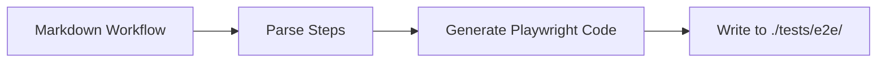

# /workflow:export - Playwright Test Generator

Convert Markdown workflow files (created by `/workflow:create`) to Playwright test code.

## Purpose

Transform exploratory browser workflows into executable Playwright tests for:

- CI/CD integration
- Regression testing
- Automated verification of stable flows

## Usage

```bash
/workflow:export <workflow-name>
```

Example:

```bash
/workflow:export login-test
```

## Workflow



## Input Format

Expects Markdown workflow from `/workflow:create`:

```markdown
# /workflow-name

Description of the workflow

## Steps

1. Navigate to https://example.com
2. Click element (uid: abc123) - button description
3. Fill element (uid: def456) with "value"
4. Wait for text "Expected text" to appear
```

## Output Format

Generates Playwright TypeScript test:

```typescript
import { test, expect } from '@playwright/test';

test('workflow-name: Description', async ({ page }) => {
  // Step 1: Navigate
  await page.goto('https://example.com');
  await page.waitForLoadState('networkidle');

  // Step 2: Click
  await page.getByRole('button', { name: /button description/i }).click();

  // Step 3: Fill
  await page.getByRole('textbox').fill('value');

  // Step 4: Verify
  await expect(page.getByText('Expected text')).toBeVisible();
});
```

## Output Location

Tests are written to:

```txt
./tests/e2e/<workflow-name>.spec.ts
```

## Step Mapping

| Markdown Step | Playwright Code |
| --- | --- |
| `Navigate to <URL>` | `page.goto('<URL>')` |
| `Click element ... - <desc>` | `page.getByRole('button', { name: /<desc>/i }).click()` |
| `Fill element ... with "<value>"` | `page.getByRole('textbox').fill('<value>')` |
| `Wait for text "<text>"` | `expect(page.getByText('<text>')).toBeVisible()` |
| `Take screenshot` | `page.screenshot({ path: ... })` |
| `Scroll to <element>` | `page.locator('<element>').scrollIntoViewIfNeeded()` |

## Selector Strategy

Following Playwright best practices:

1. **Role selectors** (preferred): `getByRole('button', { name: /text/i })`
2. **Text selectors**: `getByText('visible text')`
3. **Test ID**: `getByTestId('element-id')`
4. **CSS selectors** (fallback): `locator('css-selector')`

## Generated Code Patterns

### Wait for Network Idle

All navigations include:

```typescript
await page.waitForLoadState('networkidle');
```

### Assertion Style

Using Playwright's built-in expect:

```typescript
await expect(page.getByText('Success')).toBeVisible();
await expect(page).toHaveURL(/dashboard/);
```

### Error Handling

Generated tests include implicit waits and auto-retry (Playwright defaults).

## Example Transformation

### Input: `.claude/commands/workflows/checkout-flow.md`

```markdown
# /checkout-flow

E-commerce checkout verification

## Steps

1. Navigate to https://shop.example.com/cart
2. Click element (uid: xyz) - Proceed to Checkout
3. Fill element (uid: email) with "test@example.com"
4. Fill element (uid: card) with "4111111111111111"
5. Click element (uid: submit) - Place Order
6. Wait for text "Order Confirmed" to appear
```

### Output: `./tests/e2e/checkout-flow.spec.ts`

```typescript
import { test, expect } from '@playwright/test';

test('checkout-flow: E-commerce checkout verification', async ({ page }) => {
  // Step 1: Navigate to cart
  await page.goto('https://shop.example.com/cart');
  await page.waitForLoadState('networkidle');

  // Step 2: Proceed to Checkout
  await page.getByRole('button', { name: /proceed to checkout/i }).click();

  // Step 3: Fill email
  await page.getByRole('textbox', { name: /email/i }).fill('test@example.com');

  // Step 4: Fill card number
  await page.getByRole('textbox', { name: /card/i }).fill('4111111111111111');

  // Step 5: Place Order
  await page.getByRole('button', { name: /place order/i }).click();

  // Step 6: Verify confirmation
  await expect(page.getByText('Order Confirmed')).toBeVisible();
});
```

## Limitations

- UID-based selectors are converted to role/text selectors (best effort)
- Complex conditional logic requires manual editing
- Dynamic waits may need adjustment
- Authentication flows may need test fixtures

## Error Handling

- **Workflow not found**: Error message with available workflows list
- **Invalid format**: Warning with specific parsing issues
- **Output directory missing**: Auto-creates `./tests/e2e/` directory

## Post-Generation

After generating, you may need to:

1. **Adjust selectors**: Review and refine for your specific DOM
2. **Add fixtures**: For authentication or test data
3. **Configure Playwright**: Ensure `playwright.config.ts` exists
4. **Run tests**: `npx playwright test tests/e2e/<workflow>.spec.ts`

## Integration with CI/CD

Generated tests are compatible with standard Playwright CI setup:

```yaml
# GitHub Actions example
- name: Run Playwright tests
  run: npx playwright test tests/e2e/
```

## Related Commands

- `/workflow:create` - Create Markdown workflows interactively
- `/test` - Run comprehensive tests including Playwright
- `/auto-test` - Automatic test runner with fixes

**Typical workflow**: `/workflow:create` → verify workflow → `/workflow:export` → CI/CD

## See Also

- [Playwright Documentation](https://playwright.dev/)
- `webapp-testing` skill (official) - Advanced Playwright patterns
- `automating-browser` skill - Interactive browser automation
