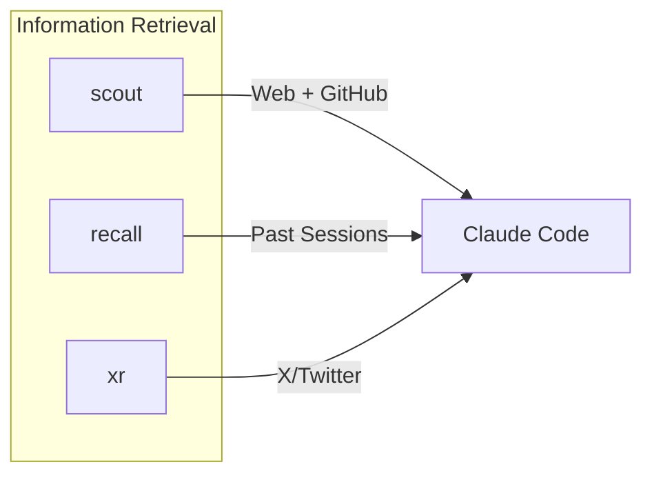

# CLI Tools

External CLI tools that extend Claude Code's capabilities.

📌 **[日本語版](../.ja/docs/CLI_TOOLS.md)**

## Overview

3 Rust CLI tools, each purpose-built for a specific gap in Claude Code's default
tooling. This document covers design intent and architecture.

## scout

Web search and page fetching via Gemini Grounding with Google Search.

| Aspect  | Detail                                                           |
| ------- | ---------------------------------------------------------------- |
| Why     | WebFetch/WebSearch consume tokens and lack Markdown conversion   |
| How     | Gemini Grounding API for search, readability for page extraction |
| Install | `brew install thkt/tap/scout`                                    |
| Source  | [thkt/scout](https://github.com/thkt/scout)                      |

### Commands

| Command               | Purpose                                      |
| --------------------- | -------------------------------------------- |
| `scout search`        | Web search (Gemini Grounding)                |
| `scout fetch`         | Fetch URL as clean Markdown                  |
| `scout research`      | Deep research (search + fetch + compile)     |
| `scout repo-overview` | GitHub repo overview (stars, issues, README) |
| `scout repo-tree`     | List files in remote GitHub repo             |
| `scout repo-read`     | Read a file from remote GitHub repo          |

### When to Use

| scout                          | WebFetch/WebSearch      |
| ------------------------------ | ----------------------- |
| Latest docs, release notes     | Never (scout preferred) |
| GitHub repo exploration        | Never (scout preferred) |
| Deep research with compilation | N/A                     |

## recall

Full-text search across past Claude Code and Codex sessions (FTS5-based SQLite
index).

| Aspect  | Detail                                              |
| ------- | --------------------------------------------------- |
| Why     | Session history in JSONL is unsearchable by default |
| How     | FTS5 index over session transcripts                 |
| Install | `brew install thkt/tap/recall`                      |
| Source  | [thkt/recall](https://github.com/thkt/recall)       |

### Commands

| Command            | Purpose                            |
| ------------------ | ---------------------------------- |
| `recall "query"`   | Full-text search across sessions   |
| `recall --days N`  | Filter to last N days              |
| `recall --project` | Filter by project path             |
| `recall --source`  | Filter by source (claude or codex) |
| `recall --reindex` | Force full index rebuild           |

### When to Use

| recall                             | Grep \*.jsonl               |
| ---------------------------------- | --------------------------- |
| Past solutions: "how did I fix X"  | Current session only        |
| Pattern recall: "what tool for Y"  | Specific known session file |
| Cross-project: "where did I use Z" |                             |

## xr

X/Twitter content fetching (tweets, threads, articles, user profiles).

| Aspect  | Detail                                                   |
| ------- | -------------------------------------------------------- |
| Why     | scout fetch cannot extract X/Twitter structured content  |
| How     | X/Twitter API for tweet/thread/article/profile retrieval |
| Install | `brew install thkt/tap/xr`                               |

### Commands

| Command                   | Purpose                 |
| ------------------------- | ----------------------- |
| `xr tweet <url>`          | Fetch single tweet      |
| `xr tweet <url> --thread` | Fetch tweet with thread |
| `xr article <url>`        | Fetch X article         |
| `xr user <screen_name>`   | Fetch user profile      |

### When to Use

| xr                            | scout fetch    |
| ----------------------------- | -------------- |
| x.com / twitter.com URLs      | All other URLs |
| Thread/replies context needed | N/A            |
| User profile lookup           | N/A            |

## Related

- [HOOKS.md](./HOOKS.md) - Hook system design (includes quality pipeline)
