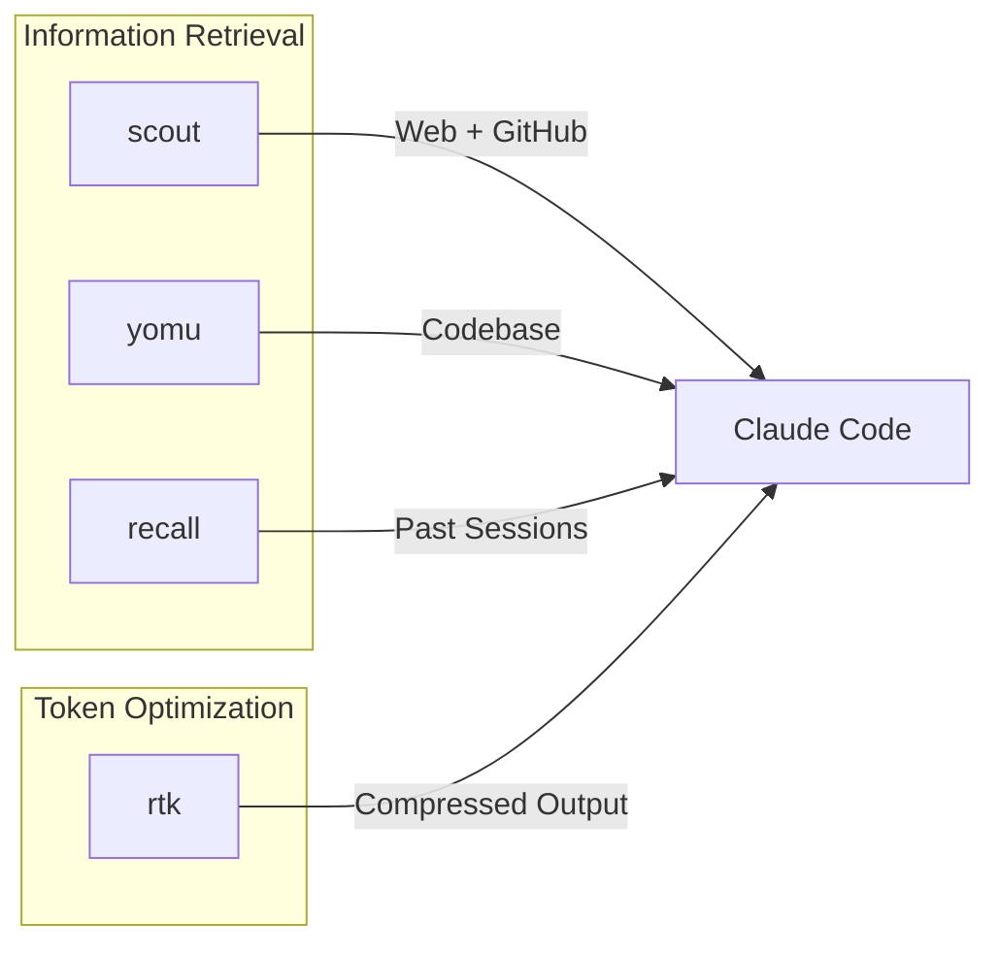

# CLI Tools

External CLI tools that extend Claude Code's capabilities.

📌 **[日本語版](../.ja/docs/CLI_TOOLS.md)**

## Overview

4 Rust CLI tools, each purpose-built for a specific gap in Claude Code's default
tooling. AI-facing rules live in
[TOOLS.md](../rules/development/TOOLS.md) — this document covers design intent
and architecture.



## scout

Web search and page fetching via Gemini Grounding with Google Search.

| Aspect  | Detail                                                           |
| ------- | ---------------------------------------------------------------- |
| Why     | WebFetch/WebSearch consume tokens and lack Markdown conversion   |
| How     | Gemini Grounding API for search, readability for page extraction |
| Install | `brew install thkt/tap/scout`                                    |
| Source  | [thkt/scout](https://github.com/thkt/scout)                      |

### Commands

| Command               | Purpose                                      |
| --------------------- | -------------------------------------------- |
| `scout search`        | Web search (Gemini Grounding)                |
| `scout fetch`         | Fetch URL as clean Markdown                  |
| `scout research`      | Deep research (search + fetch + compile)     |
| `scout repo-overview` | GitHub repo overview (stars, issues, README) |
| `scout repo-tree`     | List files in remote GitHub repo             |
| `scout repo-read`     | Read a file from remote GitHub repo          |

### When to Use

| scout                          | WebFetch/WebSearch      |
| ------------------------------ | ----------------------- |
| Latest docs, release notes     | Never (scout preferred) |
| GitHub repo exploration        | Never (scout preferred) |
| Deep research with compilation | N/A                     |

## yomu

Semantic code search for frontend codebases (TS/TSX/JS/CSS/HTML). Embedding-
based, finds code by meaning rather than string matching.

| Aspect  | Detail                                        |
| ------- | --------------------------------------------- |
| Why     | Grep finds exact strings; yomu finds concepts |
| How     | Chunk indexing + embedding search             |
| Install | `brew install thkt/tap/yomu`                  |
| Source  | [thkt/yomu](https://github.com/thkt/yomu)     |

### Commands

| Command        | Purpose                                        |
| -------------- | ---------------------------------------------- |
| `yomu search`  | Semantic search (concept, identifier, related) |
| `yomu index`   | Update chunk index incrementally               |
| `yomu rebuild` | Rebuild chunk index from scratch               |
| `yomu impact`  | Analyze impact of changes to file or symbol    |
| `yomu status`  | Show index statistics                          |

### When to Use

| yomu                                    | Grep/Glob                               |
| --------------------------------------- | --------------------------------------- |
| Concept: "form validation", "auth flow" | Literal: error messages, regex          |
| Related: "hooks that do Y"              | Known path: `src/components/Button.tsx` |
| Known identifier: `useAuth`             | File listing: `**/*.tsx`                |
| Unknown name: "where does X happen"     |                                         |

## recall

Full-text search across past Claude Code and Codex sessions (FTS5-based SQLite
index).

| Aspect  | Detail                                              |
| ------- | --------------------------------------------------- |
| Why     | Session history in JSONL is unsearchable by default |
| How     | FTS5 index over session transcripts                 |
| Install | `brew install thkt/tap/recall`                      |
| Source  | [thkt/recall](https://github.com/thkt/recall)       |

### Commands

| Command            | Purpose                            |
| ------------------ | ---------------------------------- |
| `recall "query"`   | Full-text search across sessions   |
| `recall --days N`  | Filter to last N days              |
| `recall --project` | Filter by project path             |
| `recall --source`  | Filter by source (claude or codex) |
| `recall --reindex` | Force full index rebuild           |

### When to Use

| recall                             | Grep \*.jsonl               |
| ---------------------------------- | --------------------------- |
| Past solutions: "how did I fix X"  | Current session only        |
| Pattern recall: "what tool for Y"  | Specific known session file |
| Cross-project: "where did I use Z" |                             |

## rtk (Rust Token Killer)

Token-optimized CLI proxy. Rewrites command output to reduce token consumption
by stripping noise, compressing tables, and summarizing verbose output.

| Aspect  | Detail                                           |
| ------- | ------------------------------------------------ |
| Why     | CLI output wastes tokens on whitespace and noise |
| How     | PreToolUse hook auto-rewrites Bash commands      |
| Install | `brew install thkt/tap/rtk`                      |
| Source  | [thkt/rtk](https://github.com/thkt/rtk)          |

### How It Works

rtk is transparent. A PreToolUse hook (`rtk-rewrite.sh`) rewrites Bash commands
before execution. No manual `rtk` prefix needed.

```text
User types: git status
Hook rewrites to: rtk git status
Output: compressed, noise-stripped
```

### Coverage

| Category   | Commands                                            |
| ---------- | --------------------------------------------------- |
| Git/GitHub | git, gh                                             |
| File ops   | cat/bat, rg/grep, ls/eza, tree, find/fd, diff, head |
| JS/TS      | vitest, tsc, eslint, prettier, playwright, pnpm     |
| Rust       | cargo (test/build/clippy/check/fmt)                 |
| Python     | pytest, ruff, pip, mypy                             |
| Go         | go (test/build/vet), golangci-lint                  |
| Containers | docker, kubectl                                     |
| Network    | curl, wget                                          |

### Meta Commands

```bash
rtk gain              # Token savings analytics
rtk gain --history    # Command usage history
rtk discover          # Find missed optimization opportunities
```

## Related

- [TOOLS.md](../rules/development/TOOLS.md) — AI-facing tool selection rules
- [HOOKS.md](./HOOKS.md) — Hook system design (includes quality pipeline)
