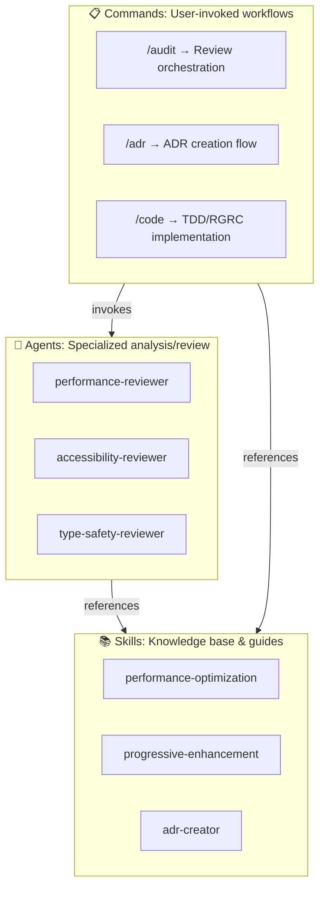
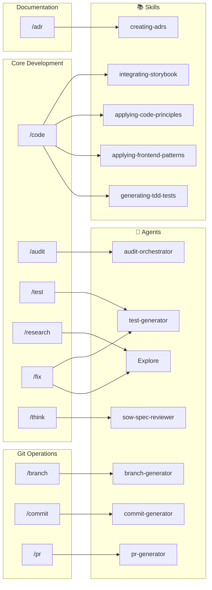

# Claude Commands Reference

Custom commands for systematic software development support.

## 🎯 Available Commands

### Core Development Commands

| Command | Purpose | Environment |
| --- | --- | --- |
| `/think` | Verifiable SOW creation with validation | Analysis phase |
| `/research` | Investigation without implementation | Understanding phase |
| `/code` | TDD/RGRC implementation | Development phase |
| `/test` | Comprehensive testing | Verification phase |
| `/audit` | Code review via agents | Quality phase |
| `/sow` | Display SOW progress | Monitoring phase |
| `/validate` | Validate SOW conformance | Verification phase |

### Quick Action Commands

| Command | Purpose | Environment | Combines |
| --- | --- | --- | --- |
| `/fix` | Quick bug fixes | 🔧 Development | think → code → test |

### External Review Commands

| Command | Purpose | Environment |
| --- | --- | --- |
| `/rabbit` | CodeRabbit AI review for external perspective | 🐰 Quality check |

### Automation Commands (SlashCommand Tool v1.0.123+)

| Command | Purpose | Environment | Uses SlashCommand |
| --- | --- | --- | --- |
| `/auto-test` | Auto test runner with conditional fix | 🔧 Development | Yes - invokes `/fix` on failure |
| `/full-cycle` | Complete development cycle automation | 🔄 Meta-command | Yes - chains multiple commands |

### Browser Automation Commands

| Command | Purpose | Environment |
| --- | --- | --- |
| `/workflow:create [name]` | Create reusable browser automation workflows | 🌐 E2E Testing |

### Documentation Commands

| Command | Purpose | Environment |
| --- | --- | --- |
| `/adr [title]` | Create Architecture Decision Record in MADR format | 📝 Documentation |
| `/rulify <number>` | Generate project rule from ADR | 📝 Documentation |

## 🔍 Dry-run Impact Simulation

**Automatic safety feature** integrated into PRE_TASK_CHECK workflow.

When confirming file operations or complex changes, Claude Code automatically displays a brief impact simulation before execution:

- **Files to modify**: Lists 2-5 key files
- **Affected components**: Shows impacted modules
- **Risk level**: 🟢 Low / 🟡 Medium / 🔴 High
- **Important notes**: Highlights areas requiring attention

This "Dry-run" approach previews changes without execution, helping you:

- Understand the scope of changes
- Identify potential risks
- Make informed decisions before proceeding

**Workflow integration**:

```txt
1. Understanding Check
2. User Confirmation (Y) ← STOP POINT
3. 🔍 Impact Simulation ← NEW (auto-displayed for risky changes)
4. Execution Plan
5. Plan Confirmation (Y) ← STOP POINT
6. Execute
```

## 🔄 Standard Workflows

### Feature Development

Choose based on complexity:

```txt
[Complex - Architecture decisions needed]
(/research →) Plan Mode → /think → /code → /test → /audit → /validate

[Standard - Clear requirements]
/think → /code → /test → /audit → /validate

[Simple - Small feature]
/code → /test
```

**Plan Mode**: Press `Shift+Tab` to enter. Explore codebase, design approach, get user approval before proceeding.

**Note**: `/research` is optional before Plan Mode when deep investigation with persistent documentation is needed.

### Progress Monitoring

```txt
/sow (check progress anytime)
```

### Bug Investigation & Fix

```txt
/research → /fix
```

### Investigation Only (No Implementation)

```txt
/research (findings saved to .claude/workspace/research/)
```

### Automated Workflows (SlashCommand Tool)

```txt
/auto-test        # Automatic test → fix cycle
/full-cycle       # Complete automated development flow
```

## 💡 Command Details

### /think - Verifiable SOW Generator

- Creates verifiable Statement of Work with dynamic validation
- **Generates both SOW and Spec**: sow.md (planning) + spec.md (implementation details)
- Defines acceptance criteria with TodoWrite integration
- Sets validation points and success metrics
- Saves to `.claude/workspace/planning/` with auto-update capability
- Enables progress tracking via `/sow` and `/validate`
- **Spec includes**: Functional requirements, API specs, data models, UI specs, test scenarios

### /research - Investigation

- Explores without implementation
- Uses Task agent for complex searches
- Documents findings persistently
- Efficient parallel search execution

### /code - Implementation

- Follows TDD/RGRC cycle (Red-Green-Refactor-Commit)
- **Auto-references spec.md**: Uses specification as implementation guide
- Applies SOLID principles
- Manual commit execution
- Quality checks via hooks
- **Spec-driven**: Implements functional requirements, follows API specs and data models
- **Modular structure**: Details split into `commands/code/` for maintainability (see ADR 0001)

### /test - Verification

- Discovers and runs test commands
- Tracks progress with TodoWrite
- Handles unit, integration, E2E tests
- Browser testing for UI changes

### /fix - Quick Fixes

- Streamlined mini-workflow with TDD approach
- For small, well-understood issues
- Development environment only
- Rapid iteration cycle
- **6-phase process**: Root cause → Regression test → Fix → Verify → Additional tests → Done
- **Modular structure**: Details split into `commands/fix/` for maintainability (see ADR 0002)
- **Shared TDD components**: References `commands/shared/` and `skills/tdd-fundamentals/`

### /rabbit - CodeRabbit AI Review

- External AI code review via CodeRabbit CLI
- Fast execution (10-30 seconds)
- Provides second opinion from independent AI
- Options: `--base <branch>`, `--type <all|committed|uncommitted>`
- Complements `/audit` with external perspective

### /audit - Code Review

- Orchestrates specialized review agents
- **Auto-references spec.md**: Verifies implementation aligns with specification
- Multiple review dimensions (security, performance, a11y)
- Actionable recommendations
- Priority-based issue reporting
- **Spec verification**: Identifies missing features, API deviations, and requirement gaps

### /sow - Progress Viewer

- Displays current SOW progress status
- Shows acceptance criteria completion
- Tracks key metrics and build status
- Read-only, no options needed
- Quick status check for active work

### /validate - SOW Validator

- Validates implementation against SOW
- L2 (practical) validation level
- Checks acceptance criteria, coverage, performance
- Pass/fail logic with clear scoring
- Identifies missing features and issues

### /auto-test - Automatic Test Runner

- Runs tests automatically after file changes
- Uses SlashCommand tool to invoke `/fix` if tests fail
- Streamlines test-fix cycle
- Can be triggered via hooks in settings.json
- Requires SlashCommand tool v1.0.123+

### /full-cycle - Complete Development Automation

- Meta-command orchestrating entire development flow
- Uses SlashCommand to chain: /research → /think → /code → /test → /audit → /validate
- Conditional execution based on results
- Parallel execution support for independent tasks
- TodoWrite integration for progress tracking
- Requires SlashCommand tool v1.0.123+

### /adr - Architecture Decision Record Creator

- Creates MADR (Markdown Architecture Decision Records) format documentation
- Records architecture decisions with context and rationale
- Automatic numbering (0001, 0002, ...)
- Saves to `docs/adr/` in project root
- Interactive input for decision details
- Japanese language support

### /rulify - ADR to Rule Converter

- Automatically generates project rules from ADR
- Converts decision into AI-executable format
- Saves to `docs/rules/` in project root
- Auto-integrates with `.claude/CLAUDE.md`
- Enables AI to follow project-specific decisions

### /workflow:create - Browser Workflow Generator

- Creates reusable browser automation workflows via interactive recording
- Uses Chrome DevTools MCP for real browser control
- Saves workflows as Markdown command files
- Generated workflows become discoverable slash commands
- Executes via `/workflow-name` after creation
- Use cases: E2E testing, monitoring, scraping, regression testing
- Interactive step-by-step recording with live execution
- Supports navigation, clicking, form filling, waiting, screenshots
- Workflows saved to `.claude/commands/workflows/`
- Human-editable Markdown format

## 📂 Workspace Structure

```txt
.claude/
├── CLAUDE.md          # Global rules
├── docs/
│   └── COMMANDS.md    # This file
├── commands/          # Command definitions
│   ├── adr.md        # ADR creator
│   ├── rulify.md     # ADR to rule converter
│   ├── auto-test.md  # Auto test runner (SlashCommand)
│   ├── code.md       # Main orchestrator (thin wrapper)
│   ├── code/         # Modular components (ADR 0001)
│   │   ├── spec-context.md
│   │   ├── storybook.md
│   │   ├── test-preparation.md
│   │   ├── rgrc-cycle.md
│   │   ├── quality-gates.md
│   │   └── completion.md
│   ├── fix.md        # Main orchestrator (thin wrapper)
│   ├── fix/          # Modular components (ADR 0002)
│   │   ├── root-cause-analysis.md
│   │   ├── regression-test.md
│   │   ├── implementation.md
│   │   ├── verification.md
│   │   ├── test-generation.md
│   │   └── completion.md
│   ├── shared/       # Shared TDD components (ADR 0002)
│   │   ├── tdd-cycle.md
│   │   └── test-generation.md
│   ├── full-cycle.md # Meta-command (SlashCommand)
│   ├── rabbit.md
│   ├── research.md
│   ├── audit.md
│   ├── test.md
│   ├── think.md
│   ├── sow.md
│   ├── validate.md
│   ├── workflow/
│   │   └── create.md # Workflow generator
│   └── workflows/    # Generated workflows (user-created)
├── skills/           # Reusable knowledge base
│   └── tdd-fundamentals/  # TDD principles (ADR 0002)
│       ├── SKILL.md
│       └── examples/
│           ├── feature-driven.md
│           └── bug-driven.md
├── ja/               # Japanese versions
│   └── commands/
└── workspace/        # Working files
    └── sow/         # SOW documents
```

## 🚀 Quick Start

### New Feature (Enhanced Flow)

```bash
/think "Feature description"  # Create verifiable SOW
/research                      # Understand codebase
/code                         # Implement with TDD
/test                         # Verify tests pass
/sow                          # Check progress
/validate                     # Validate conformance
```

### Bug Fix

```bash
/research "Bug symptoms"
/fix       # Quick targeted fix
```

## 📋 Command Selection Guide

### Use `/fix` when

- Issue is small and well-defined
- Working in development environment
- Rapid iteration needed

### Use Plan Mode when

- Complex feature requiring architecture decisions
- Multiple valid approaches exist
- Need to explore codebase before planning
- Want user approval on approach before implementation

**How to enter**: Press `Shift+Tab` or type "enter plan mode"

### Use `/research` when

- Need deep investigation with persistent documentation
- Exploring solution options without implementation
- Want findings saved for future reference
- Can combine with Plan Mode: `/research` → Plan Mode

### Use `/think` when

- Starting new feature
- Need structured planning with validation
- Creating verifiable SOW document
- Want automated progress tracking

### Use `/sow` when

- Need to check implementation progress
- Want to see acceptance criteria status
- Monitoring active development work

### Use `/validate` when

- Ready to verify implementation
- Need conformance check against SOW
- Want to identify missing requirements

### Use `/rabbit` when

- Want external AI perspective (independent from internal agents)
- Need fast CLI-based review (10-30 seconds)
- Looking for quick sanity check before commit/PR
- Supplementing `/audit` with second opinion

### Use `/adr` when

- Making important architecture decisions
- Need to document technical choices
- Want to record decision rationale
- Team needs visibility into decisions

### Use `/rulify` when

- ADR decision should affect AI behavior
- Want to enforce project-specific patterns
- Need AI to follow architecture decisions automatically

### Use `/workflow:create` when

- Need to automate repetitive browser interactions
- Creating E2E test scenarios
- Setting up monitoring for critical user flows
- Building data collection workflows
- Want to document complex manual testing procedures
- Need reproducible browser automation

## 🏗️ Commands, Agents, Skills Architecture

### Architecture Overview

Claude Code provides functionality through a three-layer structure: Commands, Agents, and Skills. Understanding each role enables effective utilization.



**Layer Characteristics**:

| Layer | Features |
| --- | --- |
| **Commands** | Thin wrapper, coordinates Skills and Agents |
| **Agents** | Task execution, short-term, can reference Skills |
| **Skills** | Persistent knowledge, educational, reusable |

### Command Dependencies

Commands declare their dependencies in YAML frontmatter via `dependencies` field:



**Reading the Diagram**:

- Arrows show `dependencies` declared in each command's frontmatter
- Commands without arrows have no explicit skill/agent dependencies
- Some commands (like `/full-cycle`) orchestrate other commands via SlashCommand tool

### Naming Conventions

| Type | Format | Examples |
| --- | --- | --- |
| **Skills** | gerund form (動名詞形式) | `generating-tdd-tests`, `applying-frontend-patterns`, `creating-hooks` |
| **Agents** | kebab-case | `audit-orchestrator`, `test-generator`, `sow-spec-reviewer` |
| **Built-in Agents** | PascalCase | `Explore`, `Plan` |

**Why gerund for Skills?**

- 動詞の〜ing形は「能力・スキル」を表現するのに適切
- ファイル名 (`generating-tdd-tests/SKILL.md`) と一致
- `dependencies` 配列で使用する名前と実ファイル名が一致し、追跡が容易

### Detailed Role Division

#### 📋 Commands

**Role**: User-invoked workflows

**Features**:

- User interface (`/command` format)
- Thin orchestration layer
- Coordinates Agents and Skills
- Task progress management

**Examples**:

- `/audit` → Invokes multiple review agents, consolidates results
- `/adr` → References adr-creator skill, executes ADR creation process

#### 🤖 Agents

**Role**: Specialized analysis/review (primarily called by Commands)

**Features**:

- Domain-specific expertise
- Actual code analysis/review execution
- Can reference Skills knowledge base
- Short-term task execution

**Examples**:

- `performance-reviewer` → Identifies performance bottlenecks in actual code

#### 📚 Skills

**Role**: Knowledge base, guides, project-specific automation

**Features**:

- Persistent technical knowledge
- Educational content
- Cross-project reusability
- Keyword-based auto-trigger (optional)

**Examples**:

- `performance-optimization` → Web Vitals, React optimization guides
- `progressive-enhancement` → CSS-first approach design principles
- `esa-daily-report` → Project-specific daily report automation

### Collaboration Examples

#### Example 1: Performance Optimization

```text
User: "This page is slow"
    ↓
Skill (auto-trigger): performance-optimization
    → Provides Web Vitals knowledge
    → Suggests measurement methods
    ↓
User: "/audit"
    ↓
Command: /audit
    ↓
Agent: performance-reviewer
    → Analyzes actual code
    → References performance-optimization skill
    → Identifies bottlenecks
    ↓
Output: Specific improvement recommendations
    (Skill knowledge + Agent analysis)
```

#### Example 2: ADR Creation

```text
User: "/adr 'Adopt React Native for Mobile'"
    ↓
Command: /adr
    ↓
Skill: adr-creator
    → Provides MADR format template
    → 6-step process guide
    → Reference collection script
    ↓
Command: /adr
    → Executes process following Skill guide
    → Collects user input
    → Generates ADR file
    ↓
Output: docs/adr/0023-adopt-react-native.md
```

### When to Create Which

#### When to Create Commands

- ✅ Workflows users execute repeatedly
- ✅ Need to combine multiple Agents and Skills
- ✅ Interactive tasks requiring user input

#### When to Create Agents

- ✅ Domain-specific expert analysis needed
- ✅ Execution-based tasks like code review/verification
- ✅ Specialized processing called from Commands

#### When to Create Skills

- ✅ Cross-project technical knowledge
- ✅ Educational content, best practices collections
- ✅ Project-specific automation workflows
- ✅ Keyword-triggered automatic assistance

### Detailed Documentation

- **Skills**: `~/.claude/skills/README.md`
- **Agents**: Documents under `~/.claude/agents/`
- **Commands**: This file (COMMANDS.md)

## 🔧 Configuration

### Language Settings

- Command files: English
- Output to user: Japanese (per CLAUDE.md)

### Related Files

- `~/.claude/CLAUDE.md` - Global settings and rules
- `~/.claude/rules/` - Development principles
- `~/.claude/settings.json` - Tool permissions

### 📚 Guides

Step-by-step workflow guides:

- [Part 1: Three-Layer Architecture](./guides/part1-three-layer-architecture.md)
- [Part 2: Investigation Phase (/research)](./guides/part2-research-investigation.md)
- [Part 3: Planning Phase (/think)](./guides/part3-think-sow-spec.md)
- [Part 4: Implementation Phase (/code)](./guides/part4-code-implementation.md)
- [Part 5: Quality Phase (/audit)](./guides/part5-review-quality.md)
- [Part 6: Cross-cutting Concerns (PRE_TASK_CHECK)](./guides/part6-pre-task-check.md)
