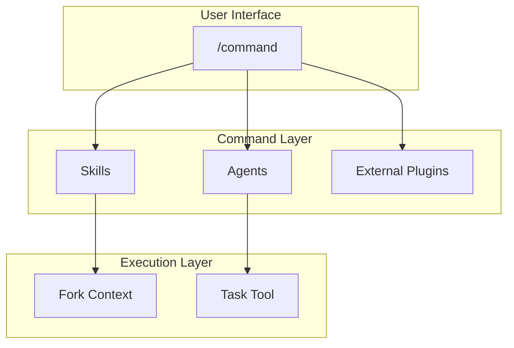

# Commands Design

Command design and relationships.

📌 **[日本語版](../.ja/docs/COMMANDS.md)**

## Architecture



## Commands & Workflows

See [WORKFLOW_REFERENCE](../rules/workflows/WORKFLOW_REFERENCE.md) for command
listing and selection guide.

## Design Principles

### 1. Thin Wrapper Pattern

Commands are orchestrators, no implementation details.

```markdown
# Good: /code

- Skills: orchestrating-workflows (RGRC definition)
- Agents: test-generator (test generation)
- Plugins: ralph-loop (automatic iteration)

# Bad

- Hardcoding TDD steps inside the command
```

### 2. Conditional Context Loading

Load skills only when needed.

```markdown
/code --frontend → load applying-frontend-patterns /code --principles → load
applying-code-principles /code (no flags) → no additional skills
```

### 3. Graceful Degradation

Commands work without external plugins:

```markdown
ralph-loop present → automatic RGRC iteration ralph-loop absent → manual
confirmation mode (same functionality)
```

## Command → Skill/Agent Mapping

| Command     | Skills Used                                   | Agents Used                                                           |
| ----------- | --------------------------------------------- | --------------------------------------------------------------------- |
| `/think`    | -                                             | -                                                                     |
| `/code`     | orchestrating-workflows, generating-tdd-tests | test-generator                                                        |
| `/audit`    | applying-code-principles                      | tier-based reviewer agents (3 or file-routed from 17)                 |
| `/fix`      | -                                             | build-error-resolver                                                  |
| `/polish`   | -                                             | code-simplifier                                                       |
| `/feature`  | orchestrating-workflows                       | feature-explorer, feature-architect, test-generator, unit-implementer |
| `/swarm`    | orchestrating-workflows                       | qa-reviewer, unit-implementer                                         |
| `/glossary` | extracting-ubiquitous-language                | -                                                                     |

## File Structure

```text
skills/
├── code/SKILL.md      # YAML front matter + execution steps
├── fix/SKILL.md
├── think/SKILL.md
└── ...
```

### Front Matter Fields

| Field           | Required | Purpose                                    |
| --------------- | -------- | ------------------------------------------ |
| `description`   | ✓        | Command description (Skill picker display) |
| `allowed-tools` | ✓        | Permitted tools                            |
| `model`         | -        | Model to use (opus/sonnet/haiku)           |
| `argument-hint` | -        | Hint shown for argument input              |

## Related

- [SKILLS_AGENTS.md](./SKILLS_AGENTS.md) — Skills and agents reference
- [WORKFLOW_REFERENCE](../rules/workflows/WORKFLOW_REFERENCE.md) — Workflow
  selection guide
