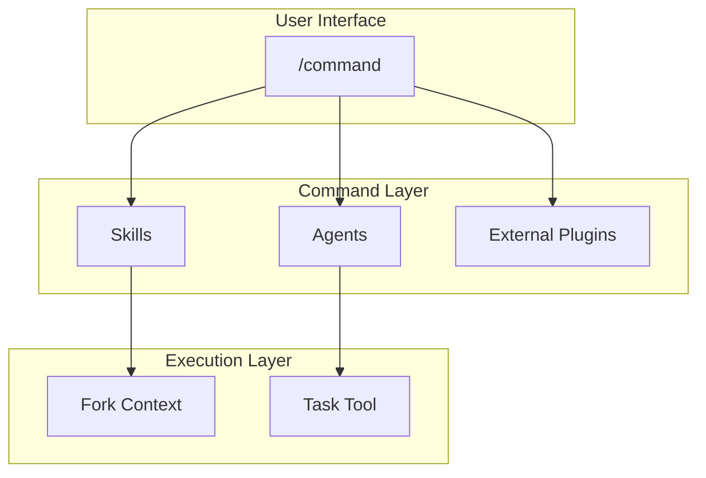

# Commands Design

Command design and relationships.

📌 **[日本語版](../.ja/docs/COMMANDS.md)**

## Architecture



## Design Principles

### 1. Thin Wrapper Pattern

Commands are orchestrators, no implementation details.

```markdown
# Good: /code

- Skills: use-workflow-tdd-cycle (RGRC cycle definition)
- Native: /goal (optional autonomous iteration)

# Bad

- Hardcoding TDD steps inside the command
```

### 2. Conditional Context Loading

Load skills only when needed.

```markdown
/code (no flags) → no additional skills
```

### 3. Graceful Degradation

Commands work without external plugins:

```markdown
/goal wrapping → autonomous iteration; absent → gates auto-retry + manual
confirmation (same functionality)
```

## Command → Skill/Agent Mapping

| Command   | Skills Used                               | Agents Used                                           |
| --------- | ----------------------------------------- | ----------------------------------------------------- |
| `/think`  | -                                         | -                                                     |
| `/code`   | use-workflow-tdd-cycle                    | -                                                     |
| `/audit`  | -                                         | tier-based reviewer agents (3 or file-routed from 17) |
| `/fix`    | use-context-root-cause-analysis           | generator-test, resolver-build                        |
| `/polish` | -                                         | enhancer-code                                         |
| `/build`  | think, code, audit, fix, polish (chained) | -                                                     |

## File Structure

```text
skills/
├── code/SKILL.md      # YAML front matter + execution steps
├── fix/SKILL.md
├── think/SKILL.md
└── ...
```

### Front Matter Fields

| Field           | Required | Purpose                                    |
| --------------- | -------- | ------------------------------------------ |
| `description`   | ✓        | Command description (Skill picker display) |
| `allowed-tools` | ✓        | Permitted tools                            |
| `model`         | -        | Model to use (opus/sonnet/haiku)           |
| `argument-hint` | -        | Hint shown for argument input              |

## Related

- [SKILLS_AGENTS.md](./SKILLS_AGENTS.md) - Skills and agents reference
