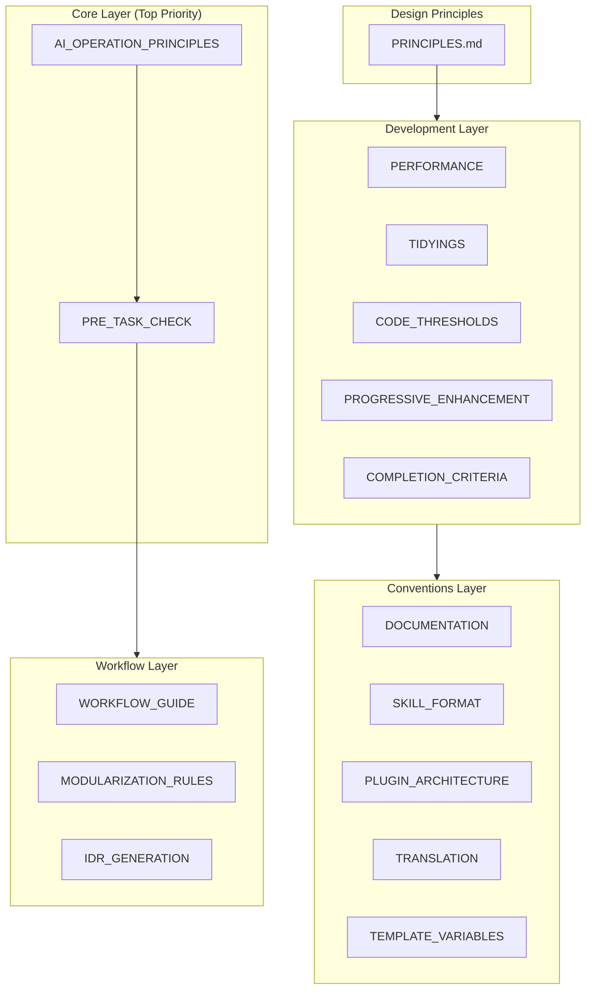
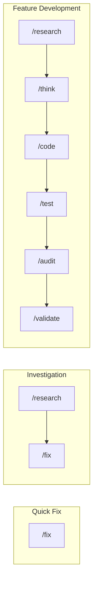

# Design Philosophy

この設定は **AIコーディングアシスタントの一貫性と品質を確保するためのフレームワーク** として設計されています。

📌 **[日本語版](../.ja/docs/DESIGN.md)**

## Architecture Overview



## Design Intentions by Layer

### 1. Core Layer — Safety & Transparency

最優先で適用されるルール。AIの「暴走」を防ぎ、ユーザーが常に状況を把握できるようにする。

| File                                                                | Intent       | Key Mechanism                             |
| ------------------------------------------------------------------- | ------------ | ----------------------------------------- |
| [AI_OPERATION_PRINCIPLES](../rules/core/AI_OPERATION_PRINCIPLES.md) | 安全性の担保 | `rm`禁止→`mv ~/.Trash/`、破壊的操作の確認 |
| [PRE_TASK_CHECK_SPEC](../rules/core/PRE_TASK_CHECK_SPEC.md)         | 理解の可視化 | 7項目チェックリスト、理解度グラフ         |
| [PRE_TASK_CHECK_RULES](../rules/core/PRE_TASK_CHECK_RULES.md)       | チェック基準 | [✓]/[→]/[?]マーカー、スキップ条件         |

**Why this design:**

- `rm`を禁止し`mv ~/.Trash/`に置換することで、macOSのゴミ箱復元機能を活用
- 出力検証マーカー `[✓][→][?]` でAIの確信度を明示化
- 7項目チェックで「わかったつもり」による誤実装を防止

### 2. Design Principles — Decision Framework

設計判断の優先順位と衝突時の解決ルールを定義。

| File                                    | Intent                             |
| --------------------------------------- | ---------------------------------- |
| [PRINCIPLES.md](../rules/PRINCIPLES.md) | 原則の優先順位、依存関係、衝突解決 |

**Principle Hierarchy:**

```text
Occam's Razor (Meta - questions all complexity)
    ↓
Progressive Enhancement / Readable Code / DRY (Universal)
    ↓
TDD / SOLID / YAGNI (Contextual)
```

**Conflict Resolution Examples:**

| Conflict           | Winner   | Reason                                   |
| ------------------ | -------- | ---------------------------------------- |
| DRY vs Readable    | Readable | 抽象化が理解を妨げるなら重複を許容       |
| SOLID vs Simple    | Simple   | 将来のためのoverdesignを避ける           |
| Perfect vs Working | Working  | 不完全な抽象化でも問題を解決するなら出荷 |

### 3. Development Layer — Practical Standards

日々の開発で適用する具体的な基準とパターン。

| File                                                                       | Intent                            | Key Threshold                      |
| -------------------------------------------------------------------------- | --------------------------------- | ---------------------------------- |
| [CODE_THRESHOLDS](../rules/development/CODE_THRESHOLDS.md)                 | 定量的品質基準                    | 関数≤30行、ファイル≤400行          |
| [TIDYINGS](../rules/development/TIDYINGS.md)                               | 整理範囲の限定                    | 振る舞い変更禁止、編集ファイルのみ |
| [PERFORMANCE](../rules/development/PERFORMANCE.md)                         | コンテキスト/フロントエンド最適化 | MCP≤10、LCP<2.5s                   |
| [PROGRESSIVE_ENHANCEMENT](../rules/development/PROGRESSIVE_ENHANCEMENT.md) | 漸進的構築                        | CSS-First、Outcome-First           |
| [COMPLETION_CRITERIA](../rules/development/COMPLETION_CRITERIA.md)         | 完了基準                          | tests pass、lint pass、build pass  |

**AI Failure Patterns (inline):**

| Pattern              | Trigger                  | Action                   |
| -------------------- | ------------------------ | ------------------------ |
| Context Bloat        | usage >70%               | `/clear` or `/compact`   |
| Repeated Fixes       | 3rd attempt, same error  | Reframe with specificity |
| Infinite Exploration | >10 files read, no edits | Scope down with subagent |
| Wrong Direction      | "not what I wanted"      | `/rewind` to checkpoint  |

**Why this design:**

- AI特有の「無限探索」「繰り返し修正」を自己検知
- `TIDYINGS`で「何を整理してよいか」を明確化し、過剰リファクタリングを防止
- 定量基準（30行、400行）で主観を排除

### 4. Conventions Layer — Consistency Rules

ドキュメント・プラグイン・翻訳の一貫性を保つルール。

| File                                                               | Intent              |
| ------------------------------------------------------------------ | ------------------- |
| [DOCUMENTATION](../rules/conventions/DOCUMENTATION.md)             | 文書構造の統一      |
| [SKILL_FORMAT](../rules/conventions/SKILL_FORMAT.md)               | Skill定義の標準形式 |
| [PLUGIN_ARCHITECTURE](../rules/conventions/PLUGIN_ARCHITECTURE.md) | プラグイン制約      |
| [TRANSLATION](../rules/conventions/TRANSLATION.md)                 | EN/JP同期ルール     |
| [TEMPLATE_VARIABLES](../rules/conventions/TEMPLATE_VARIABLES.md)   | 変数置換構文        |

**Why this design:**

- 参照深度を制限（Skills: 1階層、Rules: 3階層）して部分読み込み問題を回避
- EN/JP構造を揃えつつ、翻訳内容の差異は許容

### 5. Workflows Layer — User Interface

ユーザー向けのコマンドとワークフロー体系。

| File                                                               | Intent             |
| ------------------------------------------------------------------ | ------------------ |
| [WORKFLOW_GUIDE](../rules/workflows/WORKFLOW_GUIDE.md)             | コマンド選択ガイド |
| [MODULARIZATION_RULES](../rules/workflows/MODULARIZATION_RULES.md) | コマンド分割基準   |
| [IDR_GENERATION](../rules/workflows/IDR_GENERATION.md)             | 実装記録の自動生成 |

**Workflow Patterns:**



## Underlying Philosophy

| Philosophy       | Implementation                              |
| ---------------- | ------------------------------------------- |
| **Transparency** | チェックリスト、確信度マーカー、進捗可視化  |
| **Safety**       | 破壊的操作禁止/確認、ゴミ箱移動、復元可能性 |
| **Consistency**  | 命名規則、ファイル構成、コマンド体系        |
| **Learnability** | Explanatory mode、Insight表示               |

これらは「**AIは間違える**」という前提のもと、以下を実現するための仕組み：

- 間違いを**検知しやすく**する
- 間違いを**修正しやすく**する
- 間違いの**被害を最小化**する

## Detailed Documentation

より詳細な設計意図については、以下のドキュメントを参照してください：

| Document                            | Content                                      |
| ----------------------------------- | -------------------------------------------- |
| [COMMANDS](./COMMANDS.md)           | コマンドの設計意図と関係性                   |
| [SKILLS_AGENTS](./SKILLS_AGENTS.md) | スキル・エージェントの仕組みと使い分け       |
| [HOOKS](./HOOKS.md)                 | フックシステムとIDR生成                      |
| [TEMPLATES](./TEMPLATES.md)         | テンプレート体系とドキュメントライフサイクル |

---

_This design document explains the "why" behind the configuration. For "how to use", see [README.md](../README.md)._
