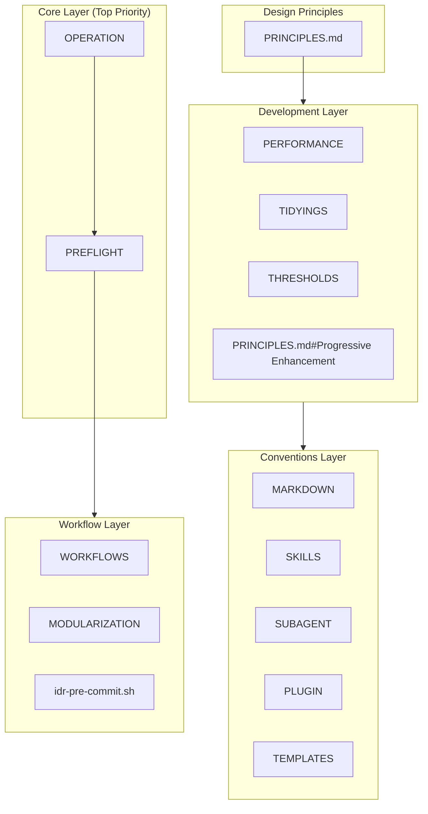
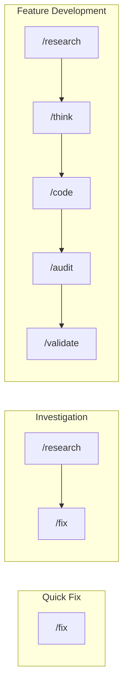

# Design Philosophy

**Framework for AI coding assistant consistency and quality.**

📌 **[日本語版](../.ja/docs/DESIGN.md)**

## Architecture Overview



## Design Intentions by Layer

### 1. Core Layer — Safety & Transparency

Top-priority rules. Prevent AI runaway and keep users informed.

| File                                                                | Intent             | Key Mechanism                                                        |
| ------------------------------------------------------------------- | ------------------ | -------------------------------------------------------------------- |
| [OPERATION](../rules/core/OPERATION.md) | Ensure safety      | `rm` prohibited → `mv ~/.Trash/`, destructive op confirmation        |
| [PREFLIGHT](../rules/core/PREFLIGHT.md)                   | Task check unified | Rationalization counters, decomposition thresholds, done definitions |

**Why this design:**

- `rm` prohibited; `mv ~/.Trash/` leverages macOS Trash recovery
- Rationalization counters prevent model self-exemption from scope checks
- Decomposition thresholds (Files ≥5, Features ≥3) prevent scope creep

### 2. Design Principles — Decision Framework

Priority order and conflict resolution for design decisions.

| File                                    | Intent                                                |
| --------------------------------------- | ----------------------------------------------------- |
| [PRINCIPLES.md](../rules/PRINCIPLES.md) | Principle priority, dependencies, conflict resolution |

**Principle Hierarchy:**

```text
Occam's Razor (Meta - questions all complexity)
    ↓
Progressive Enhancement / Readable Code / DRY (Universal)
    ↓
TDD / SOLID / YAGNI (Contextual)
```

**Conflict Resolution Examples:**

| Conflict           | Winner   | Reason                                       |
| ------------------ | -------- | -------------------------------------------- |
| DRY vs Readable    | Readable | Duplication over clarity-harming abstraction |
| SOLID vs Simple    | Simple   | Avoid overdesign for imagined futures        |
| Perfect vs Working | Working  | Ship if it solves real problems              |

### 3. Development Layer — Practical Standards

Concrete standards for daily development.

| File                                                            | Intent                       | Key Threshold                          |
| --------------------------------------------------------------- | ---------------------------- | -------------------------------------- |
| [THRESHOLDS](../rules/development/THRESHOLDS.md)      | Quality metrics + completion | Function ≤30 lines, tests pass         |
| [TIDYINGS](../rules/development/TIDYINGS.md)                    | Scope cleanup limits         | No behavior changes, edited files only |
| [PERFORMANCE](../rules/development/PERFORMANCE.md)              | Context management           | MCP ≤10, /compact >70%                 |
| [PRINCIPLES.md#Progressive Enhancement](../rules/PRINCIPLES.md) | Incremental building         | CSS-First, Outcome-First               |

**AI Failure Patterns (inline):**

| Pattern              | Trigger                  | Action                   |
| -------------------- | ------------------------ | ------------------------ |
| Context Bloat        | usage >70%               | `/clear` or `/compact`   |
| Repeated Fixes       | 3rd attempt, same error  | Reframe with specificity |
| Infinite Exploration | >10 files read, no edits | Scope down with subagent |
| Wrong Direction      | "not what I wanted"      | `/rewind` to checkpoint  |

**Why this design:**

- Self-detect AI patterns: infinite exploration, repeated fixes
- `TIDYINGS` scopes cleanup to prevent over-refactoring
- Quantitative thresholds (30 lines, 400 lines) remove subjectivity

### 4. Conventions Layer — Consistency Rules

Consistency across documentation, plugins, and translations.

| File                                                               | Intent                       |
| ------------------------------------------------------------------ | ---------------------------- |
| [MARKDOWN](../rules/conventions/MARKDOWN.md)                       | Markdown conventions         |
| [SKILLS](../rules/conventions/SKILLS.md)                           | Skill definition standard    |
| [SUBAGENT](../rules/conventions/SUBAGENT.md)                       | Sub-agent definition standard |
| [PLUGIN](../rules/conventions/PLUGIN.md)                           | Plugin constraints           |
| [TEMPLATES](../rules/conventions/TEMPLATES.md)                     | Variable substitution syntax |

**Why this design:**

- Limit reference depth (Skills: 1 level, Rules: 3 levels) to avoid partial read
  issues
- Align EN/JP structure while allowing translation content differences

### 5. Workflows Layer — User Interface

User-facing commands and workflow system.

| File                                                               | Intent                               |
| ------------------------------------------------------------------ | ------------------------------------ |
| [WORKFLOWS](../rules/workflows/WORKFLOWS.md)     | Command selection guide              |
| [MODULARIZATION](../rules/workflows/MODULARIZATION.md) | Command split criteria               |
| [idr-pre-commit.sh](../hooks/lifecycle/idr-pre-commit.sh)          | Auto-generate implementation records |

**Workflow Patterns:**



## Underlying Philosophy

| Philosophy       | Implementation                                                      |
| ---------------- | ------------------------------------------------------------------- |
| **Transparency** | Checklists, confidence markers, progress visualization              |
| **Safety**       | Destructive op prohibition/confirmation, Trash move, recoverability |
| **Consistency**  | Naming conventions, file structure, command system                  |
| **Learnability** | Explanatory mode, Insight display                                   |

Built on the premise that "**AI makes mistakes**":

- Make mistakes **easy to detect**
- Make mistakes **easy to fix**
- **Minimize** mistake damage

## Detailed Documentation

Refer to:

| Document                            | Content                                |
| ----------------------------------- | -------------------------------------- |
| [COMMANDS](./COMMANDS.md)           | Command design and relationships       |
| [SKILLS_AGENTS](./SKILLS_AGENTS.md) | Skill/agent mechanisms and usage       |
| [HOOKS](./HOOKS.md)                 | Hook system and IDR generation         |
| [TEMPLATES](./TEMPLATES.md)         | Template system and document lifecycle |
| [GLOSSARY](./GLOSSARY.md)           | Ubiquitous language dictionary         |

---

_Explains the "why" behind the configuration. For "how to use", see
[README.md](../README.md)._
