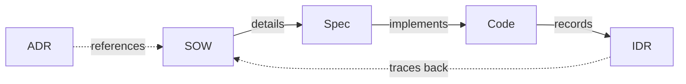

# Glossary

Ubiquitous language dictionary for this project.

📌 **[日本語版](../.ja/docs/GLOSSARY.md)**

## Documents

| Term     | Full Name                      | Purpose                       | Generated By      | Audience | Lifecycle               |
| -------- | ------------------------------ | ----------------------------- | ----------------- | -------- | ----------------------- |
| **ADR**  | Architecture Decision Record   | Record of technical decisions | `/adr`            | Human    | Immutable once accepted |
| **SOW**  | Statement of Work              | Planning, scope, criteria     | `/think`          | AI       | Static after approval   |
| **Spec** | Specification                  | Implementation details, tests | `/think`          | AI       | Static after approval   |
| **IDR**  | Implementation Decision Record | Implementation record         | `git commit` hook | Human    | Append-only             |

### ADR — Architecture Decision Record

**What it answers:** "Why did we choose this approach?"

Records the reasoning behind significant technical decisions — technology
selections, architecture patterns, deprecations, process changes. Written in
MADR format with prose-style explanation optimized for human readers who need to
understand context months or years later.

Key properties:

- **Audience: future developers** — someone joining the project should
  understand past decisions by reading ADRs
- **Immutable once accepted** — superseded by new ADRs, never edited
- **Prose over placeholders** — ADR-0008 established that human-facing documents
  use narrative style, not structured tables
- **4 template variants** by decision type: technology-selection,
  architecture-pattern, deprecation, process-change

Location: `adr/NNNN-title.md`

### SOW — Statement of Work

**What it answers:** "What are we building, and how do we know it's done?"

The planning document that defines scope, acceptance criteria, and
implementation approach. Produced during `/think` after design exploration
(approach comparison, self-challenge, domain/technical perspectives).

Key properties:

- **Audience: AI** — structured tables that AI can parse mechanically for
  `/validate` and `/code`
- **Static after approval** — once the user approves, SOW is not modified
- **AC-N acceptance criteria** — simple numbered checklist (not WHEN/THEN
  format; ADR-0008 simplified from the unused I-001/A-001 system)
- **Includes YAGNI checklist** — explicitly marks excluded features to prevent
  scope creep
- **Paired with Spec** — SOW defines "what/why", Spec defines "how"

Location: `workspace/planning/YYYY-MM-DD-[feature]/sow.md`

### Spec — Specification

**What it answers:** "How exactly do we implement this?"

Translates SOW acceptance criteria into functional requirements, test scenarios,
and domain model. The primary input for `/code` implementation.

Key properties:

- **Audience: AI** — structured tables with full traceability
  (`FR-001 Implements: AC-001` → `T-001 Validates: FR-001`)
- **Static after approval** — locked alongside SOW
- **Domain model depth varies** — brief data model for CLI/config, detailed
  entities/business rules/events for business apps (ADR-0008 threshold: entities
  ≥ 3 or business rules ≥ 3)
- **Test scenarios own the detail** — test plan lives in Spec, not SOW (ADR-0008
  eliminated duplication)
- **Traceability matrix** — every AC maps to FR, test, and NFR

Location: `workspace/planning/YYYY-MM-DD-[feature]/spec.md`

### IDR — Implementation Decision Record

**What it answers:** "What actually happened during implementation?"

Auto-generated record of each commit's changes, capturing the decisions made
during coding. Created by `claude-idr` (Rust binary) at git pre-commit hook time
by analyzing the session log and diff.

Key properties:

- **Audience: human reviewers** — written as a narrative summary of changes, not
  structured data
- **Append-only** — each commit adds a new IDR file, never modifies previous
  ones
- **Automatic** — no manual effort; the hook generates it from git diff +
  session context
- **Traces back to SOW** — placed in the same directory as the SOW when one
  exists, providing a link from planning to execution
- **Numbered sequentially** — `idr-01.md`, `idr-02.md`, ... within a feature
  directory

Location: `workspace/planning/[feature]/idr-NN.md` or
`workspace/planning/YYYY-MM-DD/idr-NN.md`

### Document Relationships



| Relationship | Mechanism                                         |
| ------------ | ------------------------------------------------- |
| SOW → Spec   | AC-N in SOW → FR-NNN `Implements: AC-N` in Spec   |
| Spec → Code  | `/code` reads Spec as implementation input        |
| Code → IDR   | git commit hook auto-generates IDR from diff      |
| ADR → SOW    | `/think` Step 5.5 proposes ADR for key decisions  |
| IDR → SOW    | IDR placed in same directory, tracing to planning |

## ID Conventions

| Prefix      | Meaning                    | Used In | Example |
| ----------- | -------------------------- | ------- | ------- |
| **AC-NNN**  | Acceptance Criteria        | SOW     | AC-001  |
| **FR-NNN**  | Functional Requirement     | Spec    | FR-001  |
| **T-NNN**   | Test Scenario              | Spec    | T-001   |
| **NFR-NNN** | Non-Functional Requirement | Spec    | NFR-001 |
| **BR-NNN**  | Business Rule              | Spec    | BR-001  |
| **I-NNN**   | Issue / Investigation      | SOW     | I-001   |
| **RC-NNN**  | Root Cause                 | Audit   | RC-001  |
| **SUG-NNN** | Suggestion                 | Audit   | SUG-001 |

### Traceability

```text
AC-001 ← FR-001 ← T-001
              ↑        ↑
           NFR-001   BR-001
```

IDs trace across documents: SOW acceptance criteria → Spec requirements → Test
scenarios.

## Confidence Markers

| Marker | Confidence | Meaning  | Action                    |
| ------ | ---------- | -------- | ------------------------- |
| `[✓]`  | ≥95%       | Verified | Proceed                   |
| `[→]`  | 70-94%     | Inferred | Confirm before proceeding |
| `[?]`  | <70%       | Unknown  | Investigate first         |

Used in AI_OPERATION_PRINCIPLES (Output Verifiability) and throughout
documentation.

## Related

- [TEMPLATES](./TEMPLATES.md) — Template structure and lifecycle
- [DESIGN](./DESIGN.md) — Architecture overview
- [HOOKS](./HOOKS.md) — IDR generation details
