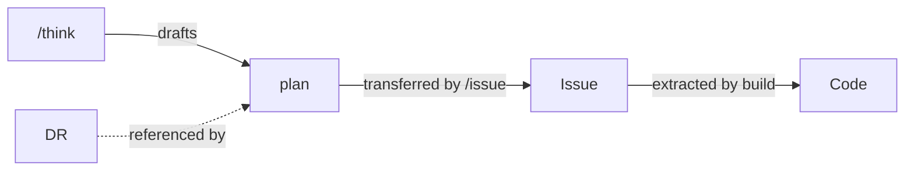

# Glossary

Ubiquitous language dictionary for this project.

📌 **[日本語版](../.ja/docs/GLOSSARY.md)**

## Documents

| Term     | Full Name           | Purpose                        | Generated By | Audience   | Lifecycle                       |
| -------- | ------------------- | ------------------------------ | ------------ | ---------- | ------------------------------- |
| **DR**   | Decision Record     | Record of technical decisions  | `/dr`        | Human      | Immutable once accepted         |
| **plan** | Implementation Plan | Scope, units, acceptance tests | `/think`     | AI + Human | Draft, then frozen in the issue |

### DR - Decision Record

**What it answers:** "Why did we choose this approach?"

Records the reasoning behind significant technical decisions - technology
selections, architecture patterns, deprecations, process changes. Written in
MADR format with prose-style explanation optimized for human readers who need to
understand context months or years later. Not every decision is architectural,
so the record is scoped as a Decision Record rather than an Architecture-only one.

Key properties:

- **Audience: future developers** - someone joining the project should
  understand past decisions by reading DRs
- **Immutable once accepted** - superseded by new DRs, never edited
- **4 template variants** by decision type: technology-selection,
  architecture-pattern, deprecation, process-change

Location: `docs/decisions/NNNN-title.md`

### plan - Implementation Plan

**What it answers:** "What are we building, in what order, and how do we verify each step?"

Drafted by `/think` after design exploration (approach comparison, `critic-design`
critique). Written to `.claude/workspace/planning/YYYY-MM-DD-<slug>.plan.md`
following the `templates/plan.md` skeleton, then `/issue` transfers both sections
into the issue's Plan section verbatim. The build workflow extracts it
(U-NNN / T-NNN id sets) and implements unit by unit.

Key properties:

- **Audience: AI and human** - build extracts the structure mechanically; a human
  reviews it in the issue before build runs
- **Two sections only** - `## Plan` (Outcome, test_command, Preconditions, U-NNN
  units) and `## Backlog candidates`
- **Frozen in the issue** - once transferred to the issue Plan section, that
  section is the source of truth build consumes
- **Units carry acceptance tests** - each U-NNN pins behavior with T-NNN tests; a
  docs / config unit omits tests and build implements it directly

Location: `.claude/workspace/planning/YYYY-MM-DD-<slug>.plan.md`, then the issue's
`## Plan` section

### Document Relationships



| Relationship | Mechanism                                                        |
| ------------ | ---------------------------------------------------------------- |
| think → plan | `/think` drafts the plan following `templates/plan.md`           |
| plan → Issue | `/issue` transfers `## Plan` and `## Backlog candidates`         |
| Issue → Code | build extracts U-NNN / T-NNN and implements unit by unit         |
| DR → plan    | `/think` proposes a DR for key decisions; the plan references it |

## ID Conventions

| Prefix    | Meaning                         | Used In | Example |
| --------- | ------------------------------- | ------- | ------- |
| **U-NNN** | Unit (implementation slice)     | plan    | U-001   |
| **T-NNN** | Test Scenario (acceptance test) | plan    | T-001   |

### Traceability

```text
U-001 → T-001
```

Ids trace within a plan: each unit U-NNN owns its acceptance tests T-NNN. T-NNN is
unique across the whole plan and never restarts per unit.

## Related

- [DESIGN](./DESIGN.md) - Architecture overview
- [HOOKS](./HOOKS.md) - Hook pipeline
