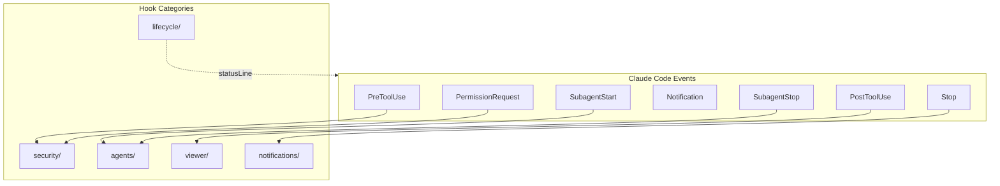
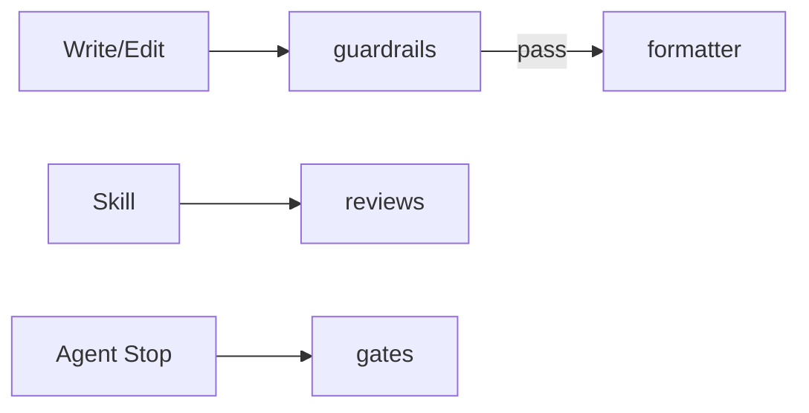
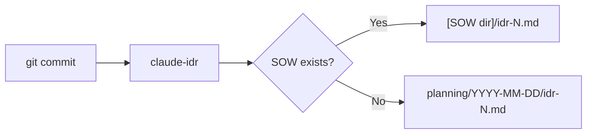

# Hooks Design

フックシステムの設計意図と仕組みを説明します。

## Overview



## Hook Categories

| Category         | Trigger                | Purpose                                         |
| ---------------- | ---------------------- | ----------------------------------------------- |
| `security/`      | PreToolUse             | Bash safety, permission control, secrets check  |
| `lifecycle/`     | statusLine, pre-commit | Status line, PR cache, IDR generation, worktree |
| `agents/`        | Subagent\*             | Agent logging, idle detection                   |
| `viewer/`        | PostToolUse            | SOW/Spec/IDR viewer                             |
| `notifications/` | Stop                   | Completion notification                         |

## Key Hooks

### security/

| Hook                    | Event             | Failure Mode | Purpose                  |
| ----------------------- | ----------------- | ------------ | ------------------------ |
| `bash-safety.sh`        | PreToolUse(Bash)  | fail-closed  | 危険コマンドをブロック   |
| `permission-request.sh` | PermissionRequest | fail-closed  | 自動承認/拒否の判定      |
| `secrets-check.sh`      | PreToolUse        | fail-closed  | シークレット漏洩チェック |
| `config-change.sh`      | PreToolUse        | fail-closed  | 設定ファイル変更の検知   |

### lifecycle/

| Hook                | Trigger    | Purpose              |
| ------------------- | ---------- | -------------------- |
| `statusline.sh`     | statusLine | ステータスライン表示 |
| `_pr-cache.sh`      | (sourced)  | PR情報のキャッシュ   |
| `idr-pre-commit.sh` | pre-commit | IDR自動生成          |

### agents/

| Hook               | Event        | Failure Mode | Purpose              |
| ------------------ | ------------ | ------------ | -------------------- |
| `subagent-done.sh` | SubagentStop | fail-open    | 完了マーカー書き込み |
| `teammate-idle.sh` | TeammateIdle | fail-open    | チームメイト待機検知 |

### viewer/

| Hook                 | Event              | Failure Mode | Purpose                     |
| -------------------- | ------------------ | ------------ | --------------------------- |
| `ccplanview-open.sh` | PostToolUse(Write) | fail-open    | Open SOW/Spec/IDR in viewer |

## Quality Pipeline (Rust Binaries)

4 Rust binaries that form the primary code quality enforcement layer. Separate
repositories, installed via `brew install thkt/tap/{tool}` or as Claude Code
plugins. Per-project config in `.claude/tools.json`.



### guardrails

PreToolUse hook. Validates code before Write/Edit is applied.

| Aspect       | Detail                                                |
| ------------ | ----------------------------------------------------- |
| Linter       | oxlint (priority) / biome (fallback)                  |
| Custom rules | 19 rules (sensitiveFile, cryptoWeak, XSS, eval, etc)  |
| Blocking     | Yes - blocks on critical/high severity                |
| Source       | [thkt/guardrails](https://github.com/thkt/guardrails) |

### formatter

PostToolUse hook. Auto-formats files after Write/Edit.

| Aspect    | Detail                                              |
| --------- | --------------------------------------------------- |
| Formatter | oxfmt (priority) / biome (fallback) + EOF newline   |
| Blocking  | Never (exit 0 always, errors logged to stderr)      |
| Source    | [thkt/formatter](https://github.com/thkt/formatter) |

### reviews

PreToolUse hook (Skill matcher). Injects static analysis context before
configured skills.

| Aspect   | Detail                                                |
| -------- | ----------------------------------------------------- |
| Tools    | knip, oxlint, tsgo, react-doctor (parallel execution) |
| Blocking | Never (advisory only, results as additionalContext)   |
| Source   | [thkt/reviews](https://github.com/thkt/reviews)       |

### gates

Stop hook. Quality gates enforced on agent completion.

| Aspect          | Detail                                                  |
| --------------- | ------------------------------------------------------- |
| Static gates    | knip, tsgo, madge                                       |
| Script gates    | lint, type-check, test (detected from package.json)     |
| Phase detection | fix → review → allow (blocks first all-pass for review) |
| Blocking        | Yes on gate failure; fail-open for missing tools        |
| Source          | [thkt/gates](https://github.com/thkt/gates)             |

### Pipeline Configuration

All 4 tools share `.claude/tools.json` at the project root:

```json
{
  "guardrails": { "rules": { "oxlint": true } },
  "formatter": { "formatters": { "oxfmt": true } },
  "reviews": { "skills": ["audit"], "tools": { "knip": true, "tsgo": true } },
  "gates": { "knip": true, "tsgo": true }
}
```

Each tool can be disabled per project with `"enabled": false`.

## Configuration

Shell hooks are configured in `settings.json`:

```json
{
  "hooks": {
    "PreToolUse": [
      {
        "matcher": "Bash",
        "hooks": [
          {
            "type": "command",
            "command": "~/.claude/hooks/security/bash-safety.sh",
            "timeout": 2000
          }
        ]
      }
    ],
    "PostToolUse": [
      {
        "matcher": "Write|Edit|MultiEdit",
        "hooks": [
          {
            "type": "command",
            "command": "~/.claude/hooks/viewer/ccplanview-open.sh",
            "timeout": 5000
          }
        ]
      }
    ]
  }
}
```

## Design Principles

### 1. Non-blocking by Default

フックは通常、操作をブロックしない。ブロックは明示的な設定が必要。

### 2. Fail-safe

フックがエラーで終了しても、Claude Codeは継続動作。

### 3. Fail-mode Convention

- **fail-open** (`set +e`): エラー時はスキップして継続。大半のフックがこちら。
- **fail-closed**
  (`set -euo pipefail`): エラー時はブロック。セキュリティフックのみ。

### 4. Composable

小さなフックを組み合わせて複雑な動作を実現。

## IDR (Implementation Decision Record)

コミット時に `claude-idr` バイナリで自動生成される実装記録。



## Related

- [Claude Code Hooks Docs](https://docs.anthropic.com/en/docs/claude-code/hooks)
