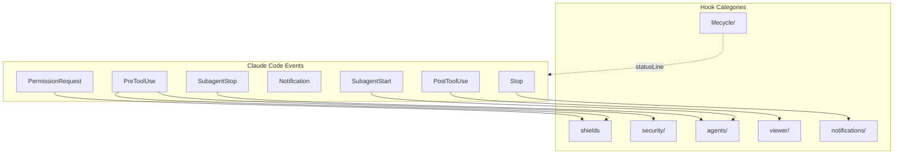
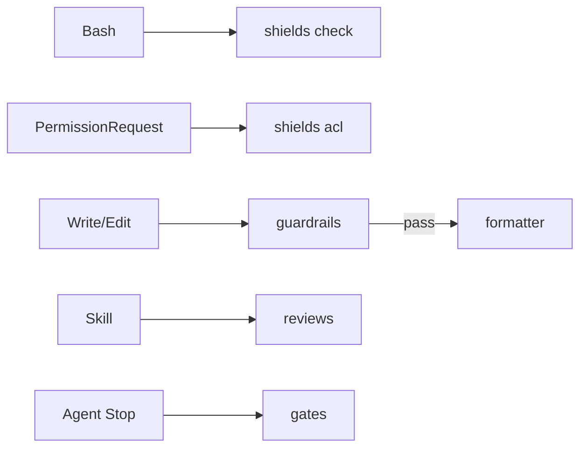
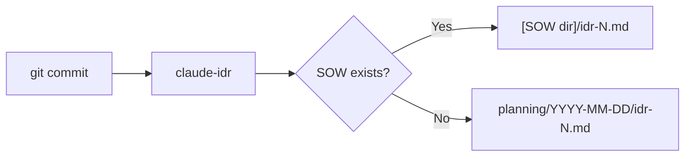

# Hooks Design

Hook system design intent and mechanism.

## Overview



## Hook Categories

| Category         | Trigger                       | Purpose                                |
| ---------------- | ----------------------------- | -------------------------------------- |
| `shields`        | PreToolUse, PermissionRequest | Command guard, file ACL, secrets check |
| `security/`      | PreToolUse                    | Config change audit logging            |
| `lifecycle/`     | statusLine, pre-commit        | Status line, PR cache, IDR generation  |
| `agents/`        | Subagent\*                    | Agent logging, idle detection          |
| `viewer/`        | PostToolUse                   | SOW/Spec/IDR viewer                    |
| `notifications/` | Stop                          | Completion notification                |

## Key Hooks

### shields (Rust binary)

Replaces bash-safety.sh, permission-request.sh, and secrets-check.sh with a
single Rust binary. Installed via `brew install thkt/tap/shields` or as a
Claude Code plugin (`shields@sentinels`).

| Subcommand      | Event             | Failure Mode | Purpose                                           |
| --------------- | ----------------- | ------------ | ------------------------------------------------- |
| `shields check` | PreToolUse(Bash)  | fail-closed  | 44 builtin + custom patterns, N1-N7 bypass defeat |
| `shields acl`   | PermissionRequest | fail-closed  | Path-based ACL with subagent restrictions         |

`shields check` also blocks `git commit` with staged secrets (20 builtin
patterns). Config via `.claude/tools.json` under the `shields` key.

### security/

| Hook               | Event      | Failure Mode | Purpose                    |
| ------------------ | ---------- | ------------ | -------------------------- |
| `config-change.sh` | PreToolUse | fail-open    | Detect config file changes |

### lifecycle/

| Hook                | Trigger    | Purpose             |
| ------------------- | ---------- | ------------------- |
| `statusline.sh`     | statusLine | Status line display |
| `_pr-cache.sh`      | (sourced)  | PR info cache       |
| `idr-pre-commit.sh` | pre-commit | IDR auto-generation |

### agents/

| Hook               | Event        | Failure Mode | Purpose                    |
| ------------------ | ------------ | ------------ | -------------------------- |
| `subagent-done.sh` | SubagentStop | fail-open    | Write completion marker    |
| `teammate-idle.sh` | TeammateIdle | fail-open    | Detect teammate idle state |

### viewer/

| Hook                 | Event              | Failure Mode | Purpose                     |
| -------------------- | ------------------ | ------------ | --------------------------- |
| `ccplanview-open.sh` | PostToolUse(Write) | fail-open    | Open SOW/Spec/IDR in viewer |

## Quality Pipeline (Rust Binaries)

5 Rust binaries that form the primary quality and security enforcement layer.
Separate repositories, installed via `brew install thkt/tap/{tool}` or as
Claude Code plugins. Per-project config in `.claude/tools.json`.



### guardrails

PreToolUse hook. Validates code before Write/Edit is applied.

| Aspect       | Detail                                                |
| ------------ | ----------------------------------------------------- |
| Linter       | oxlint (priority) / biome (fallback)                  |
| Custom rules | 19 rules (sensitiveFile, cryptoWeak, XSS, eval, etc)  |
| Blocking     | Yes - blocks on critical/high severity                |
| Source       | [thkt/guardrails](https://github.com/thkt/guardrails) |

### formatter

PostToolUse hook. Auto-formats files after Write/Edit.

| Aspect    | Detail                                              |
| --------- | --------------------------------------------------- |
| Formatter | oxfmt (priority) / biome (fallback) + EOF newline   |
| Blocking  | Never (exit 0 always, errors logged to stderr)      |
| Source    | [thkt/formatter](https://github.com/thkt/formatter) |

### reviews

PreToolUse hook (Skill matcher). Injects static analysis context before
configured skills.

| Aspect   | Detail                                                |
| -------- | ----------------------------------------------------- |
| Tools    | knip, oxlint, tsgo, react-doctor (parallel execution) |
| Blocking | Never (advisory only, results as additionalContext)   |
| Source   | [thkt/reviews](https://github.com/thkt/reviews)       |

### gates

Stop hook. Quality gates enforced on agent completion.

| Aspect          | Detail                                                  |
| --------------- | ------------------------------------------------------- |
| Static gates    | knip, tsgo, madge                                       |
| Script gates    | lint, type-check, test (detected from package.json)     |
| Phase detection | fix → review → allow (blocks first all-pass for review) |
| Blocking        | Yes on gate failure; fail-open for missing tools        |
| Source          | [thkt/gates](https://github.com/thkt/gates)             |

### Pipeline Configuration

All 5 tools share `.claude/tools.json` at the project root:

```json
{
  "shields": { "check": true, "acl": true, "custom_patterns": [] },
  "guardrails": { "rules": { "oxlint": true } },
  "formatter": { "formatters": { "oxfmt": true } },
  "reviews": { "skills": ["audit"], "tools": { "knip": true, "tsgo": true } },
  "gates": { "knip": true, "tsgo": true }
}
```

Each tool can be disabled per project with `"enabled": false`.

## Configuration

Shell hooks are configured in `settings.json`. Security hooks (shields) are
registered via the `shields@sentinels` plugin. Remaining shell hooks:

```json
{
  "hooks": {
    "PostToolUse": [
      {
        "matcher": "Write|Edit|MultiEdit",
        "hooks": [
          {
            "type": "command",
            "command": "~/.claude/hooks/viewer/ccplanview-open.sh",
            "timeout": 5000
          }
        ]
      }
    ]
  }
}
```

## Design Principles

### 1. Non-blocking by Default

Hooks do not block operations by default. Blocking requires explicit configuration.

### 2. Fail-safe

Claude Code continues operating even when a hook exits with an error.

### 3. Fail-mode Convention

- **fail-open** (`set +e`): Skip and continue on error. Most hooks fall here.
- **fail-closed**
  (`set -euo pipefail`): Block on error. Used only for security hooks.

### 4. Composable

Combine small hooks to achieve complex behavior.

## IDR (Implementation Decision Record)

Implementation records auto-generated by the `claude-idr` binary at commit time.



## Related

- [Claude Code Hooks Docs](https://docs.anthropic.com/en/docs/claude-code/hooks)
