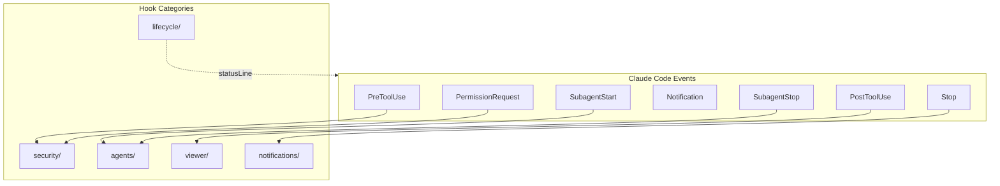
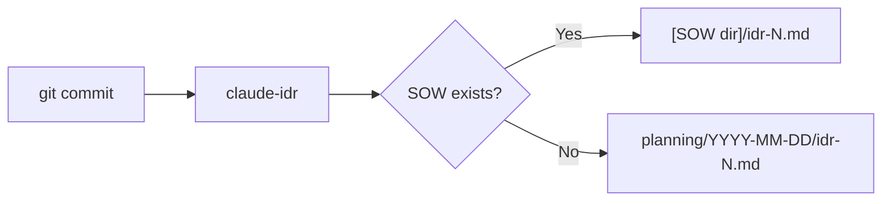

# Hooks Design

フックシステムの設計意図と仕組みを説明します。

## Overview



## Hook Categories

| Category         | Trigger                | Purpose                                         |
| ---------------- | ---------------------- | ----------------------------------------------- |
| `security/`      | PreToolUse             | Bash safety, permission control, secrets check  |
| `lifecycle/`     | statusLine, pre-commit | Status line, PR cache, IDR generation, worktree |
| `agents/`        | Subagent\*             | Agent logging, idle detection                   |
| `viewer/`        | PostToolUse            | SOW/Spec/IDR viewer                             |
| `notifications/` | Stop                   | Completion notification                         |

## Key Hooks

### security/

| Hook                    | Event             | Failure Mode | Purpose                  |
| ----------------------- | ----------------- | ------------ | ------------------------ |
| `bash-safety.sh`        | PreToolUse(Bash)  | fail-closed  | 危険コマンドをブロック   |
| `permission-request.sh` | PermissionRequest | fail-closed  | 自動承認/拒否の判定      |
| `secrets-check.sh`      | PreToolUse        | fail-closed  | シークレット漏洩チェック |
| `config-change.sh`      | PreToolUse        | fail-closed  | 設定ファイル変更の検知   |

### lifecycle/

| Hook                 | Trigger    | Purpose              |
| -------------------- | ---------- | -------------------- |
| `statusline.sh`      | statusLine | ステータスライン表示 |
| `_pr-cache.sh`       | (sourced)  | PR情報のキャッシュ   |
| `idr-pre-commit.sh`  | pre-commit | IDR自動生成          |
| `worktree-create.sh` | worktree   | ワークツリー作成     |

### agents/

| Hook                   | Event         | Failure Mode | Purpose              |
| ---------------------- | ------------- | ------------ | -------------------- |
| `subagent-start.sh`    | SubagentStart | fail-open    | 開始ログ・通知音     |
| `subagent-analysis.sh` | SubagentStop  | fail-open    | トランスクリプト保存 |
| `task-completed.sh`    | SubagentStop  | fail-open    | タスク完了通知       |
| `teammate-idle.sh`     | SubagentStop  | fail-open    | チームメイト待機検知 |

### viewer/

| Hook                 | Event              | Failure Mode | Purpose                     |
| -------------------- | ------------------ | ------------ | --------------------------- |
| `ccplanview-open.sh` | PostToolUse(Write) | fail-open    | Open SOW/Spec/IDR in viewer |

## Configuration

hooksは `settings.json` で設定:

```json
{
  "hooks": {
    "PreToolUse": [
      {
        "matcher": "Bash",
        "hooks": [
          {
            "type": "command",
            "command": "~/.claude/hooks/security/bash-safety.sh",
            "timeout": 2000
          }
        ]
      }
    ],
    "PostToolUse": [
      {
        "matcher": "Write|Edit|MultiEdit",
        "hooks": [
          {
            "type": "command",
            "command": "~/.claude/hooks/viewer/ccplanview-open.sh",
            "timeout": 5000
          }
        ]
      }
    ]
  }
}
```

## Design Principles

### 1. Non-blocking by Default

フックは通常、操作をブロックしない。ブロックは明示的な設定が必要。

### 2. Fail-safe

フックがエラーで終了しても、Claude Codeは継続動作。

### 3. Fail-mode Convention

- **fail-open** (`set +e`): エラー時はスキップして継続。大半のフックがこちら。
- **fail-closed**
  (`set -euo pipefail`): エラー時はブロック。セキュリティフックのみ。

### 4. Composable

小さなフックを組み合わせて複雑な動作を実現。

## IDR (Implementation Decision Record)

コミット時に `claude-idr` バイナリで自動生成される実装記録。



## Related

- [Claude Code Hooks Docs](https://docs.anthropic.com/en/docs/claude-code/hooks)
