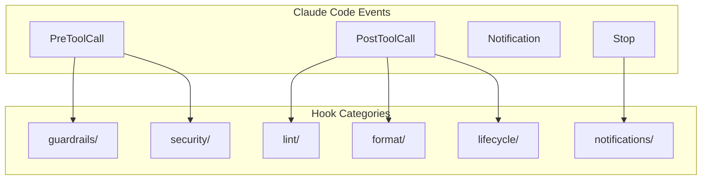
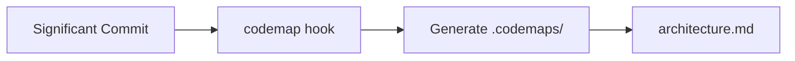
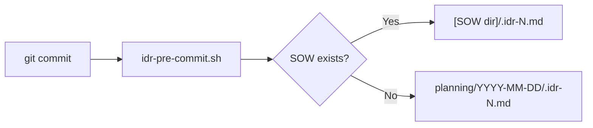

# Hooks Design

フックシステムの設計意図と仕組みを説明します。

📌 **[日本語版](../.ja/docs/HOOKS.md)**

## Overview



## Hook Categories

| Category         | Trigger      | Purpose                      |
| ---------------- | ------------ | ---------------------------- |
| `guardrails/`    | PreToolCall  | 危険な操作をブロック         |
| `security/`      | PreToolCall  | セキュリティチェック         |
| `lint/`          | PostToolCall | コード品質チェック           |
| `format/`        | PostToolCall | フォーマット適用             |
| `lifecycle/`     | git hooks    | IDR生成、ステータスライン    |
| `notifications/` | Stop         | 完了通知                     |
| `codemap/`       | PostToolCall | アーキテクチャマップ更新     |
| `scheduled/`     | Cron         | 定期タスク                   |
| `agents/`        | -            | エージェント用ユーティリティ |

## Key Hooks

### lifecycle/

| Hook                | Trigger    | Output               |
| ------------------- | ---------- | -------------------- |
| `idr-pre-commit.sh` | git commit | `.idr-N.md` 生成     |
| `statusline.sh`     | -          | ステータスライン表示 |
| `_utils.sh`         | -          | 共通ユーティリティ   |

### guardrails/

危険なコマンドをブロック。

```bash
# 例: rm コマンドをブロック
if [[ "$command" == *"rm "* ]]; then
  echo "BLOCK: Use 'mv ~/.Trash/' instead of rm"
  exit 1
fi
```

### codemap/



## Configuration

hooks は `settings.json` または `.claude/settings.local.json` で設定:

```json
{
  "hooks": {
    "PreToolCall": [
      {
        "matcher": "Bash",
        "hooks": ["~/.claude/hooks/guardrails/block-rm.sh"]
      }
    ],
    "PostToolCall": [
      {
        "matcher": "Write",
        "hooks": ["~/.claude/hooks/format/prettier.sh"]
      }
    ]
  }
}
```

## Design Principles

### 1. Non-blocking by Default

フックは通常、操作をブロックしない。ブロックは明示的な設定が必要。

### 2. Fail-safe

フックがエラーで終了しても、Claude Code は継続動作。

### 3. Composable

小さなフックを組み合わせて複雑な動作を実現。

## IDR (Implementation Decision Record)

コミット時に自動生成される実装記録。



### IDR Content

```markdown
# IDR: [目的の要約]

## 変更概要

[1段落の要約]

## 主要な変更

### [file.md](file.md)

[説明]
[コードスニペット]

## 設計判断

[理由と代替案]
```

## Related

- [IDR_GENERATION](../rules/workflows/IDR_GENERATION.md) — IDR仕様
- [Claude Code Hooks Docs](https://docs.anthropic.com/en/docs/claude-code/hooks)
