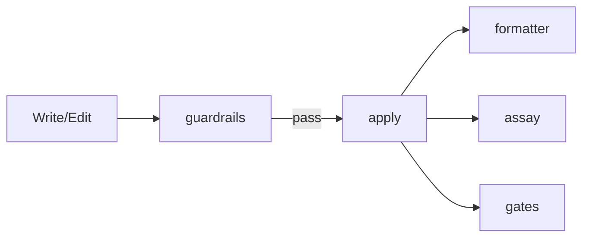

# Hooks Design

Hook system design intent and mechanism. `settings.json` is the source of truth for actual registration; this document explains structure and intent.

## Execution Layers

The Rust binaries are also distributed as sentinels plugins, but plugin registration is currently disabled in favor of direct brew-binary registration.

| Layer         | Implementation                 | Registration                     |
| ------------- | ------------------------------ | -------------------------------- |
| Shell hooks   | `~/.claude/hooks/**/*.sh`      | `settings.json`                  |
| Rust binaries | `brew install thkt/tap/{tool}` | `settings.json` (direct command) |

## Event Map

| Event              | Matcher                   | Hooks                                                                                                    |
| ------------------ | ------------------------- | -------------------------------------------------------------------------------------------------------- |
| PreToolUse         | Bash                      | auto-package-manager, security/npm-safe-install, security/rm-to-trash, textlint-lint, localized-headings |
| PreToolUse         | Edit/Write/MultiEdit      | rust-pre-edit, guardrails                                                                                |
| PreToolUse         | EnterPlanMode             | deny (planning is routed to /think)                                                                      |
| PreToolUse         | ExitPlanMode              | CCPlanView notifier                                                                                      |
| PostToolUse        | Edit/Write/MultiEdit      | rust-post-edit, textlint-fix, assay, formatter, gates                                                    |
| PostToolUse        | Write/Edit/MultiEdit/Bash | lifecycle/context-monitor                                                                                |
| SessionStart       | -                         | lifecycle/recall-index                                                                                   |
| Stop / StopFailure | -                         | notify-stop / notify-stop-failure                                                                        |
| Notification       | permission_prompt etc.    | Notification sound (afplay)                                                                              |
| statusLine         | -                         | lifecycle/statusline                                                                                     |

## Shell Hooks

### Top level

| Hook                    | Event            | Failure Mode | Purpose                                                          |
| ----------------------- | ---------------- | ------------ | ---------------------------------------------------------------- |
| auto-package-manager.sh | PreToolUse(Bash) | fail-closed  | Convert package manager commands to the ni family                |
| localized-headings.sh   | PreToolUse(Bash) | fail-closed  | Check heading language in gh issue/pr create                     |
| textlint-lint.sh        | PreToolUse(Bash) | fail-closed  | textlint + structure check on gh issue/pr create body (advisory) |
| textlint-fix.sh         | PostToolUse      | fail-closed  | Auto-fix .md files with textlint                                 |
| rust-pre-edit.sh        | PreToolUse       | fail-open    | cargo clippy before .rs edits, injected as additionalContext     |
| rust-post-edit.sh       | PostToolUse      | fail-open    | cargo fmt after .rs edits                                        |
| notify-stop.sh          | Stop             | fail-open    | Context-aware completion sound (silent for subagents)            |
| notify-stop-failure.sh  | StopFailure      | fail-open    | Notify turn abort caused by API errors                           |

### security/

| Hook                | Event            | Failure Mode | Purpose                                       |
| ------------------- | ---------------- | ------------ | --------------------------------------------- |
| npm-safe-install.sh | PreToolUse(Bash) | fail-closed  | Block package installs without ignore-scripts |
| rm-to-trash.sh      | PreToolUse(Bash) | fail-closed  | Route rm/rmdir/unlink/shred to `mv ~/.Trash/` |

### lifecycle/

| Hook               | Trigger      | Failure Mode | Purpose                                                      |
| ------------------ | ------------ | ------------ | ------------------------------------------------------------ |
| statusline.sh      | statusLine   | fail-open    | Status line display                                          |
| \_pr-cache.sh      | (sourced)    | fail-open    | PR info cache for statusline                                 |
| context-monitor.sh | PostToolUse  | fail-open    | Context usage warning (advisory)                             |
| recall-index.sh    | SessionStart | fail-open    | Background update of the recall cross-session index          |
| reflection-\*.sh   | Unregistered | fail-open    | Session reflection extract/inject. Disabled pending redesign |

### lib/

Shared functions sourced by hooks (japanese-detect, notify, reflection). Not registered on their own.

## Quality Pipeline (Rust Binaries)

Rust binaries that insert quality enforcement into the edit lifecycle. Separate repositories, installed via `brew install thkt/tap/{tool}` (assay is a local build).



### guardrails

PreToolUse hook. Validates code before Write/Edit is applied.

| Aspect       | Detail                                                      |
| ------------ | ----------------------------------------------------------- |
| Linter       | oxlint (priority) / biome (fallback)                        |
| Custom rules | sensitiveFile, cryptoWeak, XSS, eval, etc. (not exhaustive) |
| Blocking     | Yes. Blocks on critical/high severity                       |
| Source       | [thkt/guardrails](https://github.com/thkt/guardrails)       |

### formatter

PostToolUse hook. Auto-formats files after Write/Edit.

| Aspect    | Detail                                              |
| --------- | --------------------------------------------------- |
| Formatter | oxfmt (priority) / biome (fallback) + EOF newline   |
| Blocking  | Never (exit 0 always, errors logged to stderr)      |
| Source    | [thkt/formatter](https://github.com/thkt/formatter) |

### gates

PostToolUse hook. Enforces quality gates on every edit.

| Aspect       | Detail                                                                                                       |
| ------------ | ------------------------------------------------------------------------------------------------------------ |
| Static gates | knip, tsgo, litmus (test quality), circular (circular imports). litmus / circular are embedded in the binary |
| Script gates | lint, type-check, test (detected from package.json)                                                          |
| Blocking     | Blocks with a fix prompt on gate failure. Missing tools fail open                                            |
| Source       | [thkt/gates](https://github.com/thkt/gates)                                                                  |

### assay

PostToolUse hook. Validates document quality when spec.md / eval-criteria.md is saved.

| Aspect       | Detail                                           |
| ------------ | ------------------------------------------------ |
| Targets      | spec.md, eval-criteria.md                        |
| Checks       | complete / unambiguous / verifiable / consistent |
| Distribution | Local build (`~/.cargo/bin/assay`)               |

### Project Configuration

guardrails / formatter / gates share `.claude/tools.json` at the project root. Each tool can be disabled per project with `"enabled": false`.

```json
{
  "guardrails": { "rules": { "oxlint": true } },
  "formatter": { "formatters": { "oxfmt": true } },
  "gates": { "knip": true, "tsgo": true }
}
```

### Dormant

shields (command guard, file ACL, secrets check) and reviews (static analysis context injection before skills) belong to the same binary family but are intentionally left unregistered in settings.json.

## Design Principles

### 1. Non-blocking by Default

Hooks do not block operations by default. Blocking requires explicit configuration.

### 2. Fail-safe

Claude Code continues operating even when a hook exits with an error.

### 3. Fail-mode Convention

- fail-open (`set +e`): Skip and continue on error. Observation and notification hooks use this.
- fail-closed (`set -euo pipefail`): Block on error. Used for security and convention-enforcement hooks.

### 4. Composable

Combine small hooks to achieve complex behavior.

## Related

- [Claude Code Hooks Docs](https://docs.anthropic.com/en/docs/claude-code/hooks)
