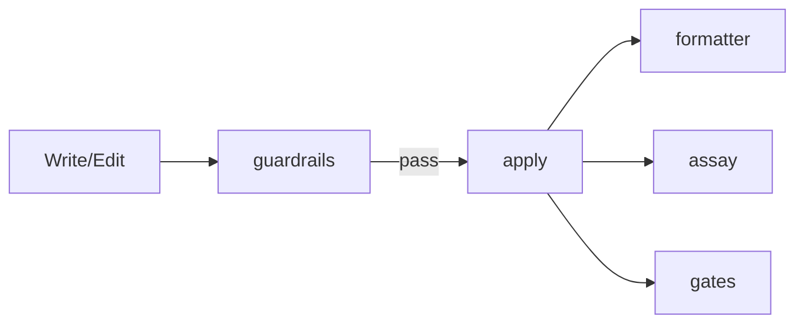

# Hooks Design

Hook system design intent and mechanism. `settings.json` is the source of truth for actual registration; this document explains structure and intent.

## Execution Layers

The Rust binaries are also distributed as sentinels plugins, but registration goes through the direct brew-binary path alone.

| Layer         | Implementation                 | Registration                     |
| ------------- | ------------------------------ | -------------------------------- |
| Script hooks  | `~/.claude/hooks/**/*.{sh,py}` | `settings.json`                  |
| Rust binaries | `brew install thkt/tap/{tool}` | `settings.json` (direct command) |

### Language

A hook is a shell script when its work is a few checks and a fork, and Python or TypeScript when
the logic is long enough to want structure or is shared with a test. `mirror_prose_guard.ts` is
the second kind: its rule lives in `_lib/mirror_prose.ts` and the repository-wide sweep test
imports the same module.

A test is written in the language of the hook it covers. The ones that stay in shell are those
placing a shell-script stub on PATH: `amphetamine_agent_session` for osascript, `rust-edit` for
cargo.

On the Python side, one method stops at its first failure and skips the assertions after it.
That happens in two shapes. A method asserting several things wraps each one in `subTest`. A
method handing the hook's output straight to `json.loads` falls to `{}` first, since a hook
that returns nothing raises there and takes the whole method down. Either shape quietly lowers
the count of what can fail, and the suite stays green.

## Naming

The directory answers which event, so the filename answers the target and the operation. The
shape is `<target>_<operation>`: the target is what this hook looks at, the operation is what it
does to it. A reader narrows by the leading word.

Python separates with underscores, shell with hyphens. A module under `_lib/` is imported, so underscores are required between its
words, and the hooks themselves import none of each other, so nothing technical binds them.
They match anyway because it makes the test name land on `<hook name>_test.py`, reachable from
the hook with no conversion in between.

The word carrying the operation is one that also reads as a noun (guard, gate, fix, index,
alert, rewrite). A verb-only word like `notify` sits poorly as a name. A verb phrase that
already reads as English stays as it is (`rm_to_trash`, `body_proofread`).

Two exceptions. Something wrapping an external app whole takes `<app>_<what it manages>`, and
`amphetamine_agent_session` keeps "only during an agent's turn" in the name. Something a single
word covers stays one word (`statusline`). A test covering several hooks at once carries a name
for that group (`rust-edit.test.sh` covers the pre/post pair plus `_lib/rust_target.py`).

| Kind        | Shape                 | Example                     |
| ----------- | --------------------- | --------------------------- |
| Python hook | `<target>_<op>.py`    | `issue_body_gate.py`      |
| shell hook  | `<target>-<op>.sh`    | `failure-alert.sh`          |
| _lib module | `<noun>.py`           | `command_scan.py`           |
| Python test | `<hook name>_test.py` | `issue_body_gate_test.py` |
| shell test  | `<hook name>.test.sh` | `failure-alert.test.sh`     |

## Narrowing the work

A hook on the Bash gate fires for every call while its actual work needs Python, so its
fast-exit runs before anything else. A shell wrapper in front of the Python body saves the
interpreter start on the calls that exit there, 7 ms to 17 ms depending on what the body
imports. Every one of these hooks takes the single file instead: `amphetamine_agent_session`,
`package_manager_rewrite`, `body_proofread`, and the three under `security/` all open with a
substring check over the raw payload and return before parsing anything.

An `if` condition in `settings.json` cannot take over that filter, since it would miss
`cd /tmp && git commit`. What the fast-exit can do is keep the imports off the calls it turns
away: a Python hook firing that often defers the heavy modules, so `re` and `subprocess` load
inside the functions that need them. A light module like `json` or `shutil`, and anything the
hook reaches on its own hot path, buys nothing measurable from being deferred.

## Event Map

A shell hook sits in the directory named after the event that fires it, so `settings.json` decides where a new one belongs. `security/` is the exception kept by role, because blocking a destructive command is worth naming apart from the rest of the Bash gate.

| Event              | Matcher            | Hooks                                                                                                                                                             |
| ------------------ | ------------------ | ----------------------------------------------------------------------------------------------------------------------------------------------------------------- |
| PreToolUse         | Bash               | pre-bash/package_manager_rewrite, security/npm_install_guard, security/rm_to_trash, security/git_sandbox_guard, pre-bash/body_proofread, pre-bash/issue_body_gate |
| PreToolUse         | Write/Edit         | edit/rust_pre_edit.py, guardrails                                                                                                                                 |
| PreToolUse         | EnterPlanMode      | deny (planning is routed to /think)                                                                                                                               |
| PreToolUse         | WebFetch/WebSearch | deny (routed to the scout CLI)                                                                                                                                    |
| PostToolUse        | Write/Edit         | edit/rust_post_edit.py, edit/textlint_fix.py, edit/mirror_prose_guard.ts, assay, formatter, gates                                                                 |
| PostToolUse        | Bash               | gates changed                                                                                                                                                     |
| PostToolUse        | \*                 | integrations/amphetamine_agent_session background                                                                                                                 |
| SessionStart       | \*                 | lifecycle/recall_index.ts                                                                                                                                         |
| UserPromptSubmit   | -                  | integrations/amphetamine_agent_session acquire                                                                                                                    |
| Stop / StopFailure | -                  | lifecycle/failure-alert, integrations/amphetamine_agent_session release                                                                                           |
| statusLine         | -                  | lifecycle/statusline                                                                                                                                              |

## Script Hooks

### pre-bash/

| Hook                       | Event            | Failure Mode | Purpose                                                                                                                          |
| -------------------------- | ---------------- | ------------ | -------------------------------------------------------------------------------------------------------------------------------- |
| package_manager_rewrite.py | PreToolUse(Bash) | fail-closed  | Convert package manager commands to the ni family. A manager's own flags, and bun's built-in test runner, pass through unchanged |
| body_proofread.py          | PreToolUse(Bash) | fail-closed  | Proofread a gh issue/pr create body and a commit message, with a structure check on the filing (advisory)                        |
| issue_body_gate.py         | PreToolUse(Bash) | fail-closed  | Deny a `gh issue create` whose body leaves the template skeleton                                                                 |

### edit/

| Hook                  | Event       | Failure Mode | Purpose                                                        |
| --------------------- | ----------- | ------------ | -------------------------------------------------------------- |
| rust_pre_edit.py      | PreToolUse  | fail-open    | cargo clippy before .rs edits, injected as additionalContext   |
| rust_post_edit.py     | PostToolUse | fail-open    | cargo fmt after .rs edits, then clippy on the result           |
| textlint_fix.py       | PostToolUse | fail-closed  | Auto-fix a Japanese .md file with textlint                     |
| mirror_prose_guard.ts | PostToolUse | fail-closed  | Warn when a `.ja/` file lost its Japanese prose (never blocks) |

### security/

| Hook                 | Event            | Failure Mode | Purpose                                                                                                       |
| -------------------- | ---------------- | ------------ | ------------------------------------------------------------------------------------------------------------- |
| npm_install_guard.ts | PreToolUse(Bash) | fail-closed  | Block a package install unless ignore-scripts is on. The .npmrc where the install runs wins over the home one |
| rm_to_trash.ts       | PreToolUse(Bash) | fail-closed  | Route rm/rmdir/unlink/shred to `mv ~/.Trash/`                                                                 |
| git_sandbox_guard.ts | PreToolUse(Bash) | fail-closed  | Stop tree-rewriting git from running sandboxed in ~/.claude. Read-only forms pass                             |

### lifecycle/

| Hook             | Trigger           | Failure Mode | Purpose                                                             |
| ---------------- | ----------------- | ------------ | ------------------------------------------------------------------- |
| statusline.sh    | statusLine        | fail-open    | Status line display, and a TTL sweep of its own per-session state   |
| recall_index.ts  | SessionStart      | fail-open    | Background update of the recall cross-session index                 |
| failure-alert.sh | Stop, StopFailure | fail-open    | Sound a turn that ended badly. Silent on end_turn and in a subagent |

### integrations/

Hooks driving an app outside Claude Code. Each one exits 0 when the app it targets is absent, so a machine without it runs unaffected.

| Hook                         | Trigger                             | Failure Mode | Purpose                                                     |
| ---------------------------- | ----------------------------------- | ------------ | ----------------------------------------------------------- |
| amphetamine_agent_session.py | UserPromptSubmit, PostToolUse, Stop | fail-closed  | Hold macOS awake while a turn runs, release it when it ends |

### _lib/

Shared code the hooks pull in, never registered on its own. `japanese.py` judges the language
itself; `mirror_prose.ts` inspects what sits under `.ja/`. The first is a predicate any file can
take, the second takes the mirror alone as its subject.

| Module          | Used by                                                        |
| --------------- | ---------------------------------------------------------------- |
| command_scan.py | issue_body_gate, body_proofread, and the three security hooks  |
| gh_filing.py    | issue_body_gate, body_proofread                                 |
| hook_payload.py | textlint_fix, body_proofread, rust_target, amphetamine          |
| hook_payload.ts | mirror_prose.ts, recall_index.ts                                 |
| mirror_prose.ts | mirror_prose_guard and the .ja/ sweep test                       |
| japanese.py     | body_proofread, textlint_fix                                     |
| japanese.ts     | mirror_prose.ts                                                  |
| textlint.py     | body_proofread, textlint_fix                                     |
| rust_target.py  | rust_pre_edit, rust_post_edit                                    |

## Quality Pipeline (Rust Binaries)

Rust binaries that insert quality enforcement into the edit lifecycle. Separate repositories, installed via `brew install thkt/tap/{tool}` (assay is a local build).


```mermaid
flowchart LR
    W[Write/Edit] --> G[guardrails]
    G -->|pass| AP[apply]
    AP --> F[formatter]
    AP --> A[assay]
    AP --> GA[gates]
```

### guardrails

PreToolUse hook. Validates code before Write/Edit is applied.

| Aspect       | Detail                                                      |
| ------------ | ----------------------------------------------------------- |
| Linter       | oxlint (priority) / biome (fallback)                        |
| Custom rules | sensitiveFile, cryptoWeak, XSS, eval, etc. (not exhaustive) |
| Blocking     | Yes. Blocks on critical/high severity                       |
| Source       | [thkt/guardrails](https://github.com/thkt/guardrails)       |

### formatter

PostToolUse hook. Auto-formats files after Write/Edit.

| Aspect    | Detail                                              |
| --------- | --------------------------------------------------- |
| Formatter | oxfmt (priority) / biome (fallback) + EOF newline   |
| Blocking  | Never (exit 0 always, errors logged to stderr)      |
| Source    | [thkt/formatter](https://github.com/thkt/formatter) |

### gates

PostToolUse hook. Enforces quality gates on every edit.

| Aspect       | Detail                                                                                                       |
| ------------ | ------------------------------------------------------------------------------------------------------------ |
| Static gates | knip, tsgo, litmus (test quality), circular (circular imports). litmus / circular are embedded in the binary |
| Script gates | lint, type-check, test (detected from package.json)                                                          |
| Blocking     | Blocks with a fix prompt on gate failure. Missing tools fail open                                            |
| Source       | [thkt/gates](https://github.com/thkt/gates)                                                                  |

### assay

PostToolUse hook. Validates document quality when spec.md / eval-criteria.md is saved.

| Aspect       | Detail                                           |
| ------------ | ------------------------------------------------ |
| Targets      | spec.md, eval-criteria.md                        |
| Checks       | complete / unambiguous / verifiable / consistent |
| Distribution | Local build (`~/.cargo/bin/assay`)               |

### Project Configuration

guardrails / formatter / gates share `.claude/tools.json` at the project root. Each tool can be disabled per project with `"enabled": false`.

```json
{
  "guardrails": { "rules": { "oxlint": true } },
  "formatter": { "formatters": { "oxfmt": true } },
  "gates": { "knip": true, "tsgo": true }
}
```

### Dormant

shields (command guard, file ACL, secrets check) and reviews (static analysis context injection before skills) belong to the same binary family but are intentionally left unregistered in settings.json.

## Design Principles

### 1. Non-blocking by Default

Hooks do not block operations by default. Blocking requires explicit configuration.

### 2. State Is Per Session

The wiring lives in the global `settings.json`, so every Claude Code process on the machine
runs the same hook. A throttle or a once-per-session mark therefore needs a record per
session id: a single shared file has the processes overwrite each other, and two of them end
up firing in turn. State that is deliberately machine-wide, such as `recall_index`'s "at most
once per window", is the exception and says so where it is written.

### 3. Fail-mode Convention

The mode names how the script itself reacts to an error, not whether the tool call survives. Only a PreToolUse hook can stop a call, and it does so by printing a decision rather than by exiting non-zero. Claude Code keeps running when a hook exits with an error.

A fail-closed hook can still ignore one specific failure, which is not a downgrade: `textlint_fix.py` stops on its own defects and ignores textlint's exit code, because the edit has already landed by the time it runs.

| Mode        | The script                                          | In shell            | In Python                  | Used by                            |
| ----------- | --------------------------------------------------- | ------------------- | -------------------------- | ---------------------------------- |
| fail-open   | Runs past an error and exits 0                      | `set +e`            | Catches and returns        | Observation and notification hooks |
| fail-closed | Stops at the first error, including its own defects | `set -euo pipefail` | Lets the exception through | Security and convention hooks      |

### 4. Composable

Combine small hooks to achieve complex behavior.

### 5. Settings.json Boundaries

An external app that writes its own hook wiring into `settings.json` leaves it behind after uninstall. The leftover wiring keeps failing non-blockingly on every event. It shows up neither in the conversation nor in `git diff`, so the only way to notice it is the transcript's `hook_non_blocking_error` and `stop_hook_summary`'s `hookErrors`.

There is no `settings.json` setting that suppresses a hook's routine per-call output line. `suppressOutput` is a key in the hook's own JSON response, and it applies to stdout only. The formatter and gates print their routine lines to stderr, and Claude Code renders stderr for any hook that produced output, recording it as `hook_success`.

`autoMemoryEnabled: false` stops auto-memory reads and writes. The binary still ships `/pause-memory`, but it stays hardcoded to `isEnabled: () => false`, so enabling it has no effect.

## Related

- [Claude Code Hooks Docs](https://docs.anthropic.com/en/docs/claude-code/hooks)
