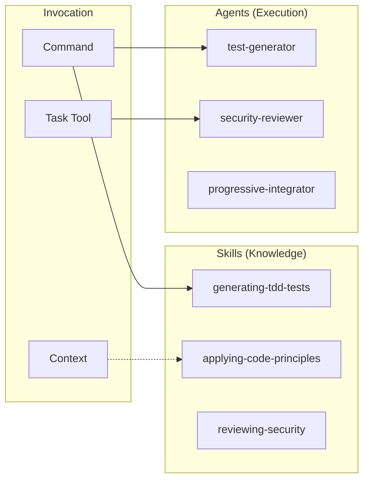
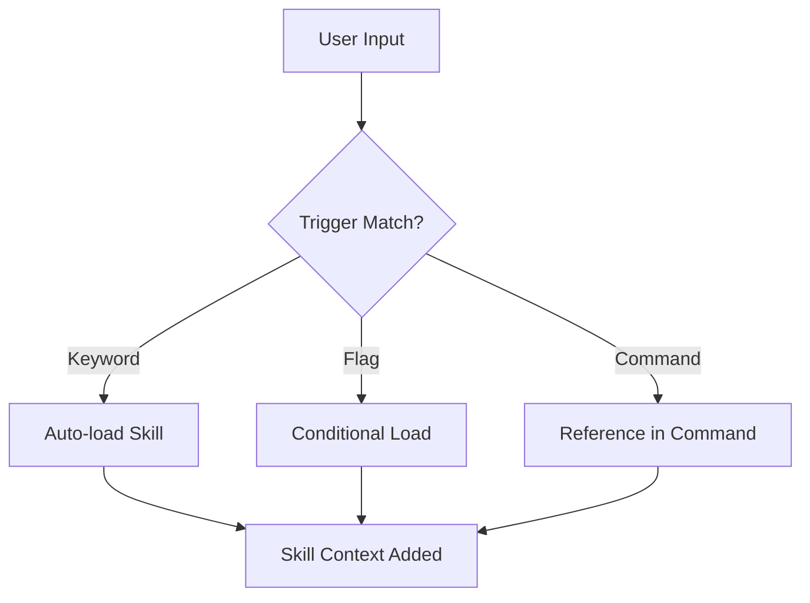

# Skills & Agents Design

スキルとエージェントの設計意図と使い分けを説明します。

📌 **[日本語版](../.ja/docs/SKILLS_AGENTS.md)**

## Core Concept



## Skills vs Agents

| Aspect         | Skills                         | Agents        |
| -------------- | ------------------------------ | ------------- |
| **Role**       | 知識ベース（What/How）         | 実行者（Do）  |
| **Invocation** | 自動ロード or コマンドから参照 | Task tool経由 |
| **Context**    | メインまたはfork               | 常にfork      |
| **State**      | 読み取り専用                   | 変更可能      |
| **Output**     | 情報提供                       | 成果物生成    |

## Skills

### Purpose

スキルは「知識モジュール」。AIが特定のタスクを実行する際に必要な知識を提供。

### Categories

| Category      | Skills                                               | Purpose            |
| ------------- | ---------------------------------------------------- | ------------------ |
| TDD/Testing   | generating-tdd-tests                                 | テスト手法         |
| Principles    | applying-code-principles, applying-frontend-patterns | 設計原則           |
| Documentation | documenting-\*                                       | ドキュメント生成   |
| Review        | reviewing-\*                                         | コードレビュー観点 |
| Workflow      | orchestrating-workflows                              | ワークフロー定義   |

### Loading Mechanism



**Trigger Examples:**

| Trigger             | Skill Loaded               |
| ------------------- | -------------------------- |
| "TDD", "テスト駆動" | generating-tdd-tests       |
| "SOLID", "原則"     | applying-code-principles   |
| "/code --frontend"  | applying-frontend-patterns |

### File Structure

```text
skills/[skill-name]/
├── SKILL.md        # 必須: YAML front matter + 知識本体
└── references/     # 任意: 詳細ガイド
    └── *.md
```

### YAML Front Matter

```yaml
---
name: generating-tdd-tests
description: >
  TDD with RGRC cycle and Baby Steps methodology.
  Use when implementing features with test-driven development,
  or when user mentions TDD, テスト駆動, Red-Green-Refactor.
allowed-tools: [Read, Write, Edit, Grep, Glob, Task]
context: fork # fork or inline
user-invocable: false # スラッシュコマンドとして呼び出し可能か
---
```

## Agents

### Purpose

エージェントは「専門実行者」。Task toolで起動され、特定の分析・生成タスクを自律的に実行。

### Categories

```text
agents/
├── analyzers/      # コード分析 (api, architecture, code-flow, domain, plugin-scanner, setup)
├── architects/     # 設計 (feature-architect)
├── critics/        # 批判的レビュー (devils-advocate)
├── enhancers/      # コード改善 (progressive-enhancer)
├── explorers/      # 探索 (feature-explorer)
├── generators/     # 生成 (branch, commit, issue, pr, test)
├── resolvers/      # 問題解決 (build-error-resolver)
├── reviewers/      # レビュー (14 specialized reviewers)
└── teams/          # 統合 (progressive-integrator)
```

### Reviewer Agents (14 types)

| Agent                   | Focus                |
| ----------------------- | -------------------- |
| security-reviewer       | OWASP Top 10         |
| type-safety-reviewer    | TypeScript型安全性   |
| type-design-reviewer    | 型設計 + カプセル化  |
| testability-reviewer    | テスト容易性         |
| test-coverage-reviewer  | テストカバレッジ品質 |
| silent-failure-reviewer | 静かな失敗検知       |
| root-cause-reviewer     | 根本原因分析         |
| code-quality-reviewer   | 構造 + 可読性        |
| performance-reviewer    | パフォーマンス       |
| accessibility-reviewer  | WCAG準拠             |
| design-pattern-reviewer | Reactパターン        |
| document-reviewer       | ドキュメント品質     |
| sow-spec-reviewer       | SOW/Spec品質         |
| subagent-reviewer       | サブエージェント定義 |

### Team Agent

| Agent                  | Focus                                                           |
| ---------------------- | --------------------------------------------------------------- |
| progressive-integrator | Reconcile challenge/verification results + root cause synthesis |

### Invocation via Task Tool

```markdown
Task tool with:

- subagent_type: "security-reviewer"
- prompt: "Review the authentication module for vulnerabilities"
- model: "sonnet" (optional)
```

## Design Decisions

### Why Separate Skills and Agents?

| Reason               | Explanation                                        |
| -------------------- | -------------------------------------------------- |
| **関心の分離**       | 知識（Skills）と実行（Agents）を分離               |
| **コンテキスト管理** | Agentsはforkで実行、メインコンテキストを汚染しない |
| **再利用性**         | Skillsは複数のコマンドから参照可能                 |
| **専門性**           | Agentsは特定タスクに特化、深い分析が可能           |

### Reference Depth Rule

```text
SKILL.md → reference.md (1階層まで)
```

理由: Claudeが深いネストを `head -100` で読むと情報が欠落する。

## Related

- [COMMANDS.md](./COMMANDS.md) — コマンドの設計
- [SKILL_FORMAT](../rules/conventions/SKILL_FORMAT.md) — スキル定義形式
