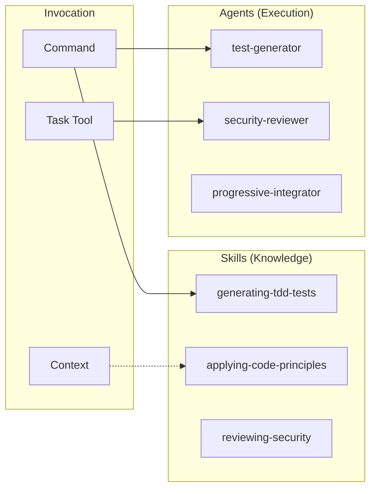
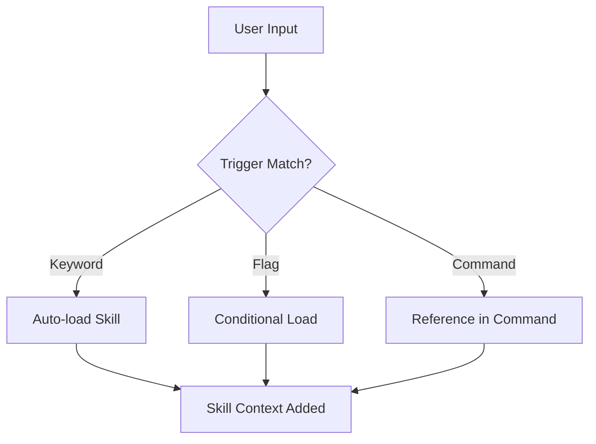

# Skills & Agents Design

Design intent and usage guidelines for Skills and Agents.

📌 **[日本語版](../.ja/docs/SKILLS_AGENTS.md)**

## Core Concept



## Skills vs Agents

| Aspect         | Skills                         | Agents        |
| -------------- | ------------------------------ | ------------- |
| **Role**       | Knowledge base (What/How)      | Executor (Do) |
| **Invocation** | Auto-load or command reference | Via Task tool |
| **Context**    | Main or fork                   | Always fork   |
| **State**      | Read-only                      | Mutable       |
| **Output**     | Information                    | Artifacts     |

## Skills

### Purpose

Skills are "knowledge modules" that provide domain-specific knowledge when AI
executes tasks.

### Categories

| Category      | Skills                                               | Purpose                  |
| ------------- | ---------------------------------------------------- | ------------------------ |
| TDD/Testing   | generating-tdd-tests                                 | Testing methodology      |
| Principles    | applying-code-principles, applying-frontend-patterns | Design principles        |
| Documentation | documenting-\*                                       | Documentation generation |
| Review        | reviewing-\*                                         | Code review perspectives |
| Workflow      | orchestrating-workflows                              | Workflow definitions     |

### Loading Mechanism



**Trigger Examples:**

| Trigger               | Skill Loaded               |
| --------------------- | -------------------------- |
| "TDD", "test-driven"  | generating-tdd-tests       |
| "SOLID", "principles" | applying-code-principles   |
| "/code --frontend"    | applying-frontend-patterns |

### File Structure

```text
skills/[skill-name]/
├── SKILL.md        # Required: YAML front matter + knowledge body
└── references/     # Optional: detailed guides
    └── *.md
```

### YAML Front Matter

```yaml
---
name: generating-tdd-tests
description: >
  TDD with RGRC cycle and Baby Steps methodology. Use when implementing features
  with test-driven development, or when user mentions TDD, テスト駆動,
  Red-Green-Refactor.
allowed-tools: [Read, Write, Edit, Grep, Glob, Task]
context: fork # fork or inline
user-invocable: false # Whether invocable as slash command
---
```

## Agents

### Purpose

Agents are "specialized executors" spawned via the Task tool to autonomously
perform specific analysis or generation tasks.

### Categories

```text
agents/
├── analyzers/      # Code analysis (api, architecture, code-flow, domain, setup)
├── architects/     # Design (feature-architect)
├── critics/        # Critical verification (devils-advocate-audit, devils-advocate-design, evidence-verifier)
├── enhancers/      # Code improvement (code-simplifier)
├── explorers/      # Exploration (feature-explorer)
├── generators/     # Generation (branch, commit, issue, pr, test)
├── resolvers/      # Problem resolution (build-error-resolver)
├── reviewers/      # Review (16 specialized reviewers)
└── teams/          # Team integration (progressive-integrator, unit-implementer)
```

### Reviewer Agents (15 types)

| Agent                   | Focus                       |
| ----------------------- | --------------------------- |
| security-reviewer       | OWASP Top 10                |
| type-safety-reviewer    | TypeScript type safety      |
| type-design-reviewer    | Type design + encapsulation |
| testability-reviewer    | Testability                 |
| test-coverage-reviewer  | Test coverage quality       |
| silent-failure-reviewer | Silent failure detection    |
| root-cause-reviewer     | Root cause analysis         |
| code-quality-reviewer   | Structure + readability     |
| progressive-enhancer    | CSS-first + JS reduction    |
| performance-reviewer    | Performance                 |
| accessibility-reviewer  | WCAG compliance             |
| design-pattern-reviewer | React patterns              |
| document-reviewer       | Documentation quality       |
| sow-spec-reviewer       | SOW/Spec quality            |
| subagent-reviewer       | Sub-agent definition review |

### Team Agents

| Agent                  | Focus                                                           |
| ---------------------- | --------------------------------------------------------------- |
| progressive-integrator | Reconcile challenge/verification results + root cause synthesis |
| unit-implementer       | RGRC cycle implementation for assigned files and tests          |

### Invocation via Task Tool

```markdown
Task tool with:

- subagent_type: "security-reviewer"
- prompt: "Review the authentication module for vulnerabilities"
- model: "sonnet" (optional)
```

## Design Decisions

### Why Separate Skills and Agents?

| Reason                     | Explanation                                             |
| -------------------------- | ------------------------------------------------------- |
| **Separation of Concerns** | Separate knowledge (Skills) from execution (Agents)     |
| **Context Management**     | Agents run in fork, don't pollute main context          |
| **Reusability**            | Skills can be referenced from multiple commands         |
| **Specialization**         | Agents specialize in specific tasks for deeper analysis |

### Reference Depth Rule

```text
SKILL.md → reference.md (1 level only)
```

Reason: Claude truncates deep nesting with `head -100`, causing information
loss.

## Related

- [COMMANDS.md](./COMMANDS.md) — Command design
- [SKILL_FORMAT](../rules/conventions/SKILL_FORMAT.md) — Skill definition format
